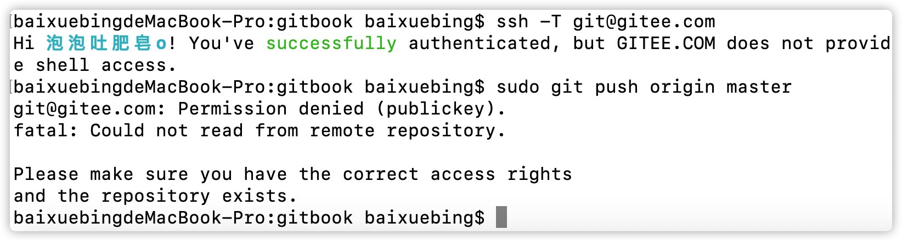

# 2b问题合集之ssh密钥问题

# 一、ucloud免密登陆问题

背景说明：

ucloud云主机，想要使用密钥登陆，提ucloud工单得到回复ucloud并不支持在web界面创建密钥并绑定(华为云、腾讯云、阿里云都支持web界面创建绑定)，只能登陆系统手动创建并下载密钥，于是root用户登陆ucloud云主机手动执行命令`ssh-keygen`，下载`id_rsa`私钥到本地，结果使用这个私钥始终无法登陆系统，还特么又提了1个ucloud工单问人家怎么回事(虽然还遇到一个哥们给我回复把私钥权限改成755试试。。。)，最终工单回复密钥未注册，请自行排查，最后折腾半天找到答案

原因如下：

**⚠️centos7ssh服务配置文件`/etc/ssh/sshd_config`中有一项配置是`AuthorizedKeysFile      .ssh/authorized_keys`，如果想要使用私钥免密登陆，则公钥必须写入到文件`.ssh/authorized_keys`中，即注册私钥，否则免密会失败！！！**

手动执行命令`cat id_rsa.pub >> authorized_keys`，把公钥注册后问题解决

# 二、mac推送仓库到码云

背景说明：

mac本机，在根目录下创建了一个目录，准备把这个目录下的内容推送到码云新建的仓库中，已经手动把**user**用户的公钥粘贴到了码云的个人账户中(码云中只有把公钥放到个人账户中才能对仓库有写权限)，但是推送的时候始终提示权限拒绝，而使用命令`ssh -T git@gitee.com`确是提示认证成功的

原因是推送的时候使用了`sudo`，用到的因该是root用户的密钥，但是只把user用户的公钥放到了码云中，所以权限拒绝，把root用户的公钥放到码云中就可以了

