# zabbix3.4自动化监控

# 1.zabbix主动被动模式区别

## 1.1主动模式与被动模式针对的是agent

- **被动模式 (Zabbix-server轮询检测zabbix-agent)**

- **主动模式 (Zabbix-agent主动上报给Zabbix-server)**

## 1.2主动模式与被被动模式选择如何选择

- **当Queue里有大量延迟的监控项**

- **当监控主机超过300+, 建议使用主动模式**


# 2.zabbix被动模式: zabbix默认是被动模式,假如有100个监控, 需要100个回合

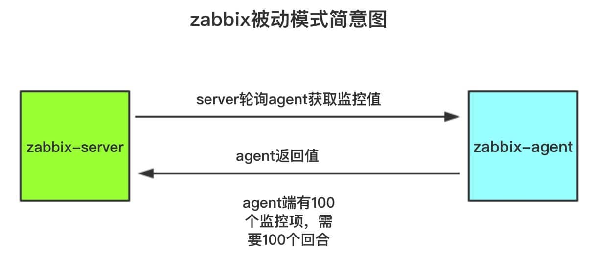


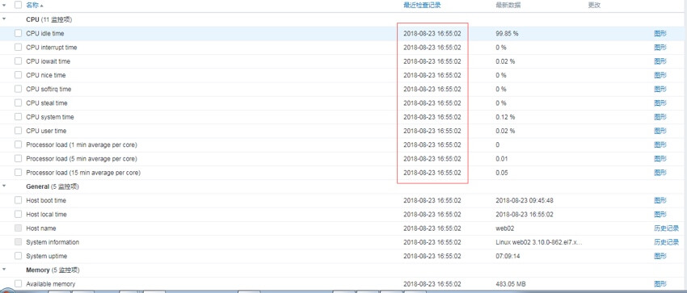


# 3.zabbix主动模式

## 3.1修改zabbix为主动模式

### 第一步、修改agent端端配置文件``/etc/zabbix/zabbix_agentd.conf``

```python
#修改以下两项
ServerActive=zabbix-server的IP地址
Hostname=zabbix-agent的主机名
```

### 第二步、zabbix web界面修改agent基础模版为Active

**全克隆被动模式模版``Template OS Linux``**

配置-->模版-->搜索``Template OS Linux``

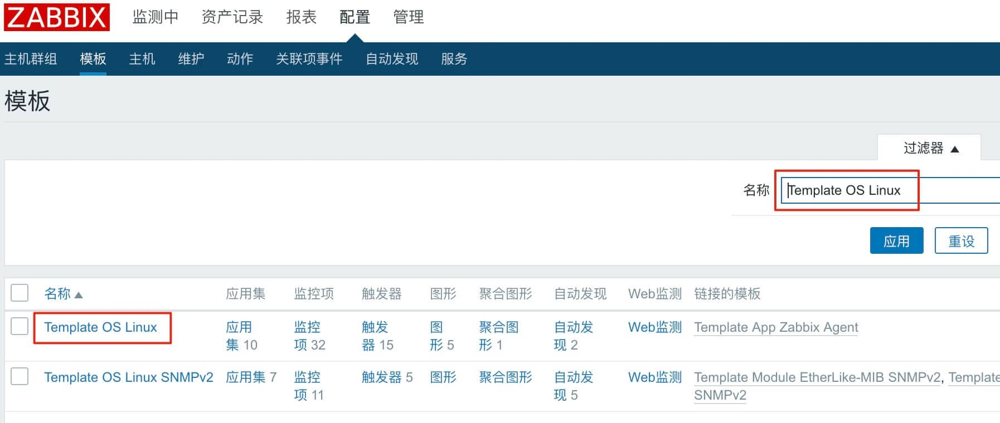

点击``全克隆``

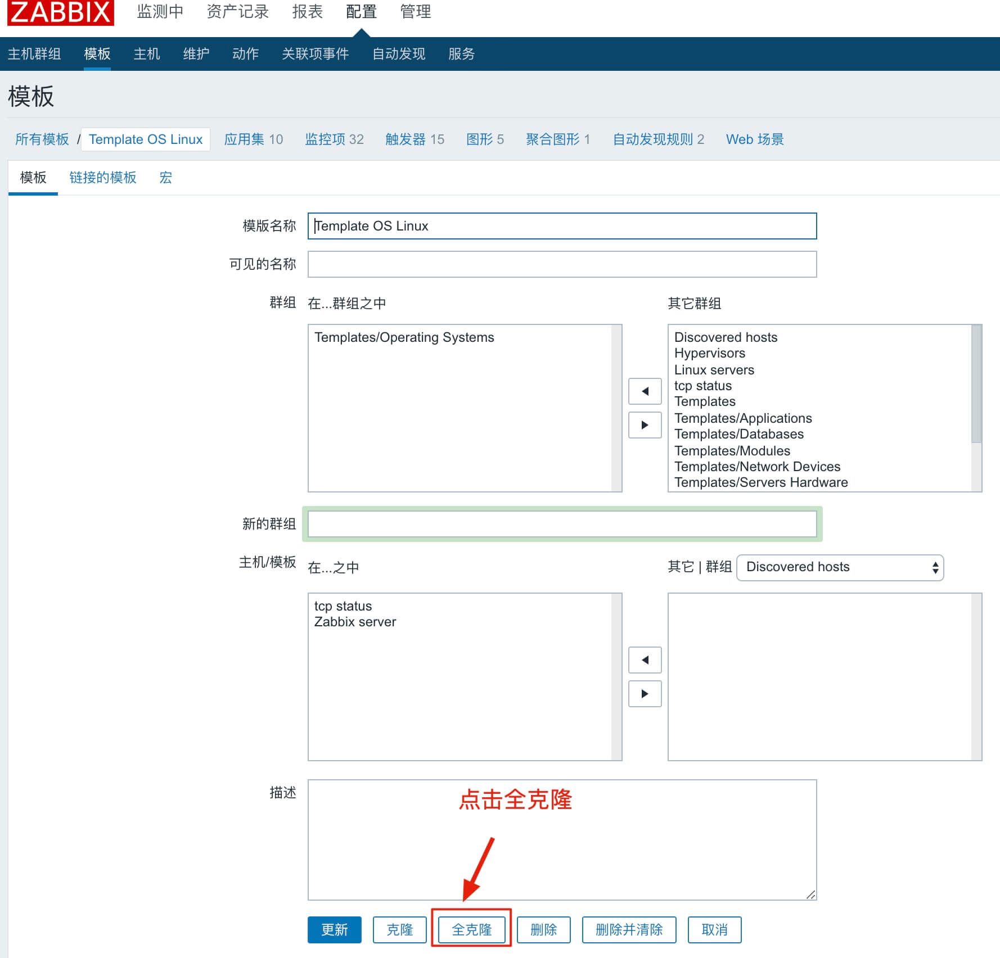

修改名称为``Template OS Linux Active``

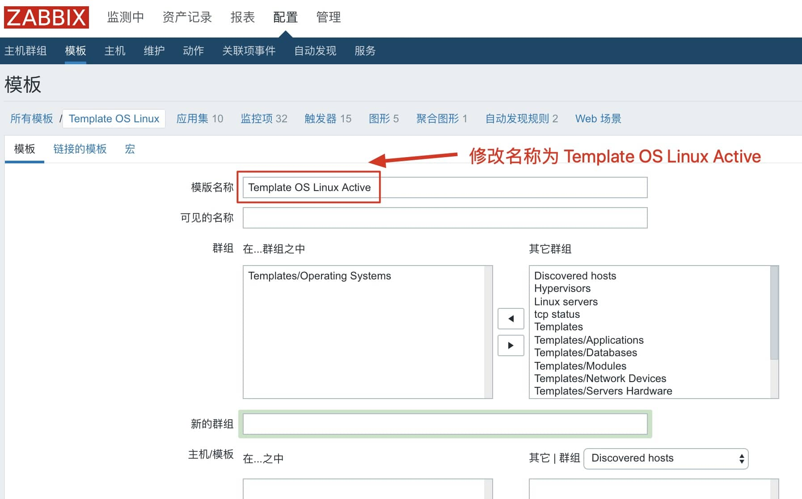

点击克隆后的Active模版-->监控项-->全选-->批量更新-->类型-->选择主动式-->更新


更新后的类型为zabbix客户端主动式


### 第三步、agent主机引用主动模式的模版

配置-->主机-->模版-->清理之前的默认模版``Template OS Linux``选择主动模式的模版``Template OS Linux Active``-->更新

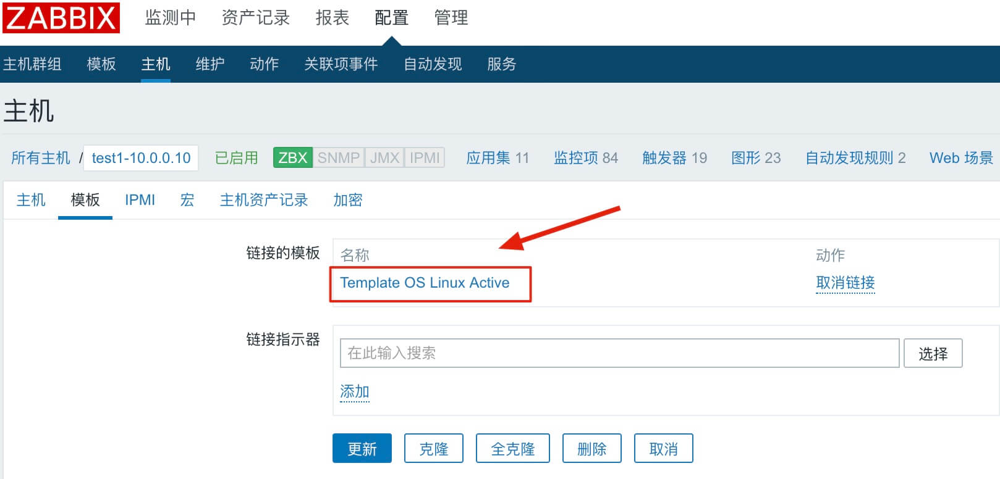

修改agent主机配置文件``/etc/zabbix/zabbix_agentd.conf``

```python
//注释Server=
#Server=10.0.0.200

//修改ServerActive一项为server端IP地址
ServerActive=10.0.0.200

//修改Hostname	这里修改为server web端主机的名称
Hostname=test1-10.0.0.10

//将StartAgents一项修改为0，表示启用主动模式
StartAgents=0

//重启agent
systemctl restart zabbix-agent

#⚠️启用主动模式后，agent端就不会监听本地10050端口
```


# 4.zabbix自动注册

## 4.1zabbix自动注册说明

[zabbix3.4自动注册官方手册](https://www.zabbix.com/documentation/3.4/zh/manual/discovery/auto_registration)

- **zabbix-agent可以自动注册到服务器进行监控。这种方式无需在服务器上手动配置它们。**


## 4.2配置步骤

### **第一步、配置zabbix-agent指定zabbix-server**

```python
修改zabbix-agent配置文件/etc/zabbix/zabbix_agentd.conf，将Server和ServerActive都指定为zabbix-server
的IP，修改Hostname为zabbix-agent的主机名
[root@zabbix-agent ~]# vim /etc/zabbix/zabbix_agentd.conf
Server=
ServerActive=
Hostname=

[root@zabbix-agent ~]# systemctl restart zabbix-agent

ServerActive即为主动模式
注意： 必须指定hostname，否则无法发现主机
```

### 第二步、单击配置->动作，选择自动注册为事件源，然后单击创建动作

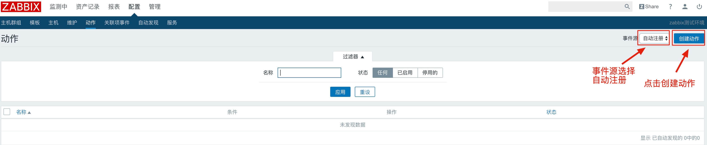


### 第三步、添加动作条件

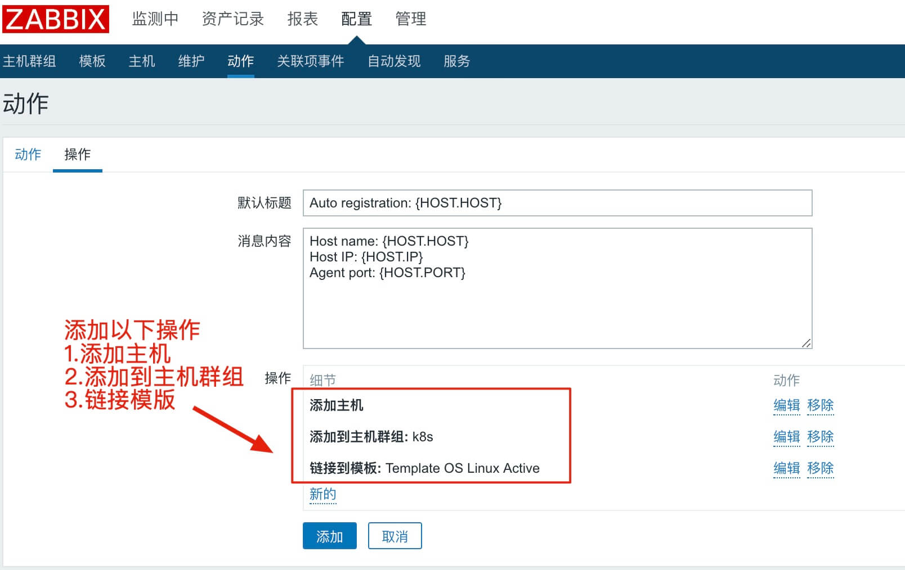

**添加后的自动注册操作**


**稍等几分钟，主机名似k8s的主机就会自动注册到server端**

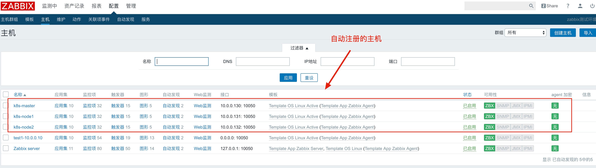


> **另外一种方式，不修改agent端配置文件/etc/zabbix/zabbix_agentd.conf中的hostname，触发条件写主机名称似IP地址，但是这样在web界面显示的主机名称是默认的Zabbix Server，感觉有些low**


# 5.zabbix自动发现

## 5.1自动发现说明

[zabbix3.4网络发现官方手册](https://www.zabbix.com/documentation/3.4/zh/manual/discovery/network_discovery)

**网络发现由两个阶段组成:发现discovery和动作actions**

⚠️**自动发现的缺点**

<p style=color:red>自动发现中填写的IP地址范围是根据zabbix-server端的子网掩码去扫对应的主机，但是这样有缺陷，这样只能去扫跟zabbix-server端子网掩码相同段的主机，如果agent划分了子网掩码，这样就无法扫全主机</p>

## 5.2配置步骤

### 第一步、配置-->自动发现-->启用默认的发现规则(或者新建发现规则、克隆默认规则)

**这里选择克隆系统默认规则并改名**


**克隆后的自动发现规则**

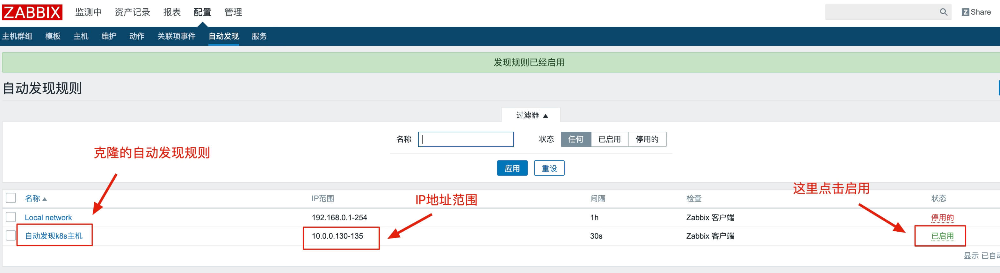


### 第二步、配置-->动作-->创建动作

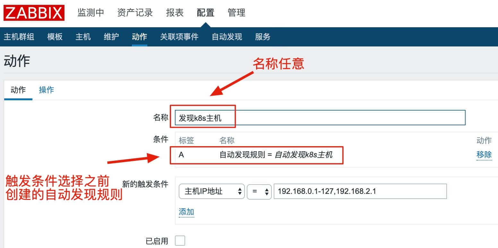

**操作信息**

```python
#默认标题
自动发现主机IP:{DISCOVERY.DEVICE.IPADDRESS}

#消息内容
客户端名称:{DISCOVERY.SERVICE.NAME}
客户端端口:{DISCOVERY.SERVICE.PORT}
客户端状态:{DISCOVERY.SERVICE.STATUS}
```


**稍等几分钟就会自动发主机**

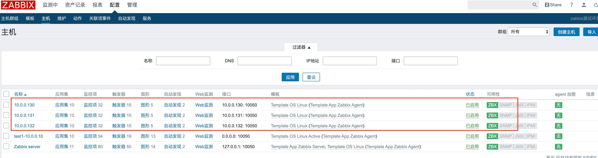