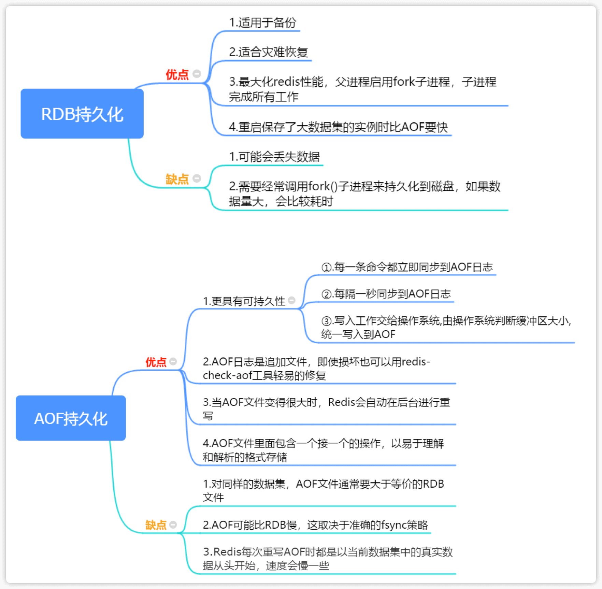
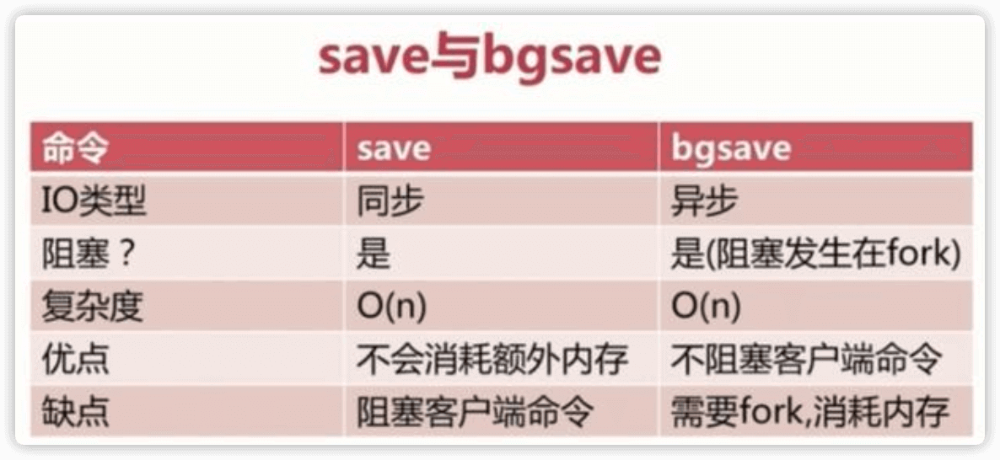
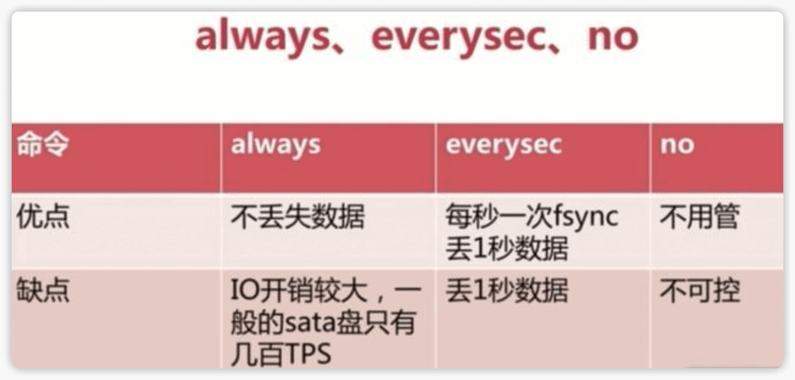

# redis持久化

# 一、什么是持久化？

**持久化：**就是将内存中的数据，写入到磁盘上，并且永久存在


# 二、redis持久化类型

- RDB

- AOF


## RDB和AOF对比

### 定义对比


### 优缺点对比




### 工作方式对比


## 2.1RDB持久化

### 2.1.1 RDB持久化介绍

可以在指定的时间间隔内生成数据集的时间点快照（point-in-time snapshot）

### 2.1.2 RDB持久化优点

- RDB是一种表示某个即时点的Redis数据的紧凑文件。RDB文件适合用于备份。例如，你可能想要每小时归档最近24小时的RDB文件，每天保存近30天的RDB快照。这允许你很容易的恢复不同版本的数据集以容灾
- RDB非常适合于灾难恢复，作为一个紧凑的单一文件，可以被传输到远程的数据中心
- RDB最大化了Redis的性能，因为Redis父进程持久化时唯一需要做的是启动(fork)一个子进程，由子进程完成所有剩余工作。父进程实例不需要执行像磁盘IO这样的操作
- RDB在重启保存了大数据集的实例时比AOF要快

### 2.1.3 RDB持久化缺点

- 当你需要在Redis停止工作(例如停电)时最小化数据丢失，RDB可能不太好。你可以配置不同的保存点(save point)来保存RDB文件(例如，至少5分钟和对数据集100次写之后，但是你可以有多个保存点)。然而，你通常每隔5分钟或更久创建一个RDB快照，所以一旦Redis因为任何原因没有正确关闭而停止工作，你就得做好最近几分钟数据丢失的准备了
- RDB需要经常调用fork()子进程来持久化到磁盘。如果数据集很大的话，fork()比较耗时，结果就是，当数据集非常大并且CPU性能不够强大的话，Redis会停止服务客户端几毫秒甚至一秒。AOF也需要fork()，但是你可以调整多久频率重写日志而不会有损(trade-off)持久性(durability)

### 2.1.4 RDB持久化优缺点总结

- 优点：速度快，适合于用作备份，主从复制也是基于RDB持久化功能实现的
- 缺点：会有数据丢失、导致服务停止几秒

### 2.1.5 RDB持久化配置参数

**RDB持久化核心配置参数**

```python
#持久化数据文件存储位置
dir /etc/redis/6379

#rdb持久化数据文件名
dbfilename dump.rdb

#900秒（15分钟）内有1个更改
save 900 1

#300秒（5分钟）内有10个更改
save 300 10

#60秒（1分钟）内有10000个更改
save 60 10000
```

**配置RDB持久化**

⚠️save这里这是做演示，还是要根据实际使用情况进行修改，例如我们线上主流的配置是 7200 10

```python
1.编辑配置文件
cat > /etc/redis/6379/redis.conf <<EOF
#持久化数据文件存储位置
dir /etc/redis/6379

#rdb持久化数据文件名
dbfilename dump.rdb

#900秒（15分钟）内有1个更改
save 900 1

#300秒（5分钟）内有10个更改
save 300 10

#60秒（1分钟）内有10000个更改
save 60 10000
EOF

2.重启redis
127.0.0.1:6379> SHUTDOWN
not connected> 

#指定配置文件启动
redis-server /etc/redis/6379/redis.conf


3.写入数据
#连接redis，如果设置了密码，使用-a参数
redis-cli
127.0.0.1:6379> set a 1
OK
127.0.0.1:6379> set b 2
OK

4.手动保存RDB持久化
127.0.0.1:6379> BGSAVE
Background saving started

5.查看RDB持久化文件
dump.rdb就是RDB持久化文件
$ ll
total 16
-rw-r--r-- 1 root root   92 Dec 10 19:31 dump.rdb
-rw-r--r-- 1 root root  410 Dec 10 19:22 redis.conf
-rw-r--r-- 1 root root 4314 Dec 10 19:31 redis.log
```


## 2.2AOF持久化

### 2.2.1 AOF持久化介绍

**AOF（append only file）只追加文件**，记录服务器执行的所有写操作命令，并在服务器启动时，通过重新执行这些命令来还原数据集。 AOF 文件中的命令全部以 Redis 协议的格式来保存，新命令会被追加到文件的末尾

**AOF持久化原理**


### 2.2.2 AOF持久化优点

- 使用AOF Redis会更具有可持久性(durable)：你可以有很多不同的fsync策略：没有fsync，每秒fsync，每次请求时fsync。使用默认的每秒fsync策略，写性能也仍然很不错(fsync是由后台线程完成的，主线程继续努力地执行写请求)，即便你也就仅仅只损失一秒钟的写数据
- AOF日志是一个追加文件，所以不需要定位，在断电时也没有损坏问题。即使由于某种原因文件末尾是一个写到一半的命令(磁盘满或者其他原因),**redis-check-aof工具也可以很轻易的修复**
- **当AOF文件变得很大时，Redis会自动在后台进行重写**。重写是绝对安全的，因为Redis继续往旧的文件中追加，使用创建当前数据集所需的最小操作集合来创建一个全新的文件，一旦第二个文件创建完毕，Redis就会切换这两个文件，并开始往新文件追加
- AOF文件里面包含一个接一个的操作，以易于理解和解析的格式存储。你也可以轻易的导出一个AOF文件。例如，即使你不小心错误地使用FLUSHALL命令清空一切，如果此时并没有执行重写，你仍然可以保存你的数据集，你只要停止服务器，删除最后一条命令，然后重启Redis就可以

### 2.2.3 AOF持久化缺点

- **对同样的数据集，AOF文件通常要大于等价的RDB文件**
- **AOF可能比RDB慢，这取决于准确的fsync策略**。通常fsync设置为每秒一次的话性能仍然很高，如果关闭fsync，即使在很高的负载下也和RDB一样的快。不过，即使在很大的写负载情况下，RDB还是能提供能好的最大延迟保证
- 在过去，我们经历了一些针对特殊命令(例如，像BRPOPLPUSH这样的阻塞命令)的罕见bug，导致在数据加载时无法恢复到保存时的样子。这些bug很罕见，我们也在测试套件中进行了测试，自动随机创造复杂的数据集，然后加载它们以检查一切是否正常，但是，这类bug几乎不可能出现在RDB持久化中。为了说得更清楚一点：Redis AOF是通过递增地更新一个已经存在的状态，像MySQL或者MongoDB一样，而RDB快照是一次又一次地从头开始创造一切，概念上更健壮。但是，要注意**Redis每次重写AOF时都是以当前数据集中的真实数据从头开始**，相对于一直追加的AOF文件(或者一次重写读取老的AOF文件而不是读内存中的数据)对bug的免疫力更强。我们还没有收到一份用户在真实世界中检测到崩溃的报告

### 2.2.4 AOF持久化优缺点总结

- 优点：可以最大程度保证数据不丢失
- 缺点：日志记录量级比较大

### 2.2.5 AOF持久化配置参数

**AOF持久化核心配置参数**

```python
#是否打开AOF日志功能
appendonly yes/no

以下三种方法只能同时打开一种
#每一条命令都立即同步到AOF
appendfsync always
#每秒写一次
appendfsync everysec
#写入工作交给操作系统,由操作系统判断缓冲区大小,统一写入到AOF
appendfsync no
```

**配置AOF持久化**

```python
1.编辑配置文件
cat >/etc/redis/6379/redis.conf <<EOF
#持久化数据文件存储位置
dir /etc/redis/6379

#打开AOF日志功能
appendonly yes

#每一条命令立即同步到AOF
appendfsync always
EOF


2.重启redis
127.0.0.1:6379> SHUTDOWN
not connected> 

#指定配置文件启动
redis-server /etc/redis/6379/redis.conf 

3.写入数据
#连接redis，如果设置了密码，使用-a参数
redis-cli
127.0.0.1:6379> set name hehe
OK

4.查看AOF文件
appendonly.aof就是AOF持久化日志文件
$ ll /etc/redis/6379/
total 20
-rw-r--r-- 1 root root   56 Dec 10 19:49 appendonly.aof
-rw-r--r-- 1 root root   92 Dec 10 19:49 dump.rdb
-rw-r--r-- 1 root root  182 Dec 10 19:49 redis.conf
-rw-r--r-- 1 root root 6358 Dec 10 19:49 redis.log
  
5.AOF文件内容
$ cat /etc/redis/6379/appendonly.aof 
*2
$6
SELECT
$1
0
*3
$3
set
$4
name
$4
hehe
*3
$3
set
$4
test
$4
test  
```


# 三、如何选择RDB和AOF

1.一般来说,如果想达到足以媲美 PostgreSQL 的数据安全性， 你应该同时使用两种持久化功能

2.如果你非常关心你的数据,但仍然可以承受数分钟以内的数据丢失， 那么你可以只使用 RDB 持久化

3.有很多用户单独使用AOF，但是我们并不鼓励这样，因为时常进行RDB快照非常方便于数据库备份，启动速度也较之快，还避免了AOF引擎的bug

4.**在企业中，通常都使用RDB来做持久化，因为一般redis是在做MySQL的缓存，就算缓存数据丢失，真实的数据还是在MySQL中，之所以用缓存是为了速度，性能而考虑，所以还是建议使用RDB持久化，相对来说会好一些**，除非专门用redis来做一个``key:value``的数据库，而且数据很重要，那么可以考虑使用AOF

**注意：基于这些原因，将来我们可能会统一AOF和RDB为一种单一的持久化模型(长远计划)**


**RDB和AOF持久化对比**


# 四、RDB与AOF工作方式

## 4.1 RDB

### 4.1.1 RDB快照工作方式

1.默认情况下，Redis保存数据集快照到磁盘，名为dump.rdb的二进制文件。你可以设置让Redis在N秒内至少有M次数据集改动时保存数据集，或者你也可以手动调用SAVE或者BGSAVE命令

2.在上文中我们已经在配置文件中做过对应的配置：

例如，这个配置会让Redis在每个60秒内至少有1000次键改动时自动转储数据集到磁盘：

save 60 1000

3.当 Redis 需要保存 dump.rdb 文件时，服务器执行以下操作：

- Redis 调用 fork() ，同时拥有父进程和子进程
- 子进程将数据集写入到一个临时的 RDB 文件中。当子进程完成对新 RDB 文件的写入时， Redis 用新RDB 文件替换原来的 RDB 文件，并删除旧的 RDB 文件

4.这种方式使得 Redis 可以从写时复制机制中获益

**RDB是先将数据集写入到一个临时文件，当临时文件全部写完时，再覆盖dump.rdb文件**


### 4.1.2 RDB持久化方式 save、bgsave、自动化

#### save

该命令会阻塞当前Redis服务器，执行save命令期间，Redis不能处理其他命令，直到RDB过程完成为止。具体流程如下：


#### bgsave

执行该命令时，Redis会在后台异步进行快照操作，快照同时还可以响应客户端请求。具体流程如下：


#### 自动化

自动触发是由我们的配置文件来完成的。在redis.conf配置文件中，里面有如下配置，我们可以去设置：

**①save：**这里是用来配置触发 Redis的 RDB 持久化条件，也就是什么时候将内存中的数据保存到硬盘。比如``save m n``。表示m秒内数据集存在n次修改时，自动触发bgsave。

默认如下配置：

- save 900 1
  - 表示900 秒内如果至少有 1 个 key 的值变化，则保存save 900 1

- save 300 10
  - 表示300 秒内如果至少有 10 个 key 的值变化，则保存save 300 10 

- save 60 10000
  - 表示60 秒内如果至少有 10000 个 key 的值变化，则保存save 60 10000

不需要持久化，那么你可以注释掉所有的 save 行来停用保存功能。

**②stop-writes-on-bgsave-error ：**默认值为yes。当启用了RDB且最后一次后台保存数据失败，Redis是否停止接收数据。这会让用户意识到数据没有正确持久化到磁盘上，否则没有人会注意到灾难（disaster）发生了。如果Redis重启了，那么又可以重新开始接收数据了

**③rdbcompression ；**默认值是yes。对于存储到磁盘中的快照，可以设置是否进行压缩存储。

**④rdbchecksum ：**默认值是yes。在存储快照后，我们还可以让redis使用CRC64算法来进行数据校验，但是这样做会增加大约10%的性能消耗，如果希望获取到最大的性能提升，可以关闭此功能。

**⑤dbfilename ：**设置快照的文件名，默认是 dump.rdb

**⑥dir：**设置快照文件的存放路径，这个配置项一定是个目录，而不能是文件名。

---

**save于bgsave对比**




---

## 4.2 AOF

### 4.2.1 AOF重写功能

1.因为 AOF 的运作方式是不断地将命令追加到文件的末尾，所以随着写入命令的不断增加， AOF 文件的体积也变得越来越大。举个例子，如果你对一个计数器调用了 100 次 INCR ，那么仅仅是为了保存这个计数器的当前值， AOF 文件就需要使用 100 条记录。然而在实际上，只使用一条 ``SET`` 命令已经足以保存计数器的当前值了，其余 99 条记录实际上都是多余的

2.为了处理这种情况， Redis 支持一种有趣的特性：可以在不断服务客户端的情况下，对 AOF 文件进行重建。执行 ``BGREWRITEAOF`` 命令， Redis 将生产一个新的 AOF 文件，这个文件包含重建当前数据集所需的最少命令


**AOF重写原理**


### 4.2.2 AOF有多持久

你可以配置 Redis 多久才将数据 fsync 到磁盘一次。

有三个选项：

- **always**：每次有新命令追加到 AOF 文件时就执行一次 fsync ：非常慢，也非常安全。
- **everysec**：每秒 fsync 一次：足够快（和使用 RDB 持久化差不多，）并且在故障时只会丢失1秒钟的数据。
- **no**：从不 fsync，将数据交给操作系统来处理。更快，也更不安全的选择。

推荐（并且也是默认）的措施为每秒 fsync 一次，这种 fsync 策略可以兼顾速度和安全性。

总之fsync 的策略在实际使用中非常慢，即使在 Redis2.0 对相关的程序进行了改进之后仍是如此。频繁调用 fsync 注定了这种策略不可能快得起来。




### 4.2.3 AOF文件出错解决方法

服务器可能在程序正在对AOF文件进行写入时停机，如果停机造成了AOF文件出错，那么 Redis 在重启时会拒绝载入这个 AOF 文件，从而确保数据的一致性不会被破坏

当发生 AOF 文件出错时，可以用以下方法来修复出错的 AOF 文件：

- 1.为现有的 AOF 文件创建一个备份
- 2.使用 Redis 附带的 ``redis-check-aof`` 程序，对原来的AOF文件进行修复。``redis-check-aof --fix``
- 3.使用 ``diff -u`` 对比修复后的 AOF 文件和原始 AOF 文件的备份，查看两个文件之间的不同之处
- 4.重启 Redis 服务器，等待服务器载入修复后的 AOF 文件，并进行数据恢复

## 4.3 RDB和AOF之间的相互作用

- 在版本号大于等于 2.4 的 Redis 中， ``BGSAVE`` 执行的过程中，不可以执行 ``BGREWRITEAOF`` 。 反过来说，在 ``BGREWRITEAOF`` 执行的过程中，也不可以执行 ``BGSAVE`` 
- 这可以防止两个 Redis 后台进程同时对磁盘进行大量的 I/O 操作。如果 ``BGSAVE`` 正在执行，并且用户显示地调用 ``BGREWRITEAOF`` 命令，那么服务器将向用户回复一个 OK 状态，并告知用户， ``BGREWRITEAOF`` 已经被预定执行； 一旦 ``BGSAVE`` 执行完毕， ``BGREWRITEAOF`` 就会正式开始
- 当 Redis 启动时，如果 RDB 持久化和 AOF 持久化都被打开了，那么程序会优先使用 AOF 文件来恢复数据集，因为 AOF 文件所保存的数据通常是最完整的


# 五、redis备份

## 5.1 备份策略

1.Redis 对于数据备份是非常友好的，因为你可以在服务器运行的时候对 RDB 文件进行复制： RDB 文件一旦被创建，就不会进行任何修改

2.当服务器要创建一个新的 RDB 文件时，它先将文件的内容保存在一个临时文件里面，当临时文件写入完毕时，程序才使用临时文件替换原来的 RDB 文件

3.这也就是说，无论何时， 复制 RDB 文件都是绝对安全的

以下是我们的建议：

- 创建一个定期任务（cron job）， 每小时将一个 RDB 文件备份到一个文件夹， 并且每天将一个 RDB 文件备份到另一个文件夹

- 确保快照的备份都带有相应的日期和时间信息， 每次执行定期任务脚本时， 使用 find 命令来删除过期的快照： 比如说， 你可以保留最近 48 小时内的每小时快照， 还可以保留最近一两个月的每日快照

- 至少每天一次， 将 RDB 备份到你的数据中心之外， 或者至少是备份到你运行 Redis 服务器的物理机器之外


## 5.2 redis备份、恢复

**<span style=color:red>redis持久化就是redis备份</span>**


**<span style=color:red>将备份文件 (dump.rdb) 移动到 redis 安装目录并启动服务即可，使用``CONFIG GET dir``命令获取redis目录</span>**


# 六、redis持久化高级配置

**RDB持久化高级配置**

```python
#后台备份进程出错时,主进程停不停止写入? 主进程不停止容易造成数据不一致
stop-writes-on-bgsave-error yes

#导出的rdb文件是否压缩 如果rdb的大小很大的话建议这么做
rdbcompression yes 

#导入rbd恢复数据时,要不要检验rdb的完整性 验证版本是不是一致
rdbchecksum yes
```

**AOF持久化高级配置**

```python
#正在导出rdb快照的过程中,要不要停止同步aof
no-appendfsync-on-rewrite yes/no

#aof文件大小比起上次重写时的大小,增长率100%时重写,缺点:业务开始的时候，会重复重写多次
auto-aof-rewrite-percentage 100

#aof文件,至少超过64M时,重写
auto-aof-rewrite-min-size 64mb
```

