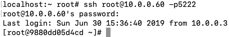

# dockerfile自动构建docker镜像

# 1.dockerfile说明

**dockerfile定义**

- **dockerfile类似ansible的剧本**


**dockerfile特点**

- **1.更适合传输，文件体积小**

- **2.实现更加定制化**


**dockerfile主要组成部分**

- **基础镜像信息			FROM centos:6.9**

- **制作镜像操作指令		RUN	yum -y install httpd**

- **容器启动时执行指令	CMD	["/bin/bash"]**


**dockerfile常用指令**

| 指令           | 含义                                                         |
| -------------- | ------------------------------------------------------------ |
| **FROM**       | **指定基础镜像，基于哪个镜像**                               |
| **MAINTAINER** | **构建者信息**                                               |
| **RUN**        | **指定运行命令**                                             |
| **ADD**        | **将宿主机文件拷贝到容器中，会自动解压**                     |
| **WORKDIR**    | **指定工作目录**                                             |
| **VOLUME**     | **设卷，挂载宿主机目录**                                     |
| **EXPOSE**     | **指定对外的端口**                                           |
| **CMD**        | **容器启动后要运行的命令，容易被替换**                       |
| **COPY**       | **复制文件**                                                 |
| **ENV**        | **环境变量**                                                 |
| **ENTRYPOINT** | **容器启动后执行的命令（无法被替换，启动容器的时候指定的命令，会被当成参数）** |


# 2.dockerfile构建镜像步骤

**第一步、编写dockerfile**

**第二步、docker build构建镜像(构建镜像的时候，dockerfile中有多少个命令就提交多少个临时容器，最后再总提交一次并且每次提交的临时容器会被删除)**

**第三步、启动容器测试**


# 3.dockerfile示例

## 3.1示例一：基础dockerfile---ssh服务镜像

### 3.1.1新建目录，专门存放dockerfile

```python
[root@docker1 ~]# mkdir /dockerfile/centos6.9_ssh
```


### 3.1.2编辑dockerfile， 文件名称必须为dockerfile

```python
[root@docker1 centos6.9_ssh]# cat > dockerfile<<EOF
FROM  centos:6.9
RUN   yum -y install openssh-server
RUN   /etc/init.d/sshd start
RUN   echo 1|passwd --stdin root
CMD   ["/usr/sbin/sshd","-D"]
EOF

#说明
FROM  centos:6.9                         基于centos6.9镜像
RUN   yum -y install openssh-server      docker容器运行的命令，安装ssh
RUN   /etc/init.d/sshd start             docker容器运行的命令，启动ssh
RUN   echo 1|passwd --stdin root         docker容器运行的命令，设置root密码
CMD   ["/usr/sbin/sshd","-D"]            容器启动时运行的命令
```


### 3.1.3构建镜像

```python
//基于dockerfile开始构建镜像
[root@docker1 centos6.9_ssh]# docker build -t centos6.9_ssh:v2.1 .
。。。
Successfully built 6a6d13135aaa
Successfully tagged centos6.9_ssh:v2.1

#说明
build      构建镜像
-t         指定镜像名称
.          从当前目录下读取dockerfile
```


### 3.1.4测试镜像

```python
//启动一个容器测试镜像
[root@docker1 centos6.9_ssh]# docker run -d -p 3222:22 centos6.9_ssh:v2.1 
a57c6406e001f4a295ec8c847627326403f83a44d72adf719d44f8f3f4463ebc

//查看镜像,可以看到，容器启动时没有指定默认命令，已从dockerfile中CMD读取初始运行名令
[root@docker1 centos6.9_ssh]# docker ps -al
CONTAINER ID        IMAGE                     COMMAND                CREATED             STATUS              PORTS                     NAMES
a57c6406e001        centos6.9_ssh:v2.1        "/usr/sbin/sshd -D"    29 seconds ago      Up 28 seconds       0.0.0.0:3222->22/tcp      elated_kirch
```


### 3.1.5ssh连接测试


## 3.2示例二：基础dockerfile--多服务

### 3.2.1新建目录，专门存放dockerfile

```python
[root@docker1 ~]# mkdir -p /dockerfile/centos6.9_ssh_http
```


## 3.2.2编辑dockerfile， 文件名称必须为dockerfile

```python
[root@docker1 ~]# cd /dockerfile/centos6.9_ssh_http
[root@docker1 centos6.9_ssh_http]# cat > dockerfile<<EOF
FROM  centos:6.9
RUN   yum -y install openssh-server httpd
RUN   /etc/init.d/sshd start
RUN   echo 1|passwd --stdin root
ADD   init.sh /init.sh
CMD   ["/bin/bash","/init.sh"]
EOF

#说明
FROM  centos:6.9                              基于centos6.9镜像
RUN   yum -y install openssh-server httpd     docker容器运行的命令，安装ssh
RUN   /etc/init.d/sshd start                  docker容器运行的命令，启动ssh
RUN   echo 1|passwd --stdin root              docker容器运行的命令，设置root密码
ADD   init.sh /init.sh                        将宿主机init.sh拷贝到容器的根目录   
CMD   ["/bin/bash","init.sh"]                 容器启动时运行的命令 
```


### 3.2.3编辑脚本

```python
[root@docker1 centos6.9_ssh_http]# cat >init.sh <<EOF 
#!/bin/bash
#
/etc/init.d/httpd start
/usr/sbin/sshd -D
EOF
```


### 3.2.4构建镜像

```python
//基于dockerfile构建镜像
[root@docker1 centos6.9_ssh_http]# docker build -t centos6.9_ssh_http:v2.1 .
。。。
Successfully built 1f4662cc114d
Successfully tagged centos6.9_ssh_http:v2.1

//查看镜像
[root@docker1 centos6.9_ssh_http]# docker images 
REPOSITORY           TAG                 IMAGE ID            CREATED             SIZE
centos6.9_ssh_http   v2.1                1f4662cc114d        7 minutes ago       310MB
```


### 3.2.5启动容器

```python
//启动容器
[root@docker1 centos6.9_ssh_http]# docker run -d -p 5222:22 -p 88:80 centos6.9_ssh_http:v2.1 
9880dd05d4cdc3849c4e62888d16592e6551ee3fb3fbae314ffd33c2744874c9

//查看容器
[root@docker1 centos6.9_ssh_http]# docker ps -al
CONTAINER ID        IMAGE                     COMMAND                CREATED             STATUS              PORTS                                      NAMES
fa48d4052ff8        centos6.9_ssh_http:v2.1   "/bin/bash /init.sh"   4 seconds ago       Up 3 seconds        0.0.0.0:5222->22/tcp, 0.0.0.0:88->80/tcp   zen_payne
```


### 3.2.6测试镜像

**ssh镜像测试**




**apache镜像测试**

```python
[root@docker1 centos6.9_ssh_http]# curl -I 10.0.0.60:88
HTTP/1.1 403 Forbidden
Date: Sun, 30 Jun 2019 15:37:34 GMT
Server: Apache/2.2.15 (CentOS)
Accept-Ranges: bytes
Content-Length: 4961
Connection: close
Content-Type: text/html; charset=UTF-8
```

