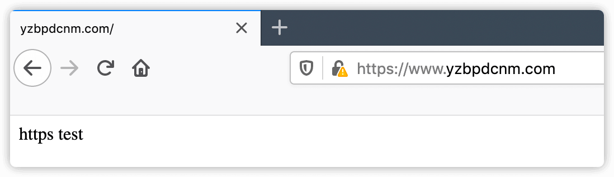

# nginx https

[openssl官网](https://www.openssl.org/)

# 一、检查环境并创建存放证书目录

## 1.1 openssl版本1.0.2以上

```shell
$ openssl version
OpenSSL 1.0.2k-fips  26 Jan 2017
```


## 1.2 nginx必须支持`--with-http_ssl_module`模块

```shell
#先把输出放到一个文件中，然后从文件中过滤
nginx -V &> nginx.txt
```


## 1.3 创建存放nginx证书的目录

```shell
mkdir /etc/nginx/ssl_key && cd /etc/nginx/ssl_key
```


# 二、生成证书

## 2.1 生成私钥

**使用openssl充当CA权威机构创建私钥(生产不可能使用此方式生成证书，不被互联网CA权威承认的黑户证书)**

加`-idea`参数就会提示输入密码，最少4位

```shell
openssl genrsa -out ca.key 2048
```


## 2.2 生成自签证书

- **交互式**

```shell
openssl req -x509 -new -nodes -sha256 -days 36500 -key ca.key -out ca.crt
```


**参数说明**

| **参数**   | **说明**         |
| ---------- | ---------------- |
| **req**    | **请求子命令**   |
| **-x509**  | **证书格式**     |
| **-new**   | **生成证书请求** |
| **-nodes** | **私钥不加密**   |
| **-days**  | **证书有效期**   |
| **-key**   | **指定私钥文件** |
| **-out**   | **输入证书文件** |


- **免交互式**

```shell
openssl req -x509 -new -nodes -sha256 -days 36500 \
 -subj "/C=CN/ST=Beijing/L=Beijing/O=dev/OU=devops/CN=www.yzbpdcnm.com" \
 -key ca.key \
 -out ca.crt
```

**免交互式`-subj`参数**

| **简写** | **完整单词**               | **含义**         |
| -------- | -------------------------- | ---------------- |
| **C**    | **Country Name**           | **国家**         |
| **ST**   | **State or Province Name** | **省**           |
| **L**    | **Locality Name**          | **城市**         |
| **O**    | **Organization Name**      | **组织名称**     |
| **OU**   | **Organization Unit Name** | **组织单位名称** |
| **CN**   | **Common Name**            | **域名**         |


# 三、配置nginx以https方式访问

## 3.1 编辑nginx配置文件

```nginx
cat > /etc/nginx/conf.d/https-test.conf <<'EOF'
server {
  listen 80;
  server_name www.test.com;
  rewrite (.*) https://$server_name$request_uri redirect;
}

server {
  #高版本的nginx已经启用ssl on
  listen 443 ssl;
  server_name www.test.com;
  ssl_certificate ssl_key/ca.crt;
  ssl_certificate_key ssl_key/ca.key;

  location / {
    root /code;
    index index.html;
  }
}
EOF
```


## 3.2 创建网站根目录

```shell
mkdir /code && echo 'https test' >/code/index.html
```


## 3.3 本地绑定hosts浏览器访问

