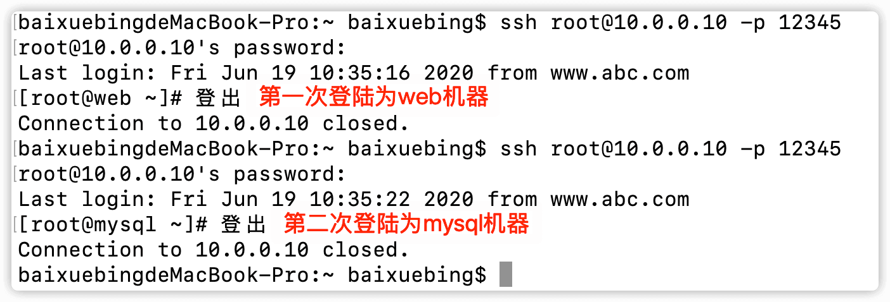
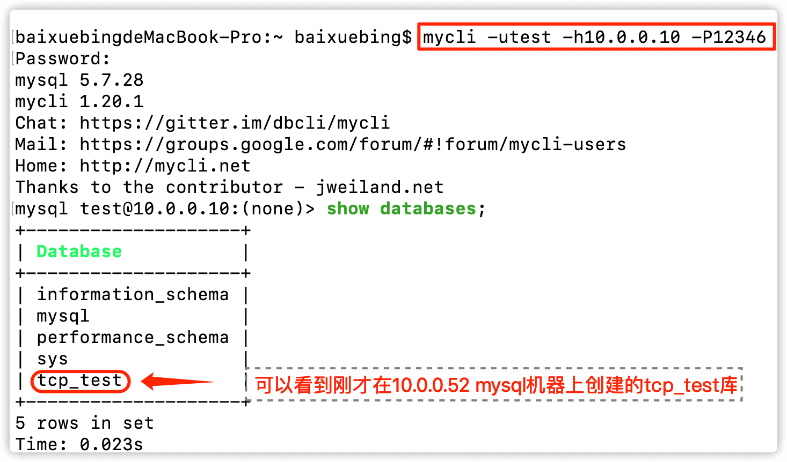

# nginx四层负载均衡

[nginx四层负载均衡官方文档](https://docs.nginx.com/nginx/admin-guide/load-balancer/tcp-udp-load-balancer/)


# 一、nginx四层负载均衡简介

[nginx官网对于--with-stream模块的简介](https://nginx.org/en/docs/stream/ngx_stream_core_module.html)

- nginx从1.9.0版本开始，新增了`ngx_stream_core_module` 模块，使nginx支持四层负载均衡。默认编译的时候该模块并未编译进去，需要编译的时候添加 `--with-stream`，使其支持stream代理。

- [负载平衡](https://www.nginx.com/solutions/load-balancing/?_ga=2.171279264.1088184775.1592298585-787841938.1592298585)是指在多个后端服务器之间有效地分配网络流量。

- nginx可以代理和负载平衡传输控制协议（TCP）通信。TCP是许多流行的应用程序和服务的协议，例如LDAP，MySQL和RTMP。

- nginx可以代理和负载均衡UDP流量。UDP（用户数据报协议）是许多流行的非事务性应用程序的协议，例如DNS，syslog和RADIUS。


# 二、先决条件

- 需要模块`--with-stream`的支持
- 通过TCP或UDP进行通信的应用程序，数据库或服务
- 上游服务器，每个服务器运行应用程序，数据库或服务的相同实例


# 三、官方配置示例

## 3.1 配置反向代理

首先，需要配置反向代理，以便NGINX可以将TCP连接或UDP数据报从客户端转发到上游组或代理服务器。

### 3.1.1 创建一个顶级[`stream{}`](https://nginx.org/en/docs/stream/ngx_stream_core_module.html#stream)块：

```nginx
stream {
    # ...
}
```


[`server {}`](https://nginx.org/en/docs/stream/ngx_stream_core_module.html#server)在顶级`stream` `{}`上下文中为每个虚拟服务器定义一个或多个配置块。


### 3.1.2 在`server` `{}`每个服务器的配置块中，包括[`listen`](https://nginx.org/en/docs/stream/ngx_stream_core_module.html#listen)用于定义服务器侦听的IP地址或端口的指令。

对于UDP通信，还包括[`udp`](https://nginx.org/en/docs/stream/ngx_stream_core_module.html#udp)参数。由于TCP是`stream`上下文的默认协议，因此`tcp`该`listen`指令没有参数：

```nginx
stream {

    server {
        listen 12345;
        # ...
    }

    server {
        listen 53 udp;
        # ...
    }
    # ...
}
```


### 3.1.3 配置[`proxy_pass`](https://nginx.org/en/docs/stream/ngx_stream_proxy_module.html#proxy_pass)指令以定义代理服务器或服务器将流量转发到的上游组

```nginx
stream {

    server {
        listen     12345;
        #TCP流量将转发到"stream_backend"上游组
        proxy_pass stream_backend;
    }

    server {
        listen     12346;
        #TCP流量将被转发到指定的服务器
        proxy_pass backend.example.com:12346;
    }

    server {
        listen     53 udp;
        #UDP流量将转发到"dns_servers"上游组
        proxy_pass dns_servers;
    }
    # ...
}
```


### 3.1.4 配置代理绑定

**如果代理服务器具有多个网络接口，则可以选择将NGINX配置为在连接到上游服务器时使用特定的源IP地址。如果将NGINX之后的代理服务器配置为接受来自特定IP网络或IP地址范围的连接，这可能很有用**

**包括[`proxy_bind`](https://nginx.org/en/docs/stream/ngx_stream_proxy_module.html#proxy_bind)指令和相应网络接口的IP地址**

```nginx
stream {
    # ...
    server {
        listen     127.0.0.1:12345;
        proxy_pass backend.example.com:12345;
        proxy_bind 127.0.0.1:12345;
    }
}
```


### 3.1.5 配置缓冲

可以调整两个内存缓冲区的大小，NGINX可以在其中放置来自客户端和上游连接的数据。如果数据量很小，则可以减少缓冲区，这可以节省内存资源。如果有大量数据，则可以增加缓冲区大小以减少套接字读/写操作的数量。在一个连接上接收到数据后，NGINX将读取该数据并通过另一连接转发该数据。缓冲区由[`proxy_buffer_size`](https://nginx.org/en/docs/stream/ngx_stream_proxy_module.html#proxy_buffer_size)伪指令控制：

```nginx
stream {
    # ...
    server {
        listen            127.0.0.1:12345;
        proxy_pass        backend.example.com:12345;
        proxy_buffer_size 16k;
    }
}
```


## 3.2 配置TCP或UDP负载平衡

### 3.2.1 创建一组服务器

[`upstream{}`](https://nginx.org/en/docs/stream/ngx_stream_upstream_module.html?&_ga=2.243518597.1088184775.1592298585-787841938.1592298585#upstream)在顶级[`stream` `{}`](https://nginx.org/en/docs/stream/ngx_stream_core_module.html#stream)上下文中定义一个或多个配置块，并为上游组（例如，`stream_backend`TCP服务器和`dns_servers`UDP服务器）设置名称：

确保上游组的名称由[`proxy_pass`](https://nginx.org/en/docs/stream/ngx_stream_proxy_module.html#proxy_pass)指令引用，就像[上面](https://docs.nginx.com/nginx/admin-guide/load-balancer/tcp-udp-load-balancer/#proxy_pass)为反向代理配置的指令一样。

```nginx
stream {

    upstream stream_backend {
        # ...
    }

    upstream dns_servers {
        # ...
    }

    # ...
}
```


### 3.2.2 在服务器组中添加后端真实服务器(上游服务器)

在该[`upstream` `{}`](https://nginx.org/en/docs/stream/ngx_stream_upstream_module.html#upstream)块内，[`server`](https://nginx.org/en/docs/stream/ngx_stream_upstream_module.html#server)为每个上游服务器添加一个指令，指定其IP地址或主机名（可以解析为多个IP地址）和一个必需的端口号。请注意，并未为每个服务器定义协议，因为该协议是由在[前面](https://docs.nginx.com/nginx/admin-guide/load-balancer/tcp-udp-load-balancer/#proxy_pass)创建`listen`的`server`块中的指令中包含的参数为整个上游组定义的。

```nginx
stream {

    upstream stream_backend {
        server backend1.example.com:12345;
        server backend2.example.com:12345;
        server backend3.example.com:12346;
        # ...
    }

    upstream dns_servers {
        server 192.168.136.130:53;
        server 192.168.136.131:53;
        # ...
    }

    # ...
}
```


### 3.2.3 配置上游服务器组的负载均衡算法

#### 3.2.3.1 **轮询 Round Robin** 

默认情况下，NGINX使用Round Robin算法来负载均衡流量，将其顺序地定向到已配置的上游组中的服务器。因为它是默认方法，所以没有`round‑robin`指令。只需在顶级上下文中创建配置块并添加上一步中所述的指令。`upstream {} stream {} server`


#### 3.2.3.2 [**最少连接**](https://nginx.org/en/docs/stream/ngx_stream_upstream_module.html#least_conn) 

**NGINX选择当前活动连接数量较少的服务器。**


#### 3.2.3.3 哈希 hash

NGINX根据用户定义的密钥（例如，源IP地址（[`$remote_addr`](https://nginx.org/en/docs/http/ngx_http_core_module.html#var_remote_addr)））选择服务器：

```nginx
upstream stream_backend {
    hash $remote_addr;
    server backend1.example.com:12345;
    server backend2.example.com:12345;
    server backend3.example.com:12346;
}
```


该`Hash`负载平衡方法也可以用来配置会话持久性。由于哈希函数基于客户端IP地址，因此除非服务器关闭或不可用，否则来自给定客户端的连接将始终传递到同一服务器。指定一个可选`consistent`参数以应用[ketama](https://www.last.fm/user/RJ/journal/2007/04/10/rz_libketama_-_a_consistent_hashing_algo_for_memcache_clients)一致性哈希方法：

```nginx
hash $remote_addr consistent;
```


### 3.2.4 为每个上游服务器指定服务器特定的参数，包括[最大连接数](https://nginx.org/en/docs/stream/ngx_stream_upstream_module.html#max_conns)，[服务器权重](https://nginx.org/en/docs/stream/ngx_stream_upstream_module.html#weight)等(可选)

```nginx
upstream stream_backend {
    hash   $remote_addr consistent;
    server backend1.example.com:12345 weight=5;
    server backend2.example.com:12345;
    server backend3.example.com:12346 max_conns=3;
}

upstream dns_servers {
    least_conn;
    server 192.168.136.130:53;
    server 192.168.136.131:53;
    # ...
}
```


另一种方法是将流量代理到单个服务器而不是上游组。如果您通过主机名标识服务器，并配置主机名以解析为多个IP地址，则NGINX使用该`Round Robin`算法对IP地址之间的流量进行负载平衡。在这种情况下，您必须在`proxy_pass`指令中指定服务器的端口号，并且不得在IP地址或主机名之前指定协议

```nginx
stream {
    # ...
    server {
        listen     12345;
        proxy_pass backend.example.com:12345;
    }
}
```


## 3.3 配置TCP健康检查

[nginx TCP健康检查官方文档](https://docs.nginx.com/nginx/admin-guide/load-balancer/tcp-health-check/)

### 3.3.1 简介

- **nginx TCP健康检查可以持续测试TCP上游服务器，避免出现故障的服务器，并可以将恢复的服务器正常地添加到负载平衡组中**


### 3.3.2 前提条件

已在[`stream`](https://nginx.org/en/docs/stream/ngx_stream_core_module.html#stream)上下文中配置了TCP服务器的上游组**

```nginx
stream {
    #...
    upstream stream_backend {
    server backend1.example.com:12345;
    server backend2.example.com:12345;
    server backend3.example.com:12345;
   }
    #...
}
```


**已经配置了将TCP连接传递到服务器组的服务器**

```nginx
stream {
    #...
    server {
        listen     12345;
        proxy_pass stream_backend;
    }
    #...
}
```


### 3.3.3 被动TCP运行状况检查

**如果连接上游服务器的尝试超时或导致错误，NGINX可以将服务器标记为不可用，并在指定的时间内停止向其发送请求。要定义NGINX认为上游服务器不可用的条件，请在[`server`](https://nginx.org/en/docs/stream/ngx_stream_upstream_module.html#server)指令中包含以下参数**

- **[`fail_timeout`](https://nginx.org/en/docs/stream/ngx_stream_upstream_module.html#fail_timeout) –在指定的连接尝试次数内必须失败的时间，才能将服务器视为不可用。同样，NGINX将服务器标记为不可用后的时间。**
- **[`max_fails`](https://nginx.org/en/docs/stream/ngx_stream_upstream_module.html#max_fails) –在指定时间内NGINX认为服务器不可用的失败尝试次数。**


默认值为`10`秒数和`1`尝试次数。因此，如果连接尝试超时或在10秒钟内至少失败一次，NGINX会将服务器标记为10秒钟不可用。该示例显示了如何在30秒内将这些参数设置为2个失败

```nginx
upstream stream_backend {
    server backend1.example.com:12345 weight=5;
    server backend2.example.com:12345 max_fails=2 fail_timeout=30s;
    server backend3.example.com:12346 max_conns=3;
}
```


#### 3.3.3.1 服务器缓慢启动(只有nginx plus可以使用)

最近恢复的上游服务器很容易被连接淹没，这可能导致服务器再次标记为不可用。慢速启动允许上游服务器在恢复或可用后将其权重从零逐渐恢复到其标称值。这可以通过[`slow_start`](https://nginx.org/en/docs/stream/ngx_stream_upstream_module.html#slow_start)上游[`server`](https://nginx.org/en/docs/stream/ngx_stream_upstream_module.html#server)指令的参数来完成

```nginx
upstream backend {
    server backend1.example.com:12345 slow_start=30s;
    server backend2.example.com;
    server 192.0.0.1 backup;
}
```

**<span style=color:red>⚠️请注意，如果组中只有一台服务器，则将`slow_start`忽略该参数，并且永远不会将服务器标记为不可用。慢速启动是NGINX Plus独有的</span>**


## 3.4 配置UDP健康检查

[nginx UDP健康检查官方文档](https://docs.nginx.com/nginx/admin-guide/load-balancer/udp-health-check/)


### 3.4.1 前提条件

已配置上下文中的上游服务器组来处理UDP网络流量（DNS，RADIUS，系统日志），例如：[`stream {}`](https://nginx.org/en/docs/stream/ngx_stream_core_module.html#stream)

```nginx
stream {
    #...
    upstream dns_upstream {
        server 192.168.136.130:53;
        server 192.168.136.131:53;
        server 192.168.136.132:53;
    }
    #...
}
```


已经配置了将UDP数据报传递到上游服务器组的服务器

```nginx
stream {
    #...
    server {
        listen          53 udp;
        proxy_pass      dns_upstream;
        proxy_timeout   1s;
        proxy_responses 1;
        error_log       logs/dns.log;
    }
    #...
}
```


### 3.4.2 被动UDP健康检查

如果服务器回复错误或超时，则NGINX可以将服务器标记为不可用，并在一段时间内停止向其发送UDP数据报。

[`max_fails`](https://nginx.org/en/docs/stream/ngx_stream_upstream_module.html#max_fails)使用[上游服务器](https://nginx.org/en/docs/stream/ngx_stream_upstream_module.html#server)的参数设置在特定时间段内连续失败的连接尝试次数（默认值为`1`）。

时间段由[`fail_timeout`](https://nginx.org/en/docs/stream/ngx_stream_upstream_module.html#fail_timeout)参数设置（默认值为`10`秒）。该参数还设置了NGINX标记服务器后认为服务器不可用的时间。

因此，如果连接尝试超时或在10秒内至少失败一次，NGINX会将服务器标记为10秒钟不可用。该示例显示了如何在60秒内将这些参数设置为2个失败：

```nginx
upstream dns_upstream {
    server 192.168.136.130:53 fail_timeout=60s;
    server 192.168.136.131:53 fail_timeout=60s;
}
```


# 四、TCP和UDP负载平衡配置官方总示例

在此示例中，所有与TCP和UDP代理相关的功能都在[`stream`](https://nginx.org/en/docs/stream/ngx_stream_core_module.html#stream)块内进行配置，就像在[`http`](https://nginx.org/en/docs/http/ngx_http_core_module.html#http)块中配置了HTTP请求的设置一样。

有两个命名的[`upstream`](https://nginx.org/en/docs/stream/ngx_stream_upstream_module.html#upstream)块，每个块包含三个托管彼此相同内容的服务器。在[`server`](https://nginx.org/en/docs/stream/ngx_stream_upstream_module.html#server)for eadch服务器中，服务器名称后跟必需的端口号。根据“ [最少连接”](https://nginx.org/en/docs/stream/ngx_stream_upstream_module.html#least_conn)负载平衡方法，[连接](https://nginx.org/en/docs/stream/ngx_stream_upstream_module.html#least_conn)在服务器之间分配：连接到活动连接最少的服务器。

这三个[`server`](https://nginx.org/en/docs/stream/ngx_stream_upstream_module.html#server)块定义了三个虚拟服务器：

- 第一台服务器侦听端口12345，并将所有TCP连接代理到上游服务器的**stream_backend**组。请注意，在模块[`proxy_pass`](https://nginx.org/en/docs/stream/ngx_stream_proxy_module.html#proxy_pass)上下文中定义的指令`stream`不得包含协议。

  指定了两个可选的超时参数：[`proxy_connect_timeout`](https://nginx.org/en/docs/stream/ngx_stream_proxy_module.html#proxy_connect_timeout)伪指令设置与**stream_backend**组中的服务器建立连接所需的超时。该[`proxy_timeout`](https://nginx.org/en/docs/stream/ngx_stream_proxy_module.html#proxy_timeout)指令设置在代理到**stream_backend**组中的一台服务器已启动之后使用的超时。

- 第二台服务器侦听端口53，并将所有UDP数据报（指令的`udp`参数`listen`）代理到称为**dns_servers**的上游组。如果`udp`未指定该参数，则套接字监听TCP连接。

- 第三台虚拟服务器侦听端口12346，并代理到**backend4.example.com的** TCP连接，后者可以解析为使用Round Robin方法实现负载平衡的多个IP地址。

```nginx
stream {
    upstream stream_backend {
        least_conn;
        server backend1.example.com:12345 weight=5;
        server backend2.example.com:12345 max_fails=2 fail_timeout=30s;
        server backend3.example.com:12345 max_conns=3;
    }
    
    upstream dns_servers {
        least_conn;
        server 192.168.136.130:53;
        server 192.168.136.131:53;
        server 192.168.136.132:53;
    }
    
    server {
        listen        12345;
        proxy_pass    stream_backend;
        proxy_timeout 3s;
        proxy_connect_timeout 1s;
    }
    
    server {
        listen     53 udp;
        proxy_pass dns_servers;
    }
    
    server {
        listen     12346;
        proxy_pass backend4.example.com:12346;
    }
}
```


# 五、实际配置示例

## 5.1 实验说明

**官方对于TCP负载均衡的说明，应该选择使用TCP协议的服务去验证**

- **nginx可以代理和负载平衡传输控制协议（TCP）通信。TCP是许多流行的应用程序和服务的协议，例如LDAP，MySQL和RTMP。**


**这里选择使用TCP协议的mysql和ssh服务作为实验对象，便于验证**

- **1.访问负载均衡的12345端口，连接至后端web的22端口**

- **2.访问负载均衡的12346端口，连接至后端mysql的3306端口**


**实验环境**

| **服务器角色** | **外网**ip**** | **主机名** |
| -------------- | -------------- | ---------- |
| **lb**         | **10.0.0.10**  | **lb**     |
| **web01**      | **10.0.0.51**  | **web**    |
| **mysql**      | **10.0.0.52**  | **mysql**  |


## 5.2 负载均衡lb操作


**<span style=color:red>⚠️`stream {}` 必须与 `http {}`在同一级，而nginx主配置文件`/etc/nginx/nginx.conf`中`include /etc/nginx/conf.d/*.conf;`是在`http`中的，因此在`/etc/nginx/conf.d/`下编辑含有`stream {} `的配置文件是会报错的</span>**


**编辑nginx主配置文件`/etc/nginx/nginx.conf`**

```nginx
#在events下方 http上方加入以下内容，以解决stream必须与http同级的问题
include /etc/nginx/conf.e/*.conf;
```


**创建目录**

```shell
mkdir /etc/nginx/conf.e
```


**编辑nginx配置文件**

```nginx
cat > /etc/nginx/conf.e/tcp.conf<<'EOF'
stream {
  #1.定义虚拟资源池
  upstream ssh {
    server 10.0.0.51:22;
    server 10.0.0.52:22;
  }

  upstream mysql {
    server 10.0.0.52:3306;
  }

  #2.调用虚拟资源池
  server {
    listen 12345;
    proxy_pass ssh;
  }

  server {
    listen 12346;
    proxy_pass mysql;
  }

}
EOF
```


**检测nginx语法并重载nginx**

```shell
$ nginx -t
nginx: the configuration file /etc/nginx/nginx.conf syntax is ok
nginx: configuration file /etc/nginx/nginx.conf test is successful

$ nginx -s reload
```


## 5.3 测试

### 5.3.1 ssh连接测试

**连接lb的12345端口，因为默认算法是rr，因此会轮流连接到web和mysql机器**




### 5.3.2 mysql连接测试

测试前在mysql机器上进行一个授权

```mysql
mysql> grant all on *.* to test@'%' identified by 'test';
Query OK, 0 rows affected, 1 warning (0.00 sec)
```

创建一个数据库，便于确认

```mysql
mysql> create database tcp_test;
Query OK, 1 row affected (0.00 sec)
```

连接成功，通过lb的四层负载均衡进行的端口转发连接到了mysql机器上的3306端口




