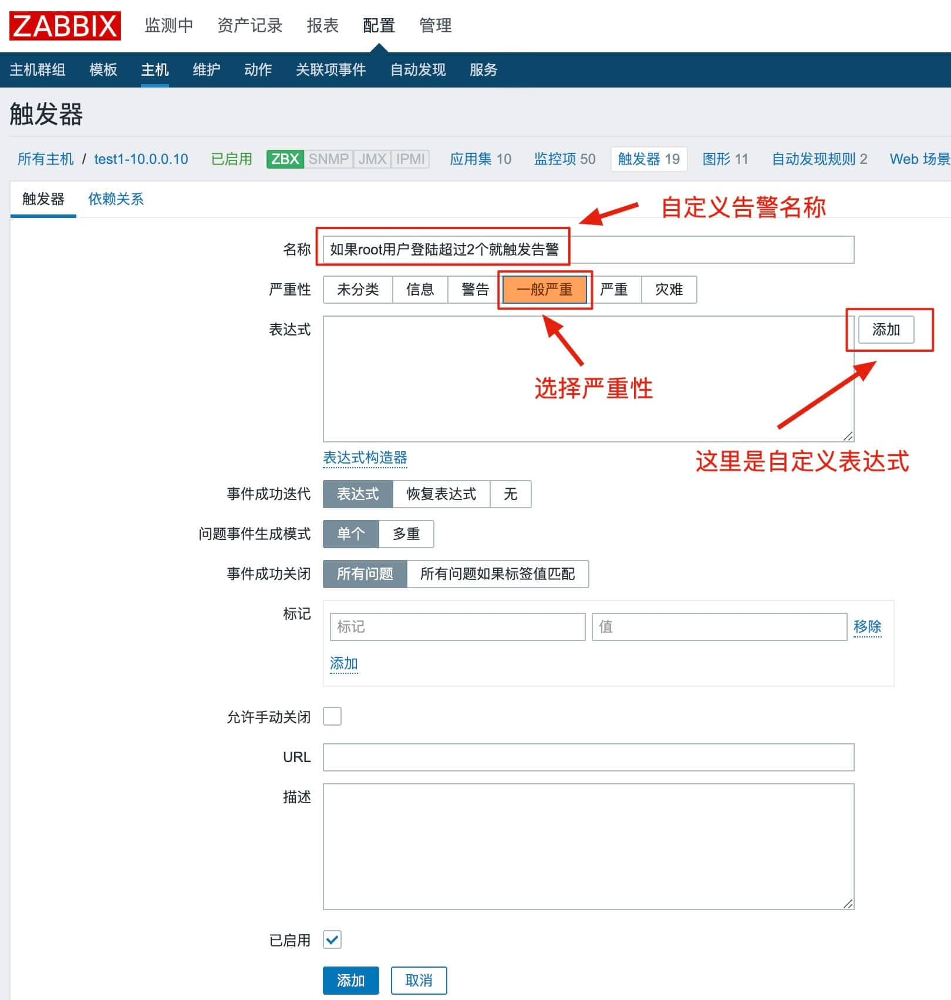
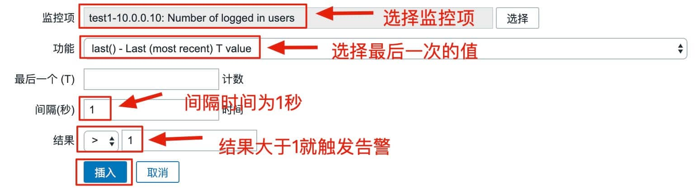
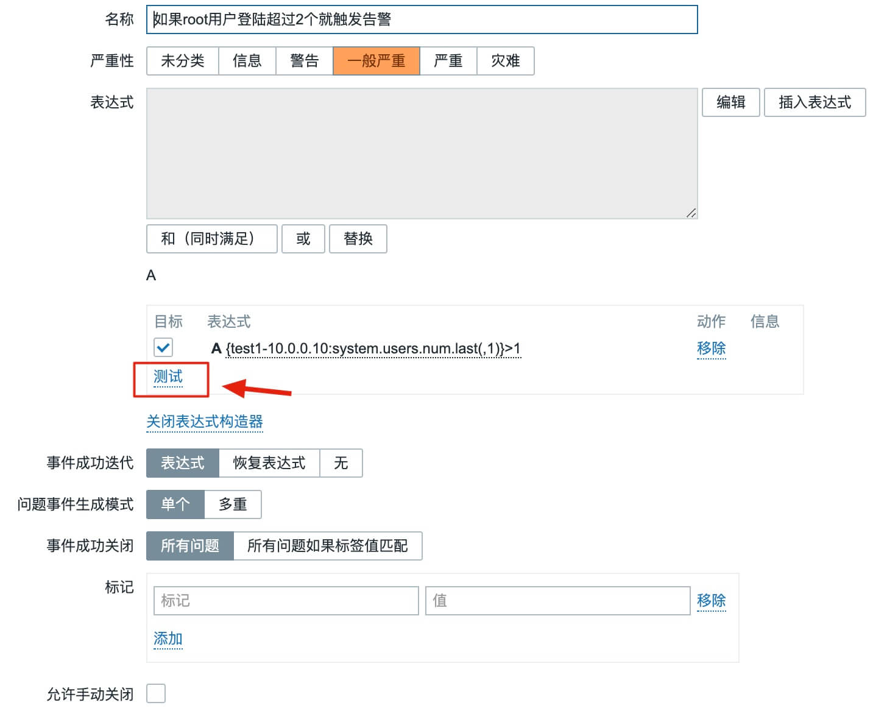
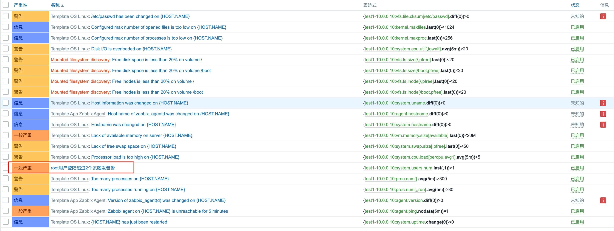
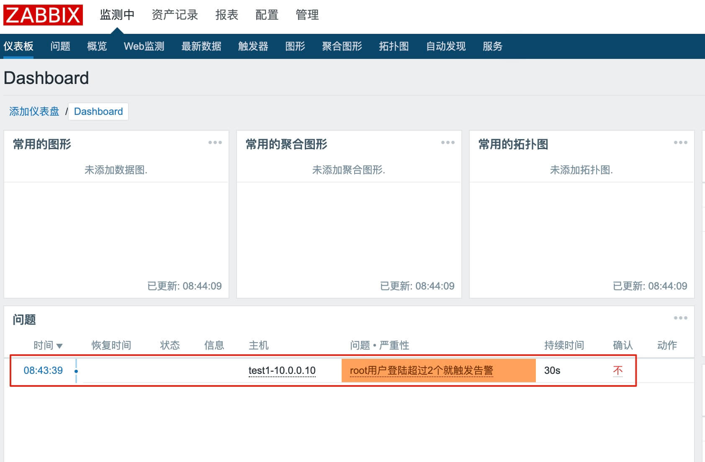
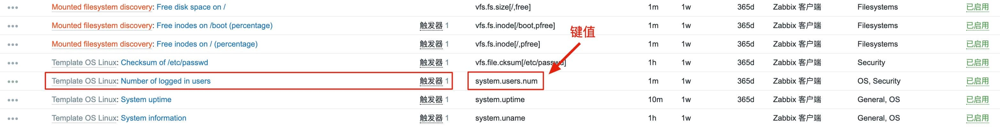

# zabbix3.4创建自定义触发器

> **触发器：trigger	当监控项超过阈值时，产生告警**


# 第一步，配置-->主机-->主机列表处的触发器-->创建触发器




# 第二步，添加表达式




# 第三步，添加表达式后测试表达式




# 第四步，查看触发器列表中刚添加的触发器




# 第五步，查看监控项中刚添加的触发器

**配置-->主机-->主机列表中的主机-->监控项**


# 第六步，开启zabbix监控面板告警声音

**右上角-->小人头-->正在发送消息-->勾选要接受的告警**


# 第七步，查看zabbix监控首页

**在用一个终端登陆zabbix-agent主机，此时root登陆数为2，就会触发告警**




# 第八步，查看键值

**添加完成后，可以在zabbix-server端获取监控项的值**

**配置-->主机-->主机列表-->监控项-->键值**




**zabbix-server端取值**

```python
#zabbix-server端安装zabbix-get包
[root@zabbix-server ~]# yum -y install zabbix-get

#对agent端取键值，结果为2表明root用户登陆数为2
[root@zabbix-server ~]# zabbix_get -s 10.0.0.10 -k system.users.num
2

-s	指定agent端IP地址
-k	键值
```

