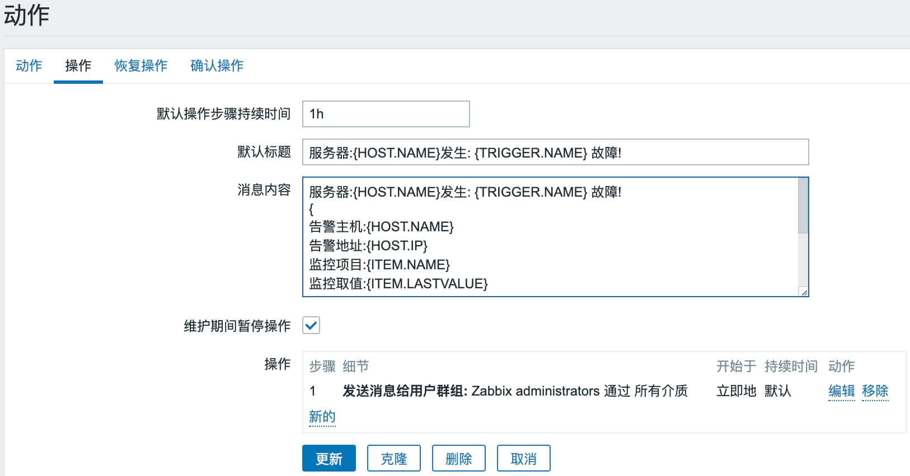

# zabbix3.4自定义告警内容

# 1.启动默认告警项

**配置-->动作**


# 2.修改告警内容

**默认告警信息**

```python
#告警标题
Problem: {TRIGGER.NAME}

#告警内容
Problem started at {EVENT.TIME} on {EVENT.DATE}
Problem name: {TRIGGER.NAME}
Host: {HOST.NAME}
Severity: {TRIGGER.SEVERITY}
Original problem ID: {EVENT.ID}

{TRIGGER.URL}
```

---

**修改告警默认标题如下**

```python
服务器:{HOST.NAME}发生: {TRIGGER.NAME} 故障!
```


**修改告警内容如下**

```python
服务器:{HOST.NAME}发生: {TRIGGER.NAME} 故障!
{
告警主机:{HOST.NAME}
告警地址:{HOST.IP}
监控项目:{ITEM.NAME}
监控取值:{ITEM.LASTVALUE}
告警等级:{TRIGGER.SEVERITY}
当前状态:{TRIGGER.STATUS}
告警信息:{TRIGGER.NAME}
告警时间:{EVENT.DATE} {EVENT.TIME}
事件ID:{EVENT.ID}
}
```




# 3.修改恢复内容

**默认恢复信息**

```python
#恢复标题
Resolved: {TRIGGER.NAME}

#恢复内容
Problem has been resolved at {EVENT.RECOVERY.TIME} on {EVENT.RECOVERY.DATE}
Problem name: {TRIGGER.NAME}
Host: {HOST.NAME}
Severity: {TRIGGER.SEVERITY}

Original problem ID: {EVENT.ID}
{TRIGGER.URL}
```

---

**修改恢复信息标题如下**

```python
服务器:{HOST.NAME}: {TRIGGER.NAME} 已恢复!
```


**修改恢复信息如下**

```python
服务器:{HOST.NAME}: {TRIGGER.NAME} 已恢复!
{
告警主机:{HOST.NAME}
告警地址:{HOST.IP}
监控项目:{ITEM.NAME}
监控取值:{ITEM.LASTVALUE}
告警等级:{TRIGGER.SEVERITY}
当前状态:{TRIGGER.STATUS}
告警信息:{TRIGGER.NAME}
告警时间:{EVENT.DATE} {EVENT.TIME}
恢复时间:{EVENT.RECOVERY.DATE} {EVENT.RECOVERY.TIME}
持续时间:{EVENT.AGE}
事件ID:{EVENT.ID}
}
```


# 4.修改确认操作

**默认确认信息**

```python
#确认标题
Acknowledged: {TRIGGER.NAME}

#确认内容
{USER.FULLNAME} acknowledged problem at {ACK.DATE} {ACK.TIME} with the following message:
{ACK.MESSAGE}

Current problem status is {EVENT.STATUS}
```

---

**修改确认标题如下**

```python
服务器:{HOST.NAME}:  报警确认
```

**修改确认内容如下**

```python
{
确认人:{USER.FULLNAME} 
时间:{ACK.DATE} {ACK.TIME} 
确认信息如下:
"{ACK.MESSAGE}"
问题服务器IP:{HOSTNAME1}
问题ID:{EVENT.ID}
当前的问题是: {TRIGGER.NAME}
}
```


**修改完后点击更新**