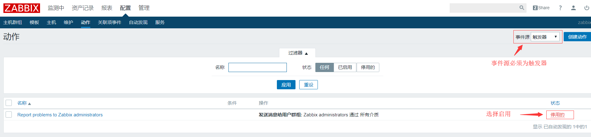
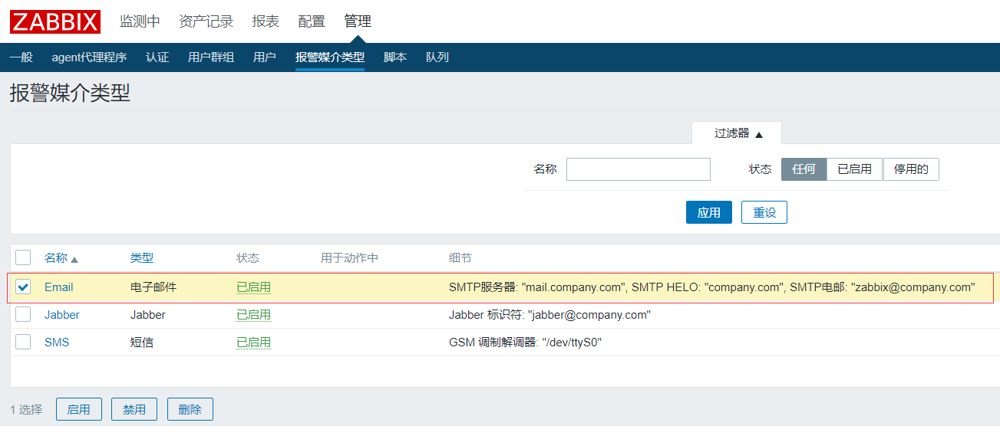
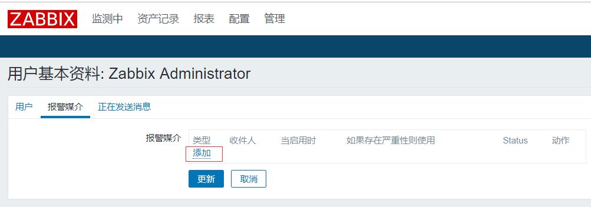
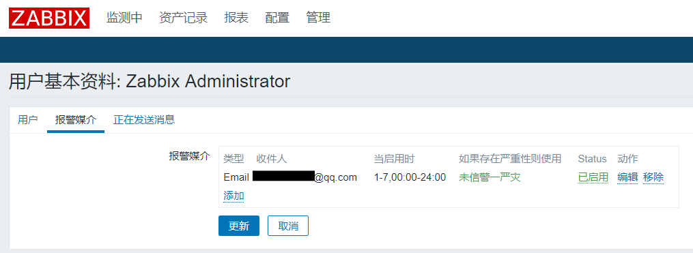
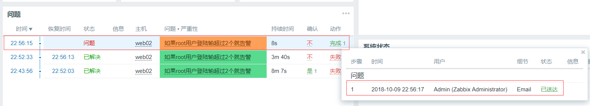
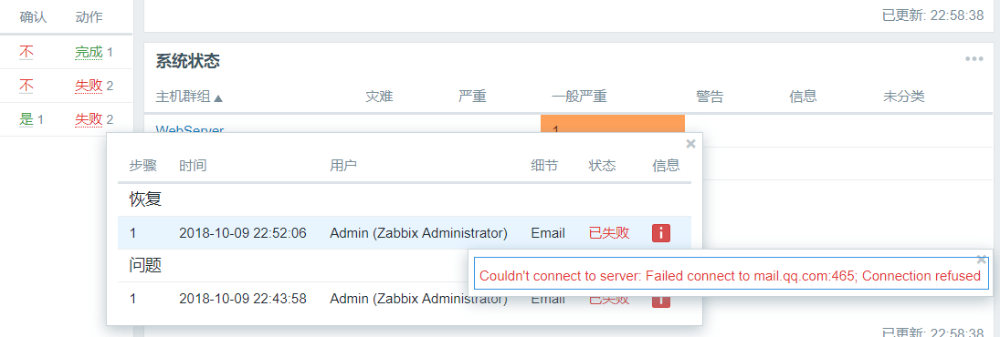
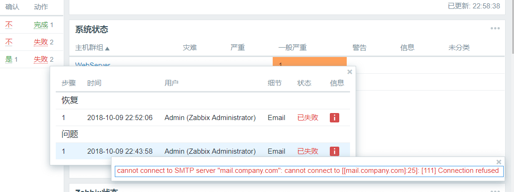

# zabbix3.4设置邮件告警

## 第一步、配置-->动作-->启用动作

## 第二步、管理-->报警媒介类型-->选择Email

## 第三步、设置服务器发件人，使用邮箱账户和授权密码，授权密码在qq邮箱官网中设置

## 第四步、设置收件人邮箱，右上角小人头-->报警媒介--添加

## 第五步、收件人类型选择Email，填写收件人邮箱，接受报警级别，添加

## 第六步、确认没有问题，点击更新

## 第七步、验证是否发送邮件

## 第八步、qq邮箱查看邮件

### 邮件发送失败

**发送邮件失败原因1：qq邮箱服务器地址写错，正确为smtp.qq.com，而不是mail.qq.com**

**发送邮件失败原因2：填写发件人信息后没有保存**

