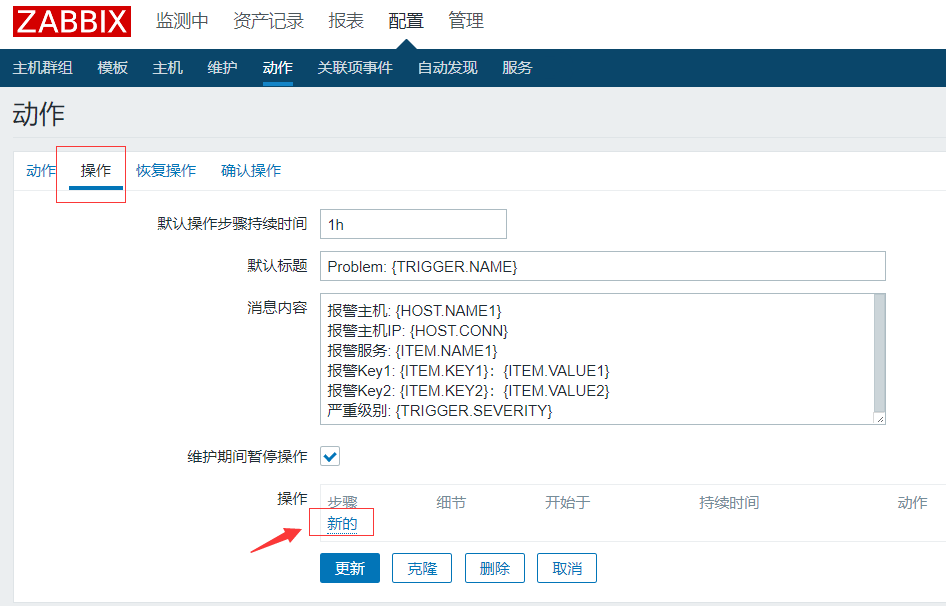
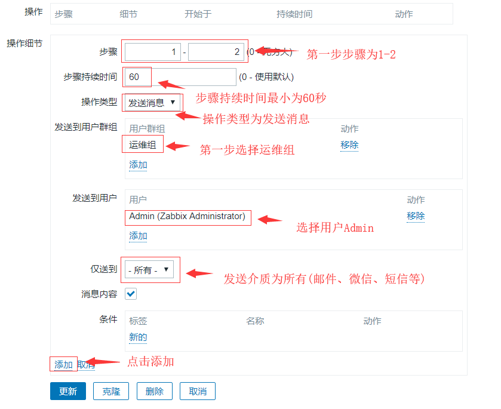
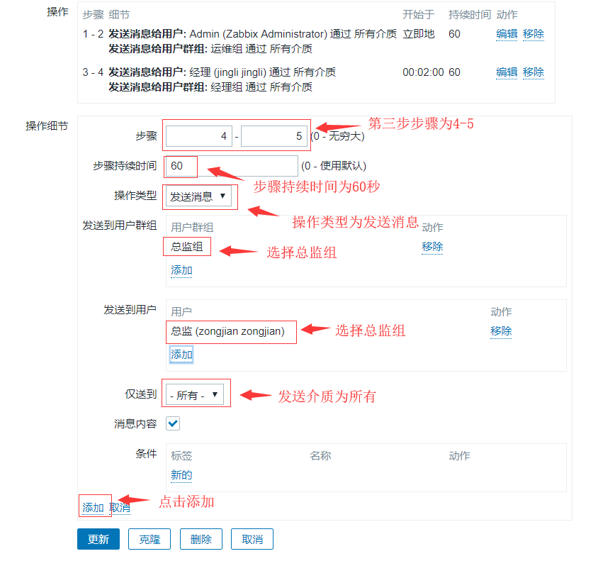
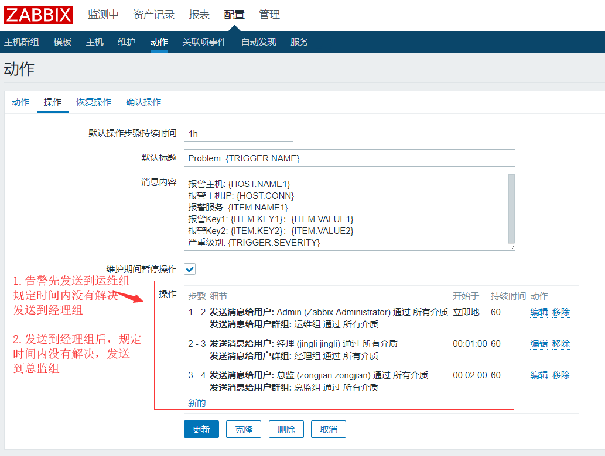
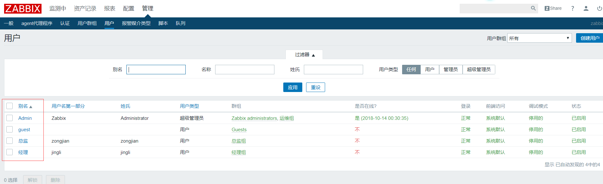
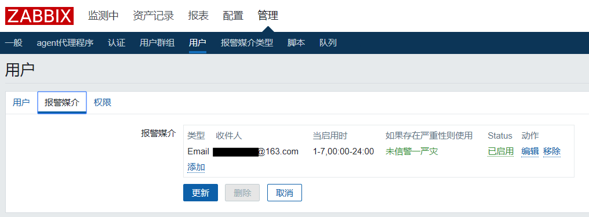
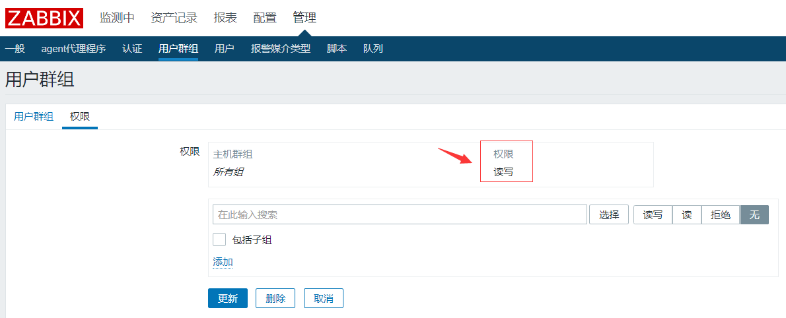
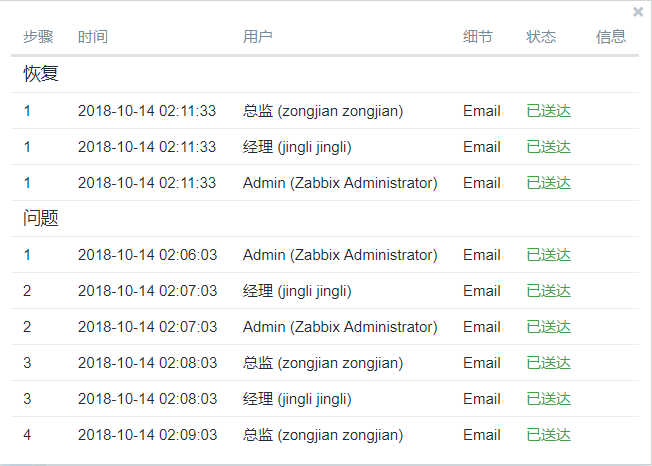

# zabbix3.4设置邮件告警升级

# **一、邮件告警升级过程**

**这里仅作示例**

**1.首先发给运维组，持续10分钟**

**2.运维组没有解决，发给经理组，持续10分钟**

**3.经理组没有解决，发给总监组**

# 二、邮件告警升级过程配置

## 2.1配置-->动作-->选择动作(这里选择默认)

## 2.2操作-->点击 新的

## 2.3填写第一步发送设置

## 2.4填写第二步发送设置

## 2.5填写第三步发送设置

## 2.6添加完成后页面

**操作步骤写1-2，2-3，3-4	1-2，3-4，5-6都可以**

## 2.7添加完成后在相应用户填写收件地址即可，管理-->用户--报警媒介

## 2.8给创建的用户群组赋予读写权限

**管理-->用户群组-->选择创建的用户群组-->权限**

## 2.9验证

**经过测试**

**1.管理员即运维组先收到告警，对应下图中问题下方1**

**2.规定时间没有完成发送给经理组，对应下图中问题下方2**

**3.经理组在规定时间内没有完成处理发送给总监组，对应下图中问题下方3，应为本文中设置总监接受1分钟，因此总监只接受一次**

**4.如果恢复，运维组、经理组、总监组都会收到恢复信息**

****