# openstack中的卷

- openstack中卷可以转换成镜像，镜像也可以转换成卷

在块存储节点上的配置文件`/etc/lvm/lvm.conf`中定义了使用lvm作为后端存储

- a/sdb/代表一个lvm，a/sdc/代表另一个lvm，可以有多个磁盘做成lvm

```python
在该devices部分中，添加一个接受/dev/sdb设备并拒绝所有其他设备的过滤 器：
devices {
...
filter = [ "a/sdb/", "a/sdc/", "r/.*/"]
```


`/etc/cinder/cinder.conf`文件中关于后端存储的定义

- enabled_backends = sata,ssd表示的是后端存储的名称，名称任意，这里使用`/dev/sdb`和`/dev/sdc`做了两个lvm，分别模拟普通的sata盘和较快速的固态硬盘(ssd)
- enabled_backends后边的任意名称会在配置文件中作为单独的一个区域存在，这个区域中的`volume_backend_name`会在后续创建卷的时候指定磁盘的类型，其中`volume_backend_name`是键，后边的sata和ssd是值，这样的话就能把普通磁盘和ssd磁盘区分开来并且给实例挂载不同的磁盘

```python
#后段名称任意，这里我们定义为普通磁盘sata，固态硬盘ssd
[DEFAULT]
enabled_backends = sata,ssd

[sata]
volume_driver = cinder.volume.drivers.lvm.LVMVolumeDriver
volume_group = cinder-volumes
iscsi_protocol = iscsi
iscsi_helper = lioadm
volume_backend_name = sata

[ssd]
volume_driver = cinder.volume.drivers.lvm.LVMVolumeDriver
volume_group = cinder-ssd
iscsi_protocol = iscsi
iscsi_helper = lioadm
volume_backend_name = ssd
```


## 创建卷(没有卷)

项目-->卷-->卷-->创建卷

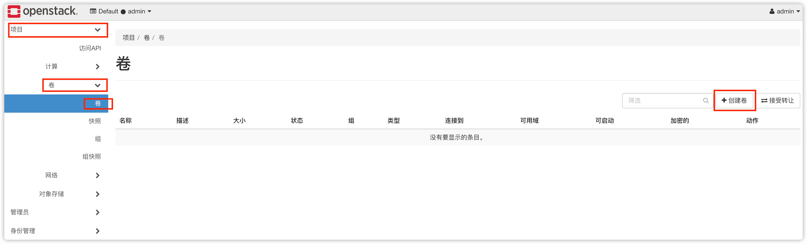


创建一个名为sata的卷

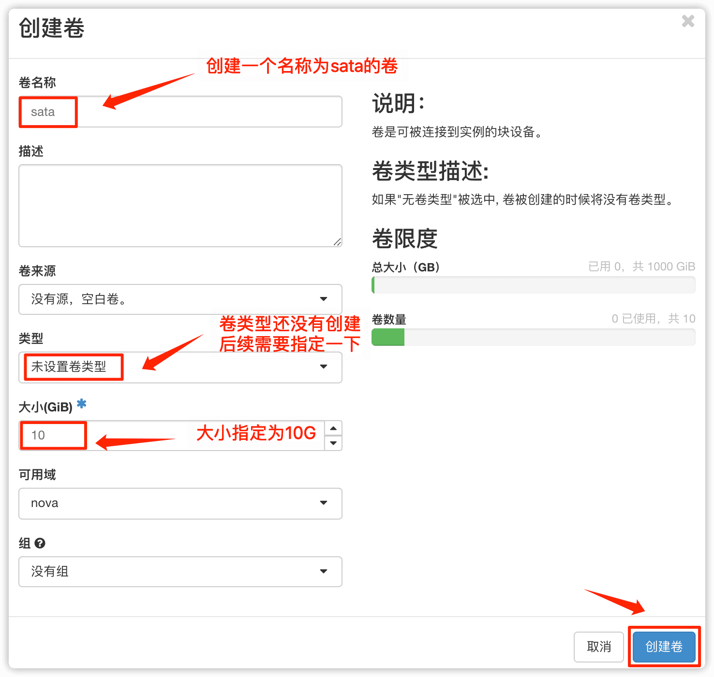

创建一个名为ssd的卷

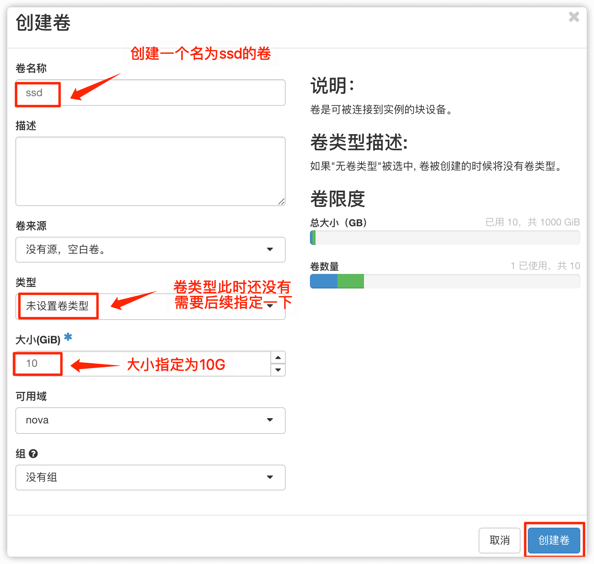


创建后的卷

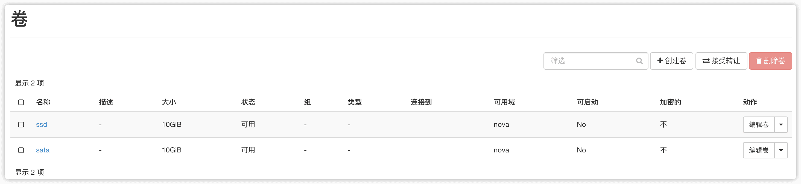


## 创建卷

管理员-->卷-->卷-->创建卷

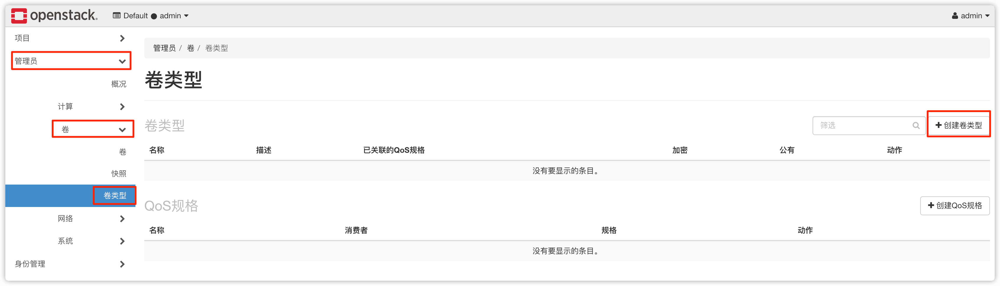


创建sata和ssd卷


创建后的卷


## 创建卷扩展规格

点击创建后的卷-->查看扩展规格


点击已创建

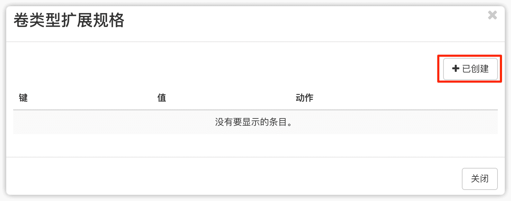


创建卷扩展规格，写入配置文件中的键和值，这里示例了ssd，sata是同样的操作


**键就是`/etc/cinder/cinder.conf`中enabled_backends对应的后端存储名称单独区域中的`volume_backend_name`**

```python
#后段名称任意，这里我们定义为普通磁盘sata，固态硬盘ssd
[DEFAULT]
enabled_backends = sata,ssd

[sata]
volume_driver = cinder.volume.drivers.lvm.LVMVolumeDriver
volume_group = cinder-volumes
iscsi_protocol = iscsi
iscsi_helper = lioadm
volume_backend_name = sata

[ssd]
volume_driver = cinder.volume.drivers.lvm.LVMVolumeDriver
volume_group = cinder-ssd
iscsi_protocol = iscsi
iscsi_helper = lioadm
volume_backend_name = ssd
```


创建后的卷扩展规格

ssd

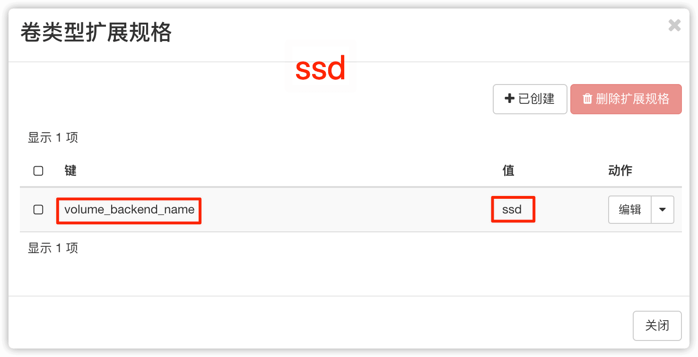

sata

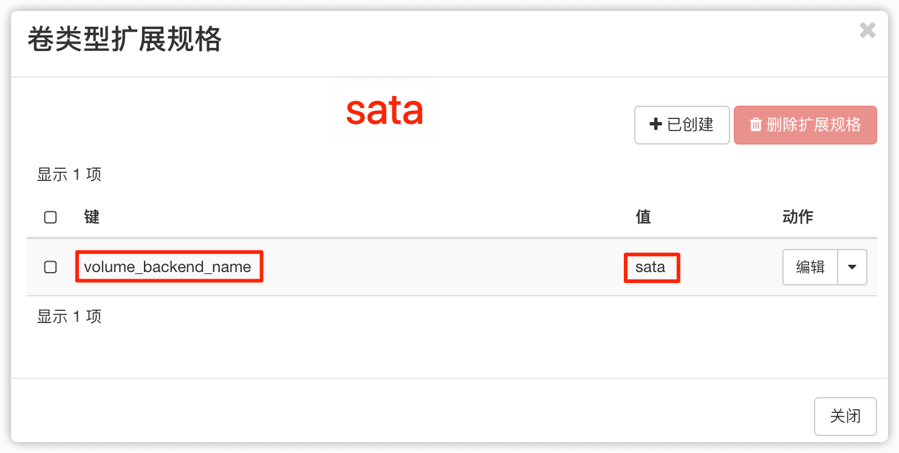


## 创建卷(有卷)

**删除之前创建的没有卷的卷**


创建sata类型的卷和ssd类型的卷


创建后的卷


## 给虚拟机关联卷

虚拟机中的初始磁盘，默认是1G大小


选择要连接卷的虚拟机，点击连接卷


选择一个卷连接


虚拟机中查看磁盘，发现会多了一个10G的磁盘


格式化后挂载


## 关于卷的安全性问题

上一步中把新关联的卷挂载到了`/mnt`，现在向新关联的卷写入一些内容

```python
$ echo 'test ssd' > /mnt/test.txt
$ cat /mnt/test.txt
test ssd
```


然后在web界面查看卷的ID

项目-->卷-->卷-->点击ssd


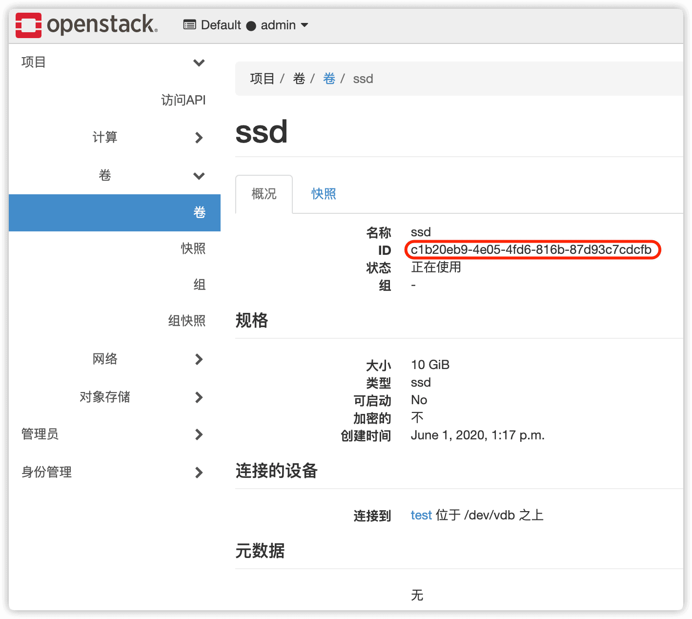


在块存储节点上查看lv，可以看到`volume-c1b20eb9-4e05-4fd6-816b-87d93c7cdcfb`是对应的ssd卷


这个ssd的具体路径是``/dev/mapper/cinder--ssd-volume--c1b20eb9--4e05--4fd6--816b--87d93c7cdcfb``


当尝试挂载这个ssd时是不被允许的

```python
[root@block1 ~]# mount /dev/mapper/cinder--ssd-volume--c1b20eb9--4e05--4fd6--816b--87d93c7cdcfb /opt
mount: /dev/mapper/cinder--ssd-volume--c1b20eb9--4e05--4fd6--816b--87d93c7cdcfb is already mounted or /opt busy
```


可以采用先拷贝这个文件然后再挂载(cp、dd都可以)

```python
#拷贝目录
cp /dev/mapper/cinder--ssd-volume--c1b20eb9--4e05--4fd6--816b--87d93c7cdcfb /root

#查看大小
[root@block1 ~]# ll -h
total 10G
-rw-r----- 1 root root 10G Jun  2 08:18 cinder--ssd-volume--c1b20eb9--4e05--4fd6--816b--87d93c7cdcfb

#挂载 loop的意思是用来把一个文件当成硬盘分区mount到目录
mount -o loop cinder--ssd-volume--c1b20eb9--4e05--4fd6--816b--87d93c7cdcfb /mnt

#进入/mnt目录，查看文件内容，此时是可以看见的
[root@block1 ~]# cd /mnt
[root@block1 mnt]# ls
lost+found  test.txt
[root@block1 mnt]# cat test.txt 
test ssd
```

**<span style=color:red>计算节点上虚拟机中的磁盘是可以被拷贝到计算节点的，并且内容可见</span>**


## 把虚拟机启动在卷上

openstack中的虚拟机默认是启动在计算节点上的

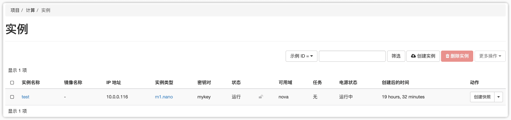


点击实例名称，查看示例id


虚拟机的存放位置默认是计算节点中的`/var/lib/nova/instances`


选择创建新卷、删除实例时删除卷，并且指定卷大小


源中指定了卷大小为5G，所以这里要选择和卷大小相同规格的根磁盘

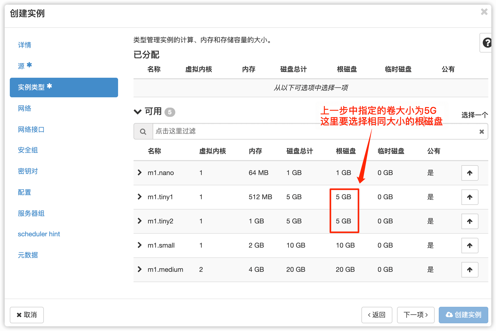


