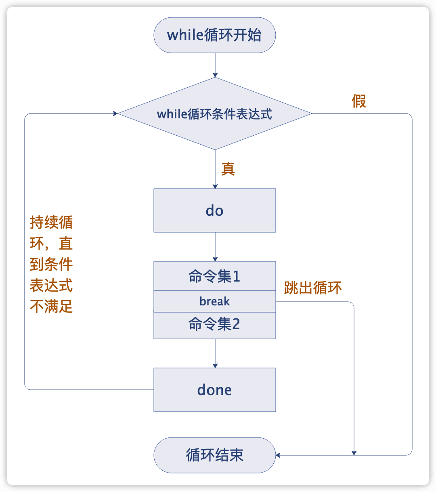
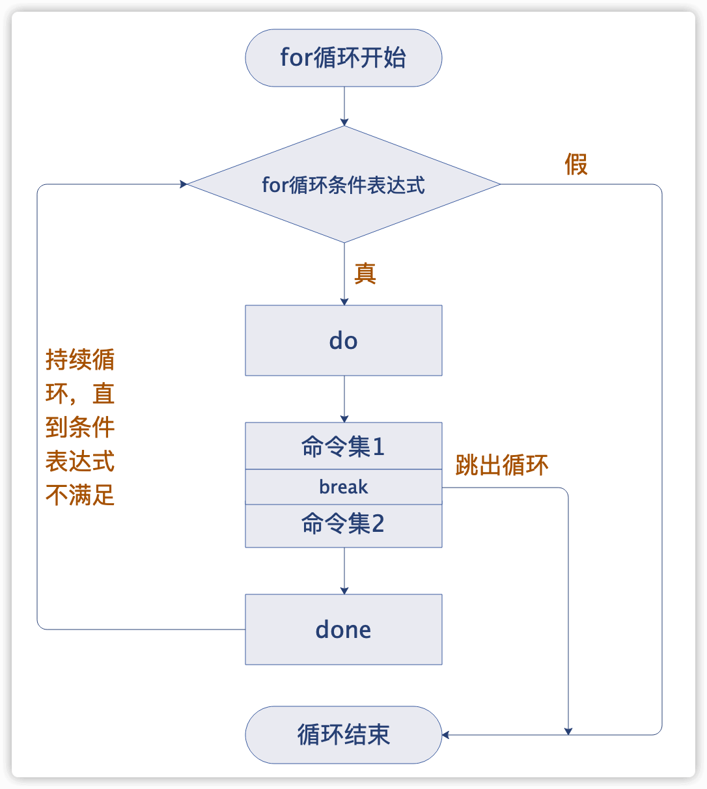
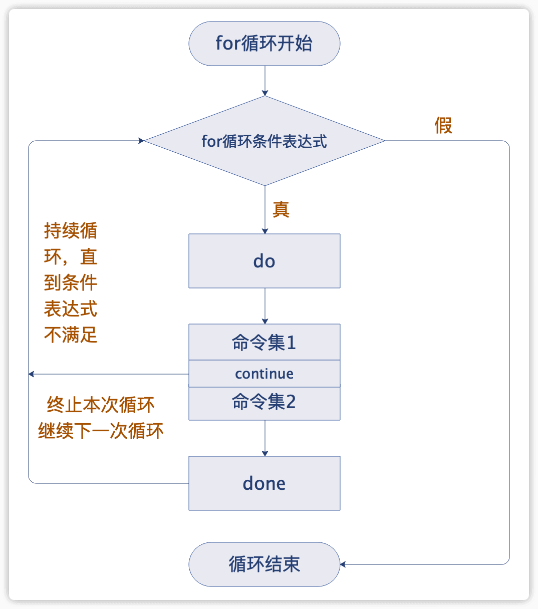
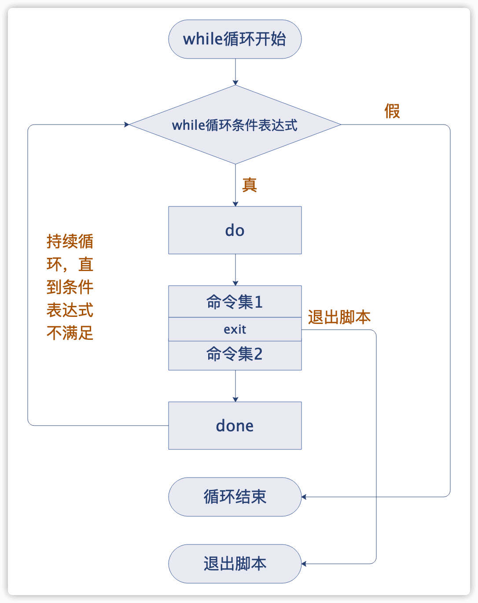
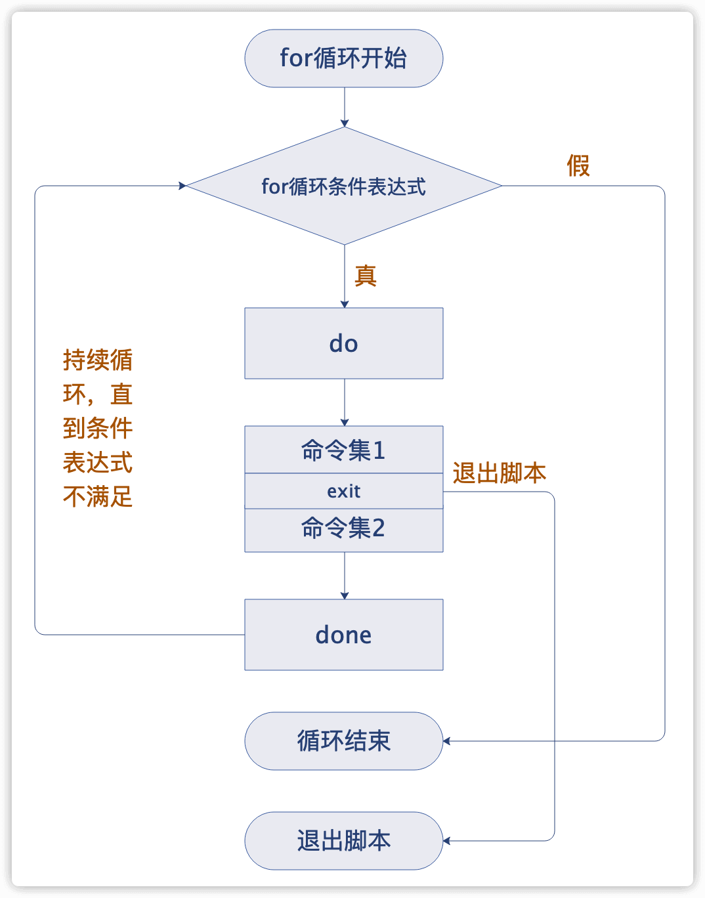

# 循环控制及状态返回值

# 一、break、continue、exit、return的区别和对比

**break、continue在条件语句及循环语句(for、while)中用于控制程序的走向**

**exit用于终止所有语句并退出当前脚本，除此之外exit还可以返回上一次程序或命令的执行状态值给当前shell**

**return类似于exit，只不过return仅用于在函数内部返回函数执行的状态值**


| 命令             | 说明                                                         |
| ---------------- | ------------------------------------------------------------ |
| **break [n]**    | **跳出整个循环，n表示跳出循环的层数**                        |
| **continue [n]** | **跳过本次循环，忽略本次循环的剩余代码，进入下一次循环，n表示退到第n层继续循环** |
| **exit [n]**     | **退出当前shell程序，n为上一次程序执行的状态返回值，n也可以省略，在下一个shell里可通过`$?`接收exit n的n的值** |
| **return [n]**   | **退出当前函数，并且在函数里作为函数的返回值，以判断函数执行是否正确，在下一个shell里可通过`$?`接收return n的n的值** |


# 二、break、continue、exit功能执行流程图

## 2.1 break

### 2.2.1 while循环中break的功能执行流程图

 




### 2.2.2 for循环中break的功能执行流程图




## 2.2 continue

### 2.2.1 while循环中continue的功能执行流程图


### 2.2.2 for循环中continue的功能执行流程图




## 2.3 exit

### 2.3.1 while循环中exit的功能执行流程图




### 2.3.2 for循环中exit的功能执行流程图




# 三、break、continue、exit、return基础示例

## 3.1 编辑综合示例脚本

```shell
#!/bin/bash
if [ $# -ne 1 ];then
  #如果传入的参数个数不为1，则打印下面的使用提示给用户
  echo $"usage:$0 {break|continue|exit|return}"
  exit 1
fi

#定义测试函数
test(){
for((i=0; i<=5; i++))
do
  if [ $i -eq 3 ] ;then
      #$*表示接受函数外的参数，是{break|continue|exit|return}中的一个
      $*;
  fi
  echo $i
done
echo "I am in func."
}

#$*为函数的传参
test $*
func_ret=$?

#如果传参有return，则提示return退出状态
if [ `echo $*|grep return|wc -l` -eq 1 ]
 then
  echo "return's exit status:$func_ret" 
fi
echo "ok"
```


## 3.2 break

**含义**

- **跳出整个循环**

当参数是`break`时

当i等于3时，符合条件，执行break，跳出整个循环，之前循环打印的变量i依次为0、1、2，并执行后续的echo，因为没有return所以执行`echo "I am in func."`和`echo "ok"`

```shell
$ sh test.sh break
0
1
2
I am in func.
ok
```


## 3.3 continue

**含义**

- **跳过本次循环，忽略本次循环的剩余代码，进入下一次循环，n表示退到第n层继续循环**

当参数是`continue`时

当i等于3时，符合条件，执行continue，跳出本次循环，继续下一次循环，因此打印的变量i没有3，执行后续的echo，因为没有return所以执行`echo "I am in func."`和`echo "ok"`

```shell
$ sh test.sh continue
0
1
2
4
5
I am in func.
ok
```


## 3.4 exit

**含义**

- **退出当前shell程序，n为上一次程序执行的状态返回值，n也可以省略，在下一个shell里可通过`$?`接收exit n的n的值**

当参数是`exit`时

当i等于3时，符合条件，执行exit，退出脚本，所有的echo都不执行，之前循环打印的变量i依次为0、1、2，默认exit的退出码是0，如果指定了则打印指定的exit退出码

```shell
$ sh test.sh exit
0
1
2
$ echo $?
0


#手动设置exit返回值是100
$ sh test.sh "exit 100"
0
1
2
$ echo $?
100
```


## 3.5 return 

**含义**

- **退出当前函数，并在函数里作为函数的返回值，以判断函数执行是否正确，在下一个shell里可通过`$?`接收return n的n的值**

当参数是`return`时

当i等于3时，符合条件，执行return，并且返回一个返回值，执行后续的echo，因为是return，所以函数中的echo不执行，最后执行`echo "return's exit status:$func_ret" `和`echo "ok"`

```shell
$ sh test.sh return
0
1
2
return's exit status:0
ok


#手动设置return返回值是100
$ sh test.sh "return 100"
0
1
2
return's exit status:100
ok
```

