# ECS运维指南之Linux系统诊断

[文档抄袭于阿里云开发者社区](https://developer.aliyun.com/topic/ebook)

# 目录

Linux启动与登陆问题

- 超详细系统启动与登陆异常排查点 

- grub.conf 文件内容被清空了怎么办

- 巧妙利用 strace 查找丢失的文件 

- 小心 PAM 不让你登录

- CentOS 登录卡住的原因被我找到了


Linux 性能问题

- 找到 Linux 虚机 Load 高的"元凶"

- OOM killer 是被谁触发的

- 我的服务器内存去哪儿了

- CPU 占用不高但网络性能很差的一个原因 

- 一次 IO 异常捕获过程


Linux 主机网络问题

- ifdown ifup 命令丢失处理

- 网络不通？ strace 二度出手

- TIME_WAIT & CLOSE_WAIT 的讨论总结 

- 一次网络抖动经典案例分析


Linux 系统服务与参数问题

- 4 个 limits 生效的问题

- 6 步排查 ss& netstat 统计结果不一样的原因

- 为什么明明内存很充足但是 java 程序仍申请不到内存 

- 请不要忽略 min_free_kbytes 的设置


最后的彩蛋

- 某地区口罩项目架构演进及优化经验


# 一、Linux启动与登陆问题

**说明**

> **Linux 启动与登录问题是 ECS 的高频问题，而往往处理不及时会直接影响到用户业务的正常可持续运行，因此也变成了我们处理问题优先级的重中之重。 在云环境上影响 ECS 启动与登录的因素非常多，镜像、管控、虚拟化、底层硬件、系统与文件异常等等，本文仅从系统与文件本身角度，在大量处理经验的基础上，归纳总结了一些可能会引起系统启动与登录问题的排查点，并给出几个比较常见的典型案例来具体展示和说明。**


## 1.1 超详细系统启动与登陆异常排查点

### 1.1.1 系统启动异常

- 部分 CentOS 系统启动黑屏，无异常报错的场景，可以 fsck 一下系统盘。

- 根分区空间满，以及 inode 数量耗尽。

- 升级内核或者从老的共享实例迁移到独享规格导致的启动异常。
  - 手动注入驱动 (mkinitrd virtio 相关驱动 )。
  - 修改 grub 的启动顺序，优先尝试使用老内核启动。
  - /boot 目录下面内核的关联文件是否全（下面仅为 demo，不同系统内核版 本文件不一致，部分内核版本 boot 下的 i386 目录也是有用的）。

```shell
config-4.9.0-7-amd64
initrd.img-4.9.0-7-amd64
System.map-4.9.0-7-amd64
vmlinuz-4.9.0-7-amd64
```


- `/boot/grub/device.map` 里面的 hda 改成 vda。

- `fstab/grub` 中的 uuid 不对，可以直接修改为 `/dev/vda1` 这种形式尝试。 数据盘分区异常加载起不来的场景，可以去注释 fstab 所有的行，添加类似下面的启动项尝试， 也适用于系统盘快照创建云盘挂载后，uuid 一致导致的启动异 常，改成非 UUID 的挂载即可。

```shell
/dev/vda1 / ext4 defaults 1 1
```


- 根目录权限 777（部分目录 777）也会导致启动异常，或者 ssh 登陆异常。

[可参考此文章权限修复尝试](https://yq.aliyun.com/articles/761371)


- 常见的关键目录缺失，有的是软链，也可以看看对应目录下面的文件数量（文件数量要跟同内核版本或者相差不大的版本对比），简单判断。

```shell
/bin /sbin /lib /lib32 /lib64 /etc /boot /usr/bin /usr/sbin /usr/lib / usr/lib64 等目录或文件缺失

for i in /bin /sbin /lib /lib32 /lib64 /etc /boot /usr/bin /usr/sbin / usr/lib /usr/lib64 ;do ls -l $i |wc -l ;done
```


- 影响启动的参数。 如果参数设置不当，是会导致启动异常的，如 `/etc/sysctl.conf` 以及检查 `rc.local` 的配置，`profile` 的检查。

```shell
vm.nr_hugepages
vm.min_free_kbytes
```


- CentOS 的 selinux 需要关闭。

```shell
# This file controls the state of SELinux on the system.
# SELINUX= can take one of these three values:
#     enforcing - SELinux security policy is enforced.
#     permissive - SELinux prints warnings instead of enforcing.
#     disabled - No SELinux policy is loaded.
SELINUX=disabled
# SELINUXTYPE= can take one of three two values:
#     targeted - Targeted processes are protected,
#     minimum - Modification of targeted policy. Only selected processes are protected. 
#     mls - Multi Level Security protection.
SELINUXTYPE=targeted
```


### 1.1.2 root 登陆异常

- `/etc/passwd`、`/etc/shadow` ( 用户名 root polikt dbus 等关键用户存在与否，文 件为空，格式乱（dos2unix)。

- `/etc/pam.d` 目录下是否有为空的文件及参数设置是否正常， 如常见的 `system-auth passwd`。

- `/etc/pam.d` 下面所有文件里面涉及的 so 文件，看看文件是否存在，是否为空 `/ usr/lib64/security`。

- 查 `/etc /lib64`、 `/bin`、 `/sbin`、`/usr/bin`、 `/usr/sbin` 等目录有没有 size 为 0 的文件。

- `/etc/profile`、`/etc/profile.d`( 打 印 列 表 )、 `/etc/bashrc`、 `/root/.bash_profile`、`/root/.bashrc` 等涉及登陆环境设置的文件是否异常。

- 注意内核版本，是否存在新老内核，多更换几个内核试下。

- 系统日志也是一个比较重要的检查项（后面会介绍无法登陆怎么检查）。

- Ubuntu 12.04 登陆异常在 `/etc/login.defs` 里面配置了错误的 `ERASECHAR` 导致，恢复默认 0177 即可。

```shell
configuration error - cannot parse erasechar value
```


- 输入 root 后直接 login 失败三连，日志如下。

```shell
Feb 12 18:18:03 iZbp1cabe6lyx26ikmjie2Z login: FAILED LOGIN 1 FROM tty1 FOR root, Authentication failure

Feb 12 18:18:03 iZbp1cabe6lyx26ikmjie2Z login: FAILED LOGIN 2 FROM tty1 FOR (unknown), Authentication failure

Feb 12 18:18:03 iZbp1cabe6lyx26ikmjieZZ login: FAILED LOGIN SESSION FROM tty1 FOR (unknown), Authentication failure
```

找个同内核版本的机器对比发现没有 `/etc/pam.d/login`。 

rpm 包校验一下，确认 login 文件没了，手动创建一个，内容拷贝过来，好了。

```shell
[root@iZbp1cabe6lyx26ikmjie2Z pam.d]# rpm -V util-linux 
missing c /etc/pam.d/login

[root@iZbp1cabe6lyx26ikmjie2Z pam.d]# rpm -ql util-linux|egrep -vi "gz|mo|share"
/etc/mtab
/etc/pam.d/chfn
/etc/pam.d/chsh
/etc/pam.d/login
/etc/pam.d/runuser
/etc/pam.d/runuser-l
/etc/pam.d/su
/etc/pam.d/su-l
```


- `/etc/ssh/sshd_config` 相关参数如 `LoginGraceTime/Allowusers/PermitRootLogin`。

- 问题不好确认的时候， 可以将 shadow 密码字段清空， 看看登陆是否正常， 可以判断是否到密码验证阶段了。 之前有过一篇关于 ssh 问题排查的文档，可参考：[ssh问题排查指南](https://yq.aliyun.com/articles/540769)


### 1.1.3 系统登陆不进去了，不挂盘的情况下怎么操作？

上面的检查点很多是需要切换到另外的系统环境下去做检查，比如挂载 LiveCD 或者 chroot 切换；但对于使用 ECS 的用户来说，阿里云暂还未提供实例挂载 ISO 镜像的功能，那么如何进行上面的操作呢？可以借助阿里云新推出的卸载系统盘功能，可以把系统盘卸载掉，作为数据盘挂载到一个新的机器，这样就可以执行上面的检查了。

[帮助文档](https://help.aliyun.com/document_detail/146752.html)


### 1.1.4 场景覆盖

#### 1.1.4.1 Linux 系统常见问题诊断覆盖以下场景

- 常用端口是否正确监听（包括ssh端口、80、443)
- 常用端口安全组检测（包括ssh端口、80、443)
- `tcp_timestamps&tcp_tw_recycle`参数检测
- cpu占用高分析
- fstab配置问题
- 软链接缺失
- ssh相关文件权限异常（比如文件权限777)
- selinux启用检测
- hugepage参数检测
- iptables启用检测
- `/etc/security/limits.conf`配置检查
- `/etc/passwd`等文件格式校验


#### 1.1.4.2 Linux 系统常见启动问题修复覆盖以下场景

- 系统启动-fsck检测修复
- 系统启动-磁盘/inode占满
- 系统启动-系统文件/软链接检测
- 系统启动-根目录/ssh目录777
- 系统启动-fstab/grub校验
- 系统启动-selinux检测
- 系统启动-sysctl内核参数hugepage&minfree检测
- vnc登陆-sshdconfig配置检测
- vnc登陆-passwd/shadow文件格式&用户检测
- vnc登陆-pam.d文件&配置检测
- vnc登陆-相关目录0size文件检测
- vnc登陆-profile/bashrc检测
- vnc登陆-多内核检测


### 1.1.5 各种脚本

[OS参数收集脚本](https://public-beijing.oss-cn-beijing.aliyuncs.com/oos/caiji.sh)

[OS优化脚本 github链接](https://github.com/huigher/os-performance-optimization)

[OS优化脚本OSS链接](https://xiaoling-public.oss-cn-hangzhou.aliyuncs.com/os_performance_optimization.py)

[OS离线修复脚本](https://public-beijing.oss-cn-beijing.aliyuncs.com/oo oos_noak.sh)


## 1.2 grub.conf 文件内容被清空了怎么办

**简介**

> **/boot/grub/grub.conf 被清空，系统启动就进入 grub 状态（CentOS 6.8）。**

- `find /boot/grub/stage1`。 显示为（hd0,0）。

- 确认一下内核的具体版本 `ls -l /boot`

- 手动设置 grub 具体步骤如下

  ```shell
  grub> root (hd0,0) # 是说跟分区在第一块硬盘的第 1 个分区 实际对于前面的 find 出来的那个文件
  
  grub> kernel /boot/vmlinuz-2.6.32-696.3.2.el6.x86_64 ro root=/dev/vda1 # 指明内核路径和根分区，注意 ro 是只读
  
  grub> initrd /boot/initramfs-2.6.32-696.3.2.el6.x86_64.img # 指明 initramfs 路径启动系统加载驱动
  
  grub> boot # 启动上面指定的系统，如果是 reboot 就等于重启整个系统了，刚才的设置就失效了
  ```

  如果没有报错的话，即可成功启动，进入到系统内部后需要继续支持。

- `mount -e remount,rw /` 重新挂载分区为读写。
- `service network restart`。 如果提示 eth0 eth1 失败，ifconfig 看不到网卡的话。
- `lsmod |grep net`。 看下 virtio_net 这个驱动有没有，如果没有的话（网卡报错基本都不会有）。
- `insmod /lib/modules/2.6.32-696.3.2.el6.x86_64/kernel/drivers/net/virtio_ net.ko`。
- 重启网络服务，嗨 ~ 网通了。
- 登陆 ssh， 找个同版本系统的 grub.conf，拷贝一份过来， 不然重启之后又进 grub 了。[参考文章](https://yq.aliyun.com/articles/203048)


## 1.3 巧妙利用 strace 查找丢失的文件

**问题描述**

> **客户反馈系统无法远程登陆，实际系统启动本身就有问题。**


根据报错信息来看，是系统内读取 user 有问题，需要挂盘查看。


- 挂盘后 chroot 如下 `ihave no name`，这里本身就是有问题了，说明系统内缺少了什么文件导致异常。

  ```shell
  root@debian:~# chroot/mnt
  [ I have no name !@debian / ] #
  ```

- strace 跟踪一下 chroot 的过程，看下丢失的文件。

  ```shell
  strace -F -ff -t -tt -s 256 -o ch.out chroot /mnt
  grep -i "no such" ch.out.pid |grep "so"
  ```

  

- 查看对应文件的关系（测试机补图）。

  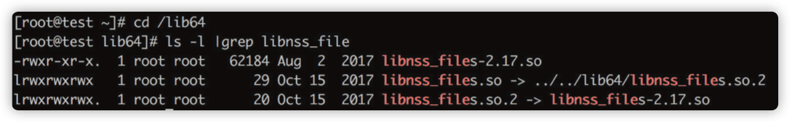

- 确认系统上丢了最终的`libnss_files-2.12.so`，尝试拷贝一个。

  ```shell
  ifconfig eth1 < 网卡 IP> netmask < 掩码地址 >
  route add default gw < 网关 IP>
  ```

  

- 此时已经可以上网了，去拷贝一个同版本的文件试试吧。

  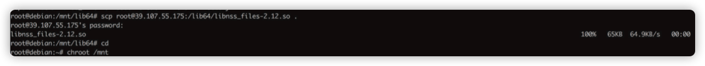


## 1.4 小心 PAM 不让你登陆

**问题描述**

> **ssh 可以登陆，管理终端无法登陆 root，提示 login in...**

先通过 ssh 方式登录系统，查看登录日志是否有异常。

```shell
$ cat /var/log/secure
Jun 2 09:26:48 iZbp1begsz1x269nxhtip4Z login: FAILED LOGIN 1 FROM tty1 FOR root，Authentication failure
```


似乎是 login 验证模块的问题进一步查看对应的配置文件 `/etc/pam.d/login`。

```shell
$ cat /etc/pam.d/login
#%PAM-1.0
auth required pam_succeed_if.so user != root quiet
auth [user_unknown=ignore success=ok ignore=ignore default=bad] pam_ securetty.so
auth substack system-auth
auth include postlogin
account required pam_nologin.so
account include system-auth
password include system-auth
# pam_selinux.so close should be the first session rule
session required pam_selinux.so close
session required pam_loginuid.so
session optional pam_console.so
# pam_selinux.so open should only be followed by sessions to be executed in the user context
session required pam_selinux.so open
session required pam_namespace.so
session optional pam_keyinit.so force revoke
session include system-auth
session include postlogin
-session optional pam_ck_connector.so
```


其中一行的作用为禁止本地登录，可以将其注释掉即可。

```shell
auth required pam_succeed_if.so user != root quiet
```


## 1.5 CentOS 登陆卡住的原因被我找到了

**问题描述**

> **系统登陆卡住，需要 ctrl +c 才能进去，如图。**


如果一直等的话，会提示如下截图：

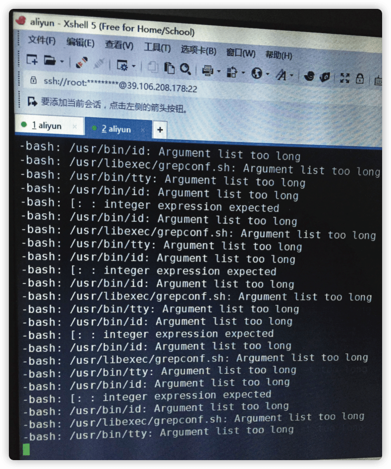


**原因**

> **/etc/profile 里面有 source /etc/profile 引起死循环，注释即可。**

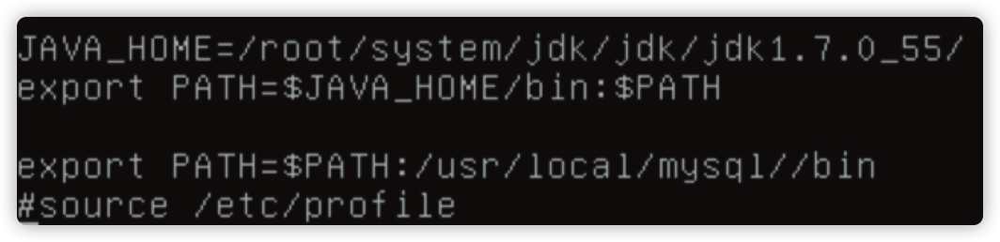


# 二、Linux 性能问题

**说明**

> **Linux 性能问题的排查和处理一直是系统管理和运维人员的"心头之患"， CPU 负载高但找不到消耗大的进程；系统出现 OOM（Out of Memory）只会一味地增大内存容量，而没有很好地理解和分析问题背后产生的根因。而这些都对线上业务的可靠和稳定性提出了挑战。本文将阿里云售后遇到的较为常见的几个系统性能问题进行展开分析，并给出一些合理的改进和优化方案。**


## 2.1 找到 Linux 虚机 Load 高的"元凶"

**问题描述**

> **有客户反馈他们的一台 ECS 周期性地 load 升高，他们的业务流量并没有上升，需要 我们排查是什么原因造成的，是否因为底层异常？**
>
> **要弄清 Linux 虚机 load 高，我们要搞清楚 Linux top 命令中 Load 的含义。**


### 2.1.1 Load average 的值从何而来

在使用 top 命令检查系统负载的时候，可以看到 `Load averages` 字段，但是这个字段并不是表示 CPU 的繁忙程度，而是度量系统整体负载。

Load averages 采样是从 `/proc/loadavg` 中获取的：

```shell
0.00 0.01 0.05 1/161 29703

每个值的含义依次为：
	lavg_1 (0.00) 1- 分钟平均负载
	lavg_5 (0.01) 5- 分钟平均负载
	lavg_15(0.05) 15- 分钟平均负载

nr_running (1) 
	在采样时刻，运行队列的任务的数目，与 /proc/stat 的 procs_running 表示相同意思，		这个数值是当前可运行的内核调度对象（进程，线程）。

nr_threads (161) 
	在采样时刻，系统中活跃的任务的个数（不包括运行已经结束的任务），即这个数值表示当前存	在系统中的内核可调度对象的数量。

last_pid(29703)
	系统最近创建的进程的 PID，包括轻量级进程，即线程。

假设当前有两个 CPU，则每个 CPU 的当前任务数为 0.00/2=0.00
```


如果你看到 load average 数值是 10， 则表明平均有 10 个进程在运行或等待状态。 有可能系统有很高的负载但是 CPU 使用率却很低，或者负载很低而 CPU 利用率很高，因为这两者没有直接关系。源码中对于这一块的说明

```c
static int loadavg_proc_show(struct seq_file *m，void *v) 
{
	unsigned long avnrun[3];
	get_avenrun(avnrun，FIXED_1/200，0);
	seq_printf(m，"%lu.%02lu %lu.%02lu %lu.%02lu %ld/%d %d\n",
		LOAD_INT(avnrun[0])，LOAD_FRAC(avnrun[0]),
		LOAD_INT(avnrun[1])，LOAD_FRAC(avnrun[1]),
		LOAD_INT(avnrun[2])，LOAD_FRAC(avnrun[2]),
		nr_running()，nr_threads,
		task_active_pid_ns(current)->last_pid);
	return 0;
}

Load 的计算函数：
static unsigned long
calc_load(unsigned long load，unsigned long exp，unsigned long active) 
{
	load *= exp;
	load += active * (FIXED_1 - exp);
	return load >> FSHIFT;
}
/*
* calc_load - update the avenrun load estimates 10 ticks after the
* CPUs have updated calc_load_tasks.
*/
void calc_global_load(void) 
{
	unsigned long upd = calc_load_update + 10;
	long active;
  
	if (time_before(jiffies，upd))
		return;
	active = atomic_long_read(&calc_load_tasks);
	active = active > 0 ? active * FIXED_1 : 0;
	
  avenrun[0] = calc_load(avenrun[0]，EXP_1，active);
	avenrun[1] = calc_load(avenrun[1]，EXP_5，active);
	avenrun[2] = calc_load(avenrun[2]，EXP_15，active);
  
	calc_load_update += LOAD_FREQ;
}
/*
* These are the constant used to fake the fixed-point load-average
* counting. Some notes:
*	- 11 bit fractions expand to 22 bits by the multiplies: this gives
*	a load-average precision of 10 bits integer + 11 bits fractional
*	- if you want to count load-averages more often，you need more
*	precision，or rounding will get you. With 2-second counting freq,
*	the EXP_n values would be 1981，2034 and 2043 if still using only
*	11 bit fractions.
*/
extern unsigned long avenrun[];	/* Load averages */
extern void get_avenrun(unsigned long *loads，unsigned long offset，int shift);
#define FSHIFT	11	/* nr of bits of precision */
#define FIXED_1	(1<<FSHIFT)	/* 1.0 as fixed-point */
#define LOAD_FREQ	(5*HZ+1)	/* 5 sec intervals */
#define EXP_1		1884	/* 1/exp(5sec/1min) as fixed-point */
#define EXP_5		2014	/* 1/exp(5sec/5min) */
#define EXP_15	2037	/* 1/exp(5sec/15min) */
#define CALC_LOAD(load,exp,n) \
	load *= exp; \
	load += n*(FIXED_1-exp); \
	load >>= FSHIFT;
```

从这个函数中可以看到， 内核计算 load 采用的是一种平滑移动的算法，Linux 的系统负载指运行队列的平均长度， 需要注意的是：可运行的进程是指处于运行队列的进程， 不是指正在运行的进程。 即进程的状态是 `TASK_RUNNING` 或者 `TASK_ UNINTERRUPTIBLE`。

Linux 内核定义一个长度为3的双字数组 avenrun，双字的低 11 位用于存放负载的小数部分，高 21 位用于存放整数部分。当进程所耗的 CPU 时间片数超过 CPU 在5秒内能够提供的时间片数时，内核计算上述的三个负载，负载初始化为 0。

假设最近 1、5、15 分钟内的平均负载分别为 load1、load5 和 load15，那么下一个计算时刻到来时，内核通过下面的算式计算负载：

```shell
load1 -= load1 - exp(-5 / 60) -+ n (1 - exp(-5 / 60 )) 
load5 -= load5 - exp(-5 / 300) + n (1 - exp(-5 / 300)) 
load15 = load15 exp(-5 / 900) + n (1 - exp(-5 / 900))
```

其中，exp(x) 为 e 的 x 次幂，n 为当前运行队列的长度。


### 2.1.2 如何找出系统中 load 高时处于运行队列的进程

通过前面的讲解， 我们已经明白有可能系统有很高的负载但是 CPU 使用率却很低， 或者负载很低而 CPU 利用率很高，这两者没有直接关系，如何用脚本统计出来处于运行队列的进程呢？

每隔 1s 统计一次：

```shell
#!/bin/bash
LANG=C
PATH=/sbin:/usr/sbin:/bin:/usr/bin
interval=1
length=86400

for i in $(seq 1 $(expr ${length} / ${interval}));do
date
	LANG=C ps -eTo stat,pid,tid,ppid,comm --no-header | sed -e 's/^ \*//' | 	perl -nE 'chomp;say if (m!^\S*[RD]+\S*!)'
	date
	cat /proc/loadavg
	echo -e "\n"
	sleep ${interval}
done
```


从统计出来的结果可以看到：

```shell
at Jan 20 15:54:12 CST 2018
D 958 958 957 nginx
D 959 959 957 nginx
D 960 960 957 nginx
D 961 961 957 nginx
R 962 962 957 nginx
D 963 963 957 nginx
D 964 964 957 nginx
D 965 965 957 nginx
D 966 966 957 nginx
D 967 967 957 nginx
D 968 968 957 nginx
D 969 969 957 nginx
D 970 970 957 nginx
D 971 971 957 nginx
D 972 972 957 nginx
D 973 973 957 nginx
D 974 974 957 nginx
R 975 975 957 nginx
D 976 976 957 nginx
D 977 977 957 nginx
D 978 978 957 nginx
D 979 979 957 nginx
R 980 980 957 nginx
D 983 983 957 nginx
D 984 984 957 nginx
D 985 985 957 nginx
D 986 986 957 nginx
D 987 987 957 nginx
D 988 988 957 nginx
D 989 989 957 nginx
R 11908 11908 18870 ps
Sat Jan 20 15:54:12 CST 2018
25.76 20.60 19.00 12/404 11912
注：R 代表运行中的队列，D 是不可中断的睡眠进程
```


在 load 比较高的时候，有大量的 nginx 处于 R 或者 D 状态，他们才是造成 load 上升的元凶，和我们底层的负载确实是没有关系的。

最后也给大家 share 一下查 CPU 使用率比较高的线程小脚本：

```shell
#!/bin/bash
LANG=C
PATH=/sbin:/usr/sbin:/bin:/usr/bin
interval=1
length=86400

for i in $(seq 1 $(expr ${length} / ${interval}));do
	date
	LANG=C ps -eT -o%cpu,pid,tid,ppid,comm | grep -v CPU | sort -n -r | head -20
	date
	LANG=C cat /proc/loadavg
	{ LANG=C ps -eT -o%cpu,pid,tid,ppid,comm | sed -e 's/^ *//' | tr -s ' ' | grep -v CPU | sort -n -r | cut -d ' ' -f 1 | xargs -I{} echo -n "{} + " && echo '0'; } | bc -l
	sleep ${interval}
done

fuser -k $0
```


## 2.2 OOM killer 是被谁触发的

### 2.2.1 问题描述

用户发现自己的服务器 CPU 在某一时刻陡然升高，但从监控上看，同一时刻的业务量却并不高，客户怀疑是云服务器有问题，希望技术支持团队予以解决。

经过我们的排查， 发现 cpu 的两次间歇飙高是由于客户系统当时发生了 OOM（out of memory）的情况， 并触发了 oom-killer 造成的。 但客户并不接受这个结论， 认为是云服务器的异常导致了 cpu 飙高，而 cpu 的升高又导致了 oom 情况的发生。也就是对于 cpu 升高和 oom 谁为因果这件事上，客户和我们持完全相反的态度。

下面我们将通过对 oom 时系统日志的解读来说明 cpu 升高和 oom 之间的因果关系。


### 2.2.2 知识点梳理

#### 2.2.2.1 预备知识

> **在解读日志之前，我们先回顾一下 linux 内核的内存管理。**

##### 2.2.2.1.1 几个基本的概念

(1) Page 页	处理器的最小 '寻址单元' 是字节或者字，而页是内存的 '管理单元'。

(2) Zone 区    

  (a) 区存在的原因：

- 有些硬件设备只能对特定的内存地址执行 DMA（direct memory access） 操作。
- 在一些架构中，实际物理内存是比系统可寻址的虚拟内存要大的，这就导致有些物理内存没有办法被永久的映射在内核的地址空间中。

- 区的划分也是直接以上面两个原因为依据的。

   (b) 区的种类

-  `ZONE_DMA`	这个区包含的 page 可以执行 DMA 操作。这部分区域的大小和 CPU 架构有关，在 x86 架构中，该部分区域大小限制为 16MB。

- `ZONE_DMA32`    类似于 `ZOME_DMA`， 这个区也包含可以执行 DMA 操作的page。该区域只存在于64位系统中，适合32位的设备访问。

- `ZONE_NORMAL`    这个区包含可以正常映射到地址空间中的 page，或者说这个区包含了除了 DMA 和 HIGHMEM 以外的内存。 许多内核操作都仅在这个区域进行。

- `ZONE_HIGHMEM`    这个区包含的是 high memory，也就是那些不能被永久映射到内核地址空间的页。

- 32位的 x86 架构中存在三种内存区域，`ZONE_DMA`，`ZONE_NORMAL`， `ZONE_HIGHMEM`。根据地址空间划分的不同，三个区域的大小不一样：

  - 1G 内核空间 /3G 用户空间

    | **区域**         | **内存范围**   |
    | ---------------- | -------------- |
    | **ZONE_DMA**     | **< 16M**      |
    | **ZONE_NORMAL**  | **16M ~ 896M** |
    | **ZONE_HIGHMEM** | **> 896M**     |

  - 4G 内核空间 /4G 用户空间

    | **区域**         | **内存范围**    |
    | ---------------- | --------------- |
    | **ZONE_DMA**     | **< 16M**       |
    | **ZONE_NORMAL**  | **16M ~ 3968M** |
    | **ZONE_HIGHMEM** | **> 3968M**     |

    64位的系统由于寻址能力的提高， 不存在 highmem 区， 所以64位系统中存在的区有 DMA，DMA32 和 NORMAL 三个区。

    | **区域**        | **内存范围** |
    | --------------- | ------------ |
    | **ZONE_DMA**    | **< 16M**    |
    | **ZONE_DMA32**  | **16M ~ 4G** |
    | **ZONE_NORMAL** | **> 4G**     |


##### 2.2.2.1.2 内核分配内存的函数

下面是内核分配内存的核心函数之一，它会分配2的 order 次方个连续的物理页内存，并将第一页的逻辑地址返回。

```c
unsigned long __get_free_pages(gfp_t gfp_mask，unsigned int order)
```


内核空间的内存分配函数和用户空间最大的不同就是每个函数会有一个 `gfp_ mask` 参数。

其中 gfp 代表的就是我们上面的内存分配函数` __get_free_pages()`。

gfp_mask 可以分成三种：行为修饰符（action modifier）, 区修饰符（zone modifier）和类型（type）。

- **行为修饰符**是用来指定内核该如何分配内存的。 比如分配内存时是否可 以进行磁盘 io，是否可以进行文件系统操作，内核是否可以睡眠（sleep） 等等。

- **区修饰符**指定内存需要从哪个区来分配。

- **类型**是行为修饰符和区修饰符结合之后的产物。在一些特定的内存分配场 合下， 我们可能需要同时指定多个行为修饰符和区修饰符， 而 type 就是 针对这些固定的场合，将所需要的行为修饰符和区修饰符都整合到了一起， 这样使用者只要指定一个 type 就可以了。

不同 type 所代表的含义可以参看下面的表格：


#### 2.2.2.2 日志解读

下面是从 oom killer 被触发到进程到被杀掉的一个大概过程， 我们来具体看 一下。

```c
nginx invoked oom-killer: gfp_mask=0x200da，order=0，oom_score_adj=0
nginx cpuset=6011a7f12bac1c4592ce41407bb41d49836197001a0e355f5a1d9589e4001e42 mems_allowed=0
CPU: 1 PID: 10242 Comm: nginx Not tainted 3.13.0-86-generic #130-Ubuntu
Hardware name: Xen HVM domU，BIOS 4.0.1 12/16/2014
	0000000000000000 ffff880070611a00 ffffffff8172a3b4 ffff88012af6c800
	0000000000000000 ffff880070611a88 ffffffff8172495d ffffffff81069b76
	ffff880070611a60 ffffffff810ca5ac ffff88020fff7e38 0000000000000000
Node 0 DMA free:15908kB min:128kB low:160kB high:192kB active_anon:0kB inactive_anon:0kB active_file:0kB inactive_file:0kB unevictable:0kB isolated(anon):0kB isolated(file):0kB present:15992kB managed:15908kB mlocked:0kB dirty:0kB writeback:0kB mapped:0kB shmem:0kB slab_ reclaimable:0kB slab_unreclaimable:0kB kernel_stack:0kB pagetables:0kB unstable:0kB bounce:0kB free_cma:0kB writeback_tmp:0kB pages_scanned:0 all_ unreclaimable? yes
lowmem_reserve[]: 0 3746 7968 7968
Node 0 DMA32 free:48516kB min:31704kB low:39628kB high:47556kB active_ anon:3619272kB inactive_anon:216kB active_file:556kB inactive_file:1516kB unevictable:0kB isolated(anon):0kB isolated(file):0kB present:3915776kB managed:3836724kB mlocked:0kB dirty:4kB writeback:0kB mapped:324kB shmem:1008kB slab_reclaimable:67136kB slab_unreclaimable:67488kB kernel_ stack:1792kB pagetables:14540kB unstable:0kB bounce:0kB free_cma:0kB writeback_tmp:0kB pages_scanned:7365 all_unreclaimable? yes
lowmem_reserve[]: 0 0 4221 4221
Node 0 Normal free:35640kB min:35748kB low:44684kB high:53620kB active_ anon:4019124kB inactive_anon:292kB active_file:1292kB inactive_file:2972kB unevictable:0kB isolated(anon):0kB isolated(file):0kB present:4456448kB managed:4322984kB mlocked:0kB dirty:24kB writeback:4kB mapped:1296kB shmem:1324kB slab_reclaimable:81196kB slab_unreclaimable:83432kB kernel_ stack:3392kB pagetables:20252kB unstable:0kB bounce:0kB free_cma:0kB writeback_tmp:0kB pages_scanned: 7874 all_unreclaimable? yes
lowmem_reserve[]: 0 0 0 0
Node 0 DMA: 1*4kB (U) 0*8kB 0*16kB 1*32kB (U) 2*64kB (U) 1*128kB (U) 1*256kB (U) 0*512kB 1*1024kB (U) 1*2048kB (R) 3*4096kB (M) = 15908kB Node 0 DMA32: 1101*4kB (UE) 745*8kB (UEM) 475*16kB (UEM) 263*32kB (EM) 88*64kB (UEM) 25*128kB (E)12*256kB (EM) 6*512kB (E) 7*1024kB (EM) 0*2048kB 0*4096kB = 48524kB
Node 0 Normal: 5769*4kB (EM) 1495*8kB (EM) 24*16kB (UE) 0*32kB 0*64kB 0*128kB 0*256kB 0*512kB 0*1024kB 0*2048kB 0*4096kB = 35420kB
Node 0 hugepages_total=0 hugepages_free=0 hugepages_surp=0 hugepages_ size=2048kB
2273 total pagecache pages
0 pages in swap cache
Swap cache stats: add 0，delete 0，find 0/0
Free swap = 0kB
Total swap = 0kB
2097054 pages RAM
0 pages HighMem/MovableOnly
33366 pages reserved
[ pid ] uid tgid total_vm rss nr_ptes swapents oom_score_adj name
[ 355]   0   355   4868    66   13       0            0
upstart-udev-br
[ 361]   0   361   12881   145  28       0            -1000
systemd-udevd  
[ 499]   0   499   3814    60   13       0            0
upstart-socket-  
[ 562]   0   562   5855    79   15       0            0
rpcbind  
[ 644]   106 644   5398    142  16       0            0 rpc.
statd
[ 775]   0   775   3818    58   12       0            0
upstart-file-br
...（此处有省略）
[10396] 104  10396 21140  12367 44      0            0 nginx
[10397] 104  10397 21140  12324 44      0            0 nginx
[10398] 104  10398 21140  12324 44      0            0 nginx
[10399] 104  10399 21140  12367 44      0            0 nginx
Out of memory: Kill process 10366 (nginx) score 6 or sacrifice child
Killed process 10366 (nginx) total-vm:84784kB，anon-rss:49156kB，filerss:520kB  
```


先来看一下第一行，它给出了 oom killer 是由谁触发的信息。

```c
nginx invoked oom-killer: gfp_mask=0x200da，order=0，oom_score_adj=0
```

order=0 告诉我们所请求的内存的大小是多少， 即 nginx 请求了2的0次方这么多个 page 的内存，也就是一个 page，或者说是 4KB。 gfp_mask 的最后两个 bit 代表的是 zone mask，也就是说它指明内存应该从哪个区来分配。

Flag value Description

```c
0x00u			0 implicitly means allocate from ZONE_NORMAL
```

\__GFP_DMA 0x01u Allocate from ZONE_DMA if possible 

__GFP_HIGHMEM 0x02u Allocate from ZONE_HIGHMEM if possible

(这里有一点需要注意，在 64 位的 x86 系统中，是没有 highmem 区的，64 位系统中的 normal 区就对应上表中的 highmem 区。）

在本案例中，zonemask是2，也就是说 nginx 正在从 zone － normal（64 位 系统）中请求内存。

其他标志位的含义如下：

```c
#define __GFP_WAIT	0x10u	/* Can wait and reschedule? */
#define __GFP_HIGH	0x20u	/* Should access emergency pools? */
#define __GFP_IO		0x40u	/* Can start physical IO? */
#define __GFP_FS		0x80u	/* Can call down to low-level FS? */
#define __GFP_COLD	0x100u	/* Cache-cold page required */
#define __GFP_NOWARN */	0x200u	/* Suppress page allocation failure warning */
#define __GFP_REPEAT	0x400u	/* Retry the allocation. Might fail */
#define __GFP_NOFAIL	0x800u	/* Retry for ever.	Cannot fail */
#define __GFP_NORETRY	0x1000u /* Do not retry.	Might fail */
#define __GFP_NO_GROW	0x2000u /* Slab internal usage */
#define __GFP_COMP	0x4000u /* Add compound page metadata */
#define __GFP_ZERO	0x8000u /* Return zeroed page on success */
#define __GFP_NOMEMALLOC 0x10000u /* Don’t use emergency reserves */
#define __GFP_NORECLAIM allocation 0x20000u /* No realy zone reclaim during */
```

所以我们当前这个内存请求带有这几个标志：`GFP_NORECLAIM`，`GFP_FS`， `GFP_IO`，`GFP_WAIT`，都是比较正常的几个标志，那么我们这个请求为什么 会有问题呢？继续往下看，可以看到下面的信息：

```c
Node 0 Normal free:35640kB min:35748kB low:44684kB high:53620kB active_ anon:4019124kB inactive_anon:292kB active_file:1292kB inactive_file:2972kB unevictable:0kB isolated(anon):0kB isolated(file):0kB present:4456448kB managed:4322984kB mlocked:0kB dirty:24kB writeback:4kB mapped:1296kB shmem:1324kB slab_reclaimable:81196kB slab_unreclaimable:83432kB kernel_ stack:3392kB pagetables:20252kB unstable:0kB bounce:0kB free_cma:0kB writeback_tmp:0kB pages_scanned: 7874 all_unreclaimable? yes
```

可以看到 normal 区 free 的内存只有 35640KB，比系统允许的最小值（min）还要低，这意味着 application 已经无法再从系统中申请到内存了，并且系统会开始启动 oom killer 来缓解系统内存压力。

这里我们说一下一个常见的误区，就是有人会认为触发了 oom killer 的进程就是问题的罪魁祸首，比如我们这个例子中的这个 nginx 进程。其实日志中 invoke oom killer 的这个进程有时候可能只是一个受害者， 因为其他应用／进程已将系统内存用尽， 而这个 invoke oomkiller 的进程恰好在此时发起了一个分配内存的请求而已。 在系统内存已经不足的情况下， 任何一个内存请求都可能触发 oom killer 的启动。

oom killer 的启动会使系统从用户空间转换到内核空间。内核会在短时间内进行大量的工作， 比如计算每个进程的 oom 分值， 从而筛选出最适合杀掉的进程。 我们从日志中也可以看到这一筛选过程：

```c
[ pid ] uid tgid total_vm   rss nr_ptes swapents oom_score_adj name
[ 355]    0  355     4868   66  13             0             0
upstart-udev-br
[ 361]    0  361     12881 145  28             0         -1000
systemd-udevd  
[ 499]    0  499     3814   60  13             0             0
upstart-socket-
[ 562]    0  562     5855   79  15             0             0
rpcbind
[ 644]  106  644     5398  142  16             0             0 rpc.
statd
[ 775]    0  775     3818   58  12             0             0
upstart-file-br
...
[10396]  104 10396   21140 12367 44            0             0 nginx
[10397]  104 10397   21140 12324 44            0             0 nginx
[10398]  104 10398   21140 12324 44            0             0 nginx
[10399]  104 10399   21140 12367 44            0             0 nginx  
```


本例中，一个 nginx 进程被选中作为缓解内存压力的牺牲进程：

```c
Out of memory: Kill process 10366 (nginx) score 6 or sacrifice child
Killed process 10366 (nginx) total-vm:84784kB，anon-rss:49156kB， file-rss:520kB
```

整个过程进行的时间很短，只有毫秒级别，但是工作量／计算量很大，这就导致了 cpu 短时间内迅速飙升， 出现峰值。 但这一切工作都由内核在内核空间中完成，所以用户在自己的业务监控数据上并不会看到业务量的异常。这些短时间升高的 cpu 是内核使用的，而不是用户的业务。

本例中客户只是偶尔看到这个现象，且业务并没有受到影响。我们给客户的建议是分析业务内存需求量最大值，如果系统已经没有办法满足特定时段业务的内存需求， 建议用户升级内存来避免 oom 的情况发生， 因为严重的 oom 情况是可能引发系统崩溃的。


## 2.3 我的服务器内存去哪儿了

**背景**

> **收到报警，系统的内存使用率触发阈值（部分图是后补的）。**


登陆系统，使用命令(top 按M)查看内存分配。

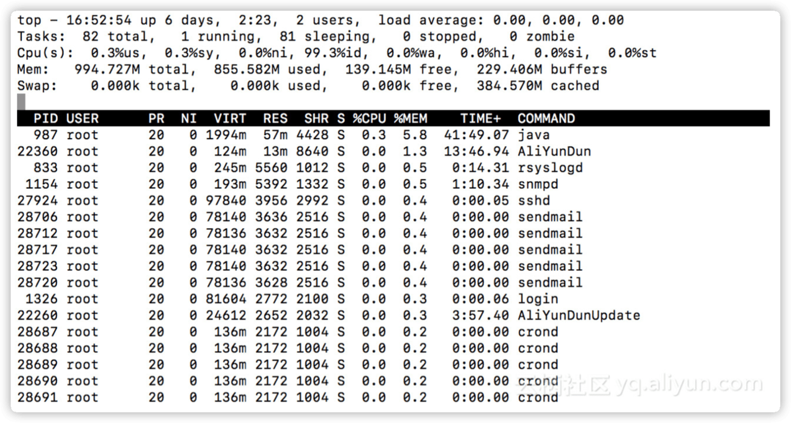


使用命令`free -m`查看内存使用情况


使用命令`atop`看下内存分配（cat /proc/meminfo 也可以看到一些细化的内存使用信息）。


发现 cache 才 1.7G，slab 非常高，4.4G，**<span style=color:red>slab 内存简单理解为是系统占用的</span>**。 使用 slabtop 继续分析。

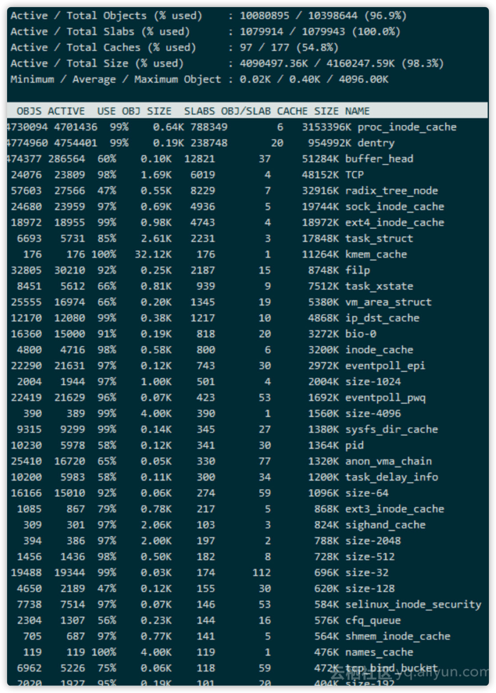

看到 `proc_inode_cache` 使用的最多， 这个代表是 proc 文件系统的 inode 占用的。


使用命令`ps -eLf`查进程，但是进程不多，再查线程，可以通过如下命令进行检查。得到如下的结果：( 原图缺失，使用测试机查看到的截图来补充说明 )


计算 socket

```shell
$ ll /proc/22360/task/*/fd/ |grep socket |wc -l
140
```

计算一下有多少fd

```shell
$ ll /proc/22360/task/*/fd/ | wc -l
335
```

每个 socket 的 inode 也不一样。


当时看到的现场有几万个 fd， 基本全是 socket， 每个 inode 都是占用空间的， 且 proc 文件系统是全内存的。 所以我们才会看到 slab 中 proc_inode_cache 内存占用高。


**建议**

> **建议用户需要从程序上优化相关的 server 端 ~**


## 2.4 CPU 占用不高但网络性能很差的一个原因 

**简介**

> **我们经常碰到整体 cpu 不高，但是性能不佳的案例，这种案例往往跟 CPU 处理中断的核心跑满有关系，话不多说，我们来看看中断相关的案例。**

### 2.4.1 什么是中断？

当一个硬件 ( 如磁盘控制器或者以太网卡 )，需要打断 CPU 的工作时，它就触发一个中断。该中断通知 CPU 发生了某些事情并且 CPU 应该放下当前的工作去处理这个事情。为了防止多个设置发送相同的中断，Linux 设计了一套中断请求系统，使得计算机系统中的每个设备被分配了各自的中断号，以确保它的中断请求的唯一性。

从 2.4 内核开始，Linux 改进了分配特定中断到指定的处理器 ( 或处理器组 ) 的功能。 这被称为 `SMP IRQ affinity`，它可以控制系统如何响应各种硬件事件。允许你限制或者重新分配服务器的工作负载，从而让服务器更有效的工作。

**<span style=color:red>以网卡中断为例，在没有设置 `SMP IRQ affinity` 时，所有网卡中断都关联到 CPU0， 这导致了 CPU0 负载过高，而无法有效快速的处理网络数据包，导致了瓶颈。</span>**

**<span style=color:blue>通过 `SMP IRQ affinity`，把网卡多个中断分配到多个 CPU 上，可以分散 CPU 压力， 提高数据处理速度。 但是 `smp_affinity` 要求网卡支持多队列， 如果网卡支持多队列则设置才有作用，网卡有多队列，才会有多个中断号，这样就可以把不同的中断号分配到不同 CPU 上，这样中断号就能相对均匀的分配到不同的 CPU 上。</span>**

而单队列的网卡可以通过 RPS/RFS 来模拟多队列的情况，但是该效果并不如网卡本身多队列 + 开启 RPSRFS 来的有效。


### 2.4.2 什么是 RPS/RFS

**RPS（Receive Packet Steering）主要是把软中断的负载均衡到各个 cpu**，简单来说，是网卡驱动对每个流生成一个 hash 标识， 这个 HASH 值得计算可以通过四元组来计算（SIP，SPORT，DIP，DPORT），然后由中断处理的地方根据这个 hash 标识分配到相应的 CPU 上去，这样就可以比较充分的发挥多核的能力了。通俗点说就是在软件层面模拟实现硬件的多队列网卡功能，**如果网卡本身支持多队列功能的话 RPS 就不会有任何的作用**。**该功能主要针对单队列网卡多 CPU 环境**，如网卡支持多队列则可使用 `SMP irq affinity` 直接绑定硬中断。


由于 RPS 只是单纯把数据包均衡到不同的 cpu，这个时候如果应用程序所在的 cpu 和软中断处理的 cpu 不是同一个， 此时对于 cpu cache 的影响会很大， 那么 RFS （Receive flow steering）确保应用程序处理的 cpu 跟软中断处理的 cpu 是同一个，这样就充分利用 cpu 的 cache，这两个补丁往往都是一起设置，来达到最好的优化效果，主要是针对单队列网卡多 CPU 环境。

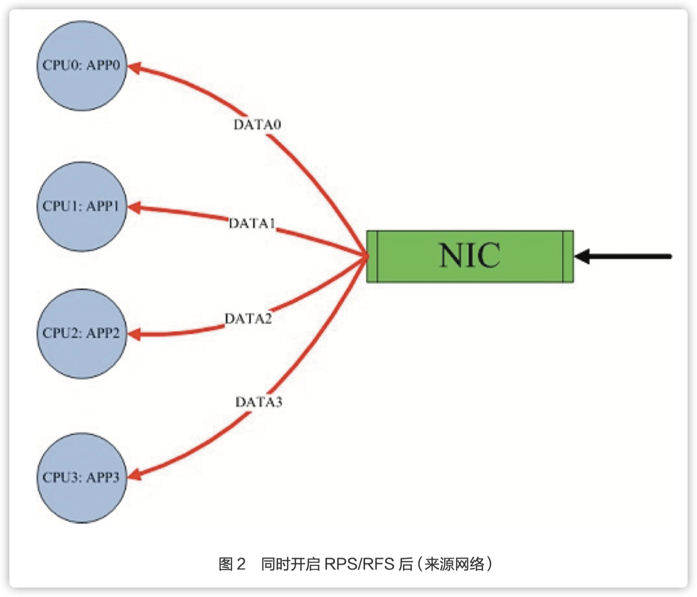

`rps_flow_cnt`，`rps_sock_flow_entries`， 参数的值会被进位到最近的2的幂次方值，对于单队列设备， 单队列的 `rps_flow_cnt` 值被配置成与`rps_sock_flow_ entries` 相同。

RFS 依靠 RPS 的机制插入数据包到指定 CPU 的 backlog 队列，并唤醒那个 CPU 来执行。

默认情况下，开启 `irqbalance` 是足够用的，但是对于一些对网络性能要求比较高的场景，手动绑定中断磨合是比较好的选择。

```shell
开启 irqbalance，会存在一些问题，比如：
a) 有时候计算出来的值不合理，导致 CPU 使用还是不均衡。
b) 在系统比较空闲 IRQ 处于 Power-save mode 时，irqbalance 会将中断集中分配给第一个 CPU，

以保证其它空闲 CPU 的睡眠时间，降低能耗。如果压力突然上升，可能会由于调整的滞后性带来性能 问题。
c) 处理中断的 CPU 总是会变，导致了更多的 context switch。
d）也存在一些情况，启动了 irqbalance，但是并没有生效，没有真正去设置处理中断的cpu。
```


### 2.4.3 如何查看网卡的队列数

Combined 代表队列个数，说明我的测试机有 4 个队列。

```shell
# ethtool -l eth0
Channel parameters for eth0:
Pre-set maximums:
RX:		0
TX:		0
Other:	0
Combined:	4
Current hardware settings:
RX:	0
TX:	0
Other:	0
Combined:	4
```


以 CentOS7.6 为例，系统处理中断的记录在 `/proc/interrupts` 文件里面，默认这个文件记录比较多，影响查看，同时如果 cpu 核心也非常多的话， 对于阅读的影响非常大。

```shell
# cat /proc/interrupts
						CPU0		CPU1		CPU2		CPU3
  0:				 141			0       0       0		IO-APIC-edge	timer		
  1:          10      0       0       0   IO-APIC-edge  i8042 
  4:         807      0       0       0   IO-APIC-edge  serial
  6:           3      0       0       0   IO-APIC-edge  floppy
  8:           0      0       0       0   IO-APIC-edge  rtc0
  9:           0      0       0       0   IO-APIC-fasteoi acpi
  10:          0      0       0       0   IO-APIC-fasteoi virtio3
  11:         22      0       0       0   IO-APIC-fasteoi hcd:usb1
  12:         15      0       0       0   IO-APIC-edge	i8042
  14:          0      0       0       0   IO-APIC-edge	ata_piix
  15:          0      0       0       0   IO-APIC-edge	ata_piix
  24:          0      0       0       0   PCI-MSI-edge	virtio1-config
	。。。
  27:       1913      0       0       0   PCI-MSI-edge	virtio2-input.0
  28:          3    834       0       0   PCI-MSI-edge	virtio2-output.0

    
input0 说明是 cpu0（第 1 个 CPU）处理的网络中断

阿里云 ecs 网络中断，如果是多个中断的话，还有 input.1 input.2 input.3 这种形式	
```


如果 ecs 的 cpu 核心非常多，那这个文件看起来就会比较费劲了，可使用下面 的命令查看处理中断的核心。

```shell
使用下面这个命令，即可将阿里云 ecs 处理中断的 cpu 找出来了（下面这个演示是 8c4个队列）

# for i in $(egrep "\-input." /proc/interrupts |awk -F ":" '{print $1}');do cat /proc/irq/$i/smp_affinity_list;done
5
7
1
3
处理一下 sar 拷贝用
# for i in $(egrep "\-input." /proc/interrupts |awk -F ":" '{print $1}');do cat /proc/irq/$i/smp_affinity_list;done |tr -s '\n' ','
5,7,1,3,

# sar -P 5,7,1,3 1 每秒刷新一次 cpu 序号为 5,7,1,3 核心的 cpu 使用率
# sar -P ALL 1 每秒刷新所有核心，用于少量 CPU 核心的监控，这样我们就可以知道处理慢的原因是不是因为队列不够导致的了
Linux 3.10.0-957.5.1.el7.x86_64 (iZwz98aynkjcxvtra0f375Z) x86_64_ (4 CPU)
05:10:06 PM		CPU		%user		%nice		%system		%iowait		%steal	%idle
05:10:07 PM		all		5.63		0.00		3.58			1.02			0.00		89.77
05:10:07 PM		0			6.12		0.00		3.06			1.02			0.00		89.90
05:10:07 PM		1			5.10		0.00		5.10			0.00			0.00		89.80
05:10:07 PM		2			5.10		0.00		3.06			2.04			0.00		89.80
05:10:07 PM		3			5.10		0.00		4.08			1.02			0.00		89.80
05:10:07 PM		CPU		%user		%nice		%system		%iowait		%steal	%idle
05:10:08 PM   all		8.78		0.00		15.01			0.69			0.00		75.52		
05:10:08 PM 	0			10.00		0.00		16.36			0.91			0.00		75.73
05:10:08 PM		1			4.81		0.00		13.46			1.92			0.00		79.81
05:10:08 PM		2			10.91		0.00		15.45			0.91			0.00		72.73
05:10:08 PM		3			9.09		0.00		14.55			0.00			0.00		76.36

sar 小技巧
打印 idle 小于 10 的核心
sar -P 1,3,5,7 1 |tail -n+3|awk '$NF<10 {print $0}'

看所有核心是否有单核打满的把 1357 换成 ALL 即可
sar -P ALL 1 |tail -n+3|awk '$NF<10 {print $0}'

再贴一个 4c8g 规格的配置（ecs.c6.xlarge），可以看到 4c 也给了四个队列，但是默认设置的是在 cpu0 和 2 上处理中断
# grep -i "input" /proc/interrupts
27: 	1932		0		0		0			PCI-MSI-edge		virtio2-input.0
29:		2				0		0		1627	PCI-MSI-edge		virtio2-input.1
32:		1974		0		0		0			PCI-MSI-edge		virtio2-input.2
35:		3				0		284	0			PCI-MSI-edge		virtio2-input.3

# for i in $(egrep "\-input." /proc/interrupts |awk -F ":" '{print $1}');do cat /proc/irq/$i/smp_affinity_list;done
1
3
1
3

原因是 cpu 是超线程的，"每个 vCPU 绑定到一个物理 CPU 超线程", 所以即使是4个队列默认也在2个 cpu 核心上

# lscpu
Architecture:			x86_64
CPU op-mode(s):			32-bit，64-bit
Byte Order:			Little Endian
CPU(s):			4
On-line CPU(s) list:			0-3
Thread(s) per core:			2
Core(s) per socket:			2
Socket(s):			1
NUMA node(s):			1
```


**关闭 IRQbalance。**

```shell
# service irqbalance status
Redirecting to /bin/systemctl status irqbalance.service
● irqbalance.service - irqbalance daemon
	Loaded: loaded (/usr/lib/systemd/system/irqbalance.service; enabled; vendor preset: enabled)
	Active: inactive (dead) since Wed 2020-05-27 14:39:28 CST; 2s ago
	Process: 1832 ExecStart=/usr/sbin/irqbalance --foreground $IRQBALANCE_ ARGS (code=exited，status=0/SUCCESS)
	Main PID: 1832 (code=exited，status=0/SUCCESS)
	May 27 14:11:40 iZbp1ee4vpiy3w4b8y2m8qZ systemd[1]: Started irqbalance daemon.
	May 27 14:39:28 iZbp1ee4vpiy3w4b8y2m8qZ systemd[1]: Stopping irqbalance daemon...
	May 27 14:39:28 iZbp1ee4vpiy3w4b8y2m8qZ systemd[1]: Stopped irqbalance daemon.
```


**手动设置 RPS。**

手动设置之前我们需要先了解下面的文件（IRQ_number 就是前面 grep input 拿到的序号）。

进入 `/proc/irq/${IRQ_number}/`， 关注两个文件：`smp_affinity` 和 `smp_ affinity_list`。 

`smp_affinity` 是 bitmask+16 进制， 

`smp_affinity_list`：这个文件更好理解，采用的是 10 进制，可读性高。

改这两个任意一个文件，另一个文件会同步更改。 

为了方便理解，咱们直接看十进制的文件 `smp_affinity_list` 即可。

```shell
如果这一步没看明白，注意前面的 /proc/interrupts 的输出
# for i in $(egrep "\-input." /proc/interrupts |awk -F ":" '{print $1}'); do cat /proc/irq/$i/smp_affinity_list;done
1
3
1
3

手动设置处理中断的 CPU 号码可以直接 echo 修改，下面就是将序号 27 的中断放到 cpu0 上处理，一般建议可以把 cpu0 空出来
# echo 0 >> /proc/irq/27/smp_affinity_list
# cat /proc/irq/27/smp_affinity_list
0

关于 bitmas
"f" 是十六进制的值对应的 二进制是 "1111"（可以理解为 4c 的配置设置为 f 的话，所有的 cpu 参与处理中断）
二进制中的每个位代表了服务器上的每个 CPU. 一个简单的 demo
CPU序号		二进制		十六进制
CPU 0			0001		1
CPU 1			0010		2
CPU 2			0100		4
CPU 3			1000		8
```


**需要对每块网卡每个队列分别进行设置。如对 eth0 的 0 号队列设置：**

```shell
echo ff > /sys/class/net/eth0/queues/rx-0/rps_cpus
```

这里的设置方式和中断亲和力设置的方法是类似的。采用的是掩码的方式，但是这里通常要将所有的 CPU 设置进入，如：

4core，f 

8core，ff 

16core，ffff 

32core，ffffffff 

默认在 0 号 cpu 上

```shell
# cat /sys/class/net/eth0/queues/rx-0/rps_cpus
0

# echo f >>/sys/class/net/eth0/queues/rx-0/rps_cpus

# cat /sys/class/net/eth0/queues/rx-0/rps_cpus
f
```


**设置 RFS 的方式。**

需要设置两个地方：

- 全局表`rps_sock_flow_table` 的条目数量。通过一个内核参数控制：

  ```shell
  # sysctl -a |grep net.core.rps_sock_flow_entries
  net.core.rps_sock_flow_entries = 0
  
  # sysctl -w net.core.rps_sock_flow_entries=1024
  net.core.rps_sock_flow_entries = 1024
  ```

- 每个网卡队列 hash 表的条目数：

  ```shell
  # cat /sys/class/net/eth0/queues/rx-0/rps_flow_cnt
  0
  
  # echo 256 >> /sys/class/net/eth0/queues/rx-0/rps_flow_cnt
  
  # cat /sys/class/net/eth0/queues/rx-0/rps_flow_cnt
  256
  ```

  

需要启动 RFS，两者都需要设置。 建议机器上所有的网卡队列设置的 `rps_flow_cnt` 相加应该小于或者等于 `rps_sock_flow_entries`。 因为是4个队列， 因此每个队列设置 256， 可以根据实际情况增大。


## 2.5 一次 IO 异常捕获过程

**简介**

> **遇到一个 IO 异常飙升的问题，IO 起飞后系统响应异常缓慢，看不到现场一直无法定位问题， 检查对应时间点应用日志也没有发现异常的访问， 这种问题怎么办呢？**


### 2.5.1 采集系统 IO，确认 IO 异常发生在系统盘，还是数据盘，使用系统自带的 iostat 即可采集

```shell
# iostat -d 3 -k -x -t 30
Linux 3.10.0-957.21.3.el7.x86_64 (tencent) 	08/05/2020 	_x86_64_	(1 CPU)

06/12/2018 11:51:49 AM
Device:         rrqm/s   wrqm/s     r/s     w/s    rkB/s    wkB/s avgrq-sz avgqu-sz   await r_await w_await  svctm  %util
vda               0.12    12.66    4.59    8.55   127.03   143.35    41.16     0.07    7.91   15.92    3.61   0.65   0.85
scd0              0.00     0.00    0.00    0.00     0.00     0.00     7.10     0.00    1.03    1.03    0.00   1.02   0.00

06/12/2018 11:51:52 AM
Device:         rrqm/s   wrqm/s     r/s     w/s    rkB/s    wkB/s avgrq-sz avgqu-sz   await r_await w_await  svctm  %util
vda               0.00    27.61   10.44   69.70   247.81   397.31    16.10     0.99   15.57    1.71   17.65   0.16   1.28
scd0              0.00     0.00    0.00    0.00     0.00     0.00     0.00     0.00    0.00    0.00    0.00   0.00   0.00
```

每隔 3 秒采集一次磁盘 io，输出时间，一共采集 30 次，想一直抓的话把 30 去掉即可，注意磁盘空余量。

```shell
通过这个命令我们可以确认如下信息：

- 问题发生的时间
- 哪块盘发生的 io
- 磁盘的 IOPS（ r/s	w/s）以及吞吐量（ rkB/s	wkB/s ）
```


### 2.5.2 确认哪块盘发生了 IO 还不够，再抓一下发生 IO 的进程，需要安装 iotop 进行捕获

```shell
# iotop -b -o -d 3 -t -qqq -n 30
10:18:41 7024 be/4 root 0.00 B/s 2.64 M/s 0.00 % 93.18 % fio
-direct=1 -iodepth=128 -rw=randwrite -ioengine=libaio -bs=1k -size=1G
-numjobs=1 -runtime=1000 -group_reporting -filename=iotest -name=Rand_ Write_Testing
```


```shell
每隔 3 秒采集一次，一共采集 30 次，静默模式，只显示有 io 发生的进程

通过这个命令我们可以确认如下信息：
- 问题发生的时间
- 产生 IO 的进程 id 以及进程参数（command）
- 进程产生的吞吐量（如果有多个可以把 qqq 去掉可显示总量）
- 进程占用当前 IO 的百分比
```

俗话说得好，光说不练假把式，我们实操来看一下 ( 涉及用户进程信息 , 没有得到客户授权因此以 fio 为演示 )。


### 2.5.3 使用 fio 进行 IO 压测，具体参数可以参考[块存储性能](https://help.aliyun.com/document_detail/25382.html?spm=a2c4e.11153940.0.0.23263337ldOT1e)

**压测窗口：**

```shell
fio -direct=1 -iodepth=128 -rw=randwrite -ioengine=libaio -bs=1k -size=1G -numjobs=1 -runtime=1000 -group_reporting -filename=iotest -name=Rand_ Write_Testing
Rand_Write_Testing: (g=0): rw=randwrite，bs=1K-1K/1K-1K/1K-1K， ioengine=libaio，iodepth=128
fio-2.0.13
Starting 1 process
^Cbs: 1 (f=1): [w] [8.5% done] [0K/2722K/0K /s] [0 /2722 /0 iops] [eta 05m:53s]
fio: terminating on signal 2

Rand_Write_Testing: (groupid=0，jobs=1): err= 0: pid=11974: Tue Jun 12 10:36:30 2018
	write: io=88797KB，bw=2722.8KB/s，iops=2722 ，runt= 32613msec
	......
```


**iotop 窗口：**

```shell
# iotop -n 10 -b -o -d 3 -t -qqq
10:36:03 11974 be/4 root 0.00 B/s 2.63 M/s 0.00 % 93.95 % fio
-direct=1 -iodepth=128 -rw=randwrite -ioengine=libaio -bs=1k -size=1G
-numjobs=1 -runtime=1000 -group_reporting -filename=iotest -name=Rand_ Write_Testing
10:36:06 11974 be/4 root 0.00 B/s 2.64 M/s 0.00 % 92.68 % fio
-direct=1 -iodepth=128 -rw=randwrite -ioengine=libaio -bs=1k -size=1G
-numjobs=1 -runtime=1000 -group_reporting -filename=iotest -name=Rand_ Write_Testing
```


**iostat 窗口：**

```shell
# iostat -d 3 -k -x -t 10
Linux 3.10.0-957.21.3.el7.x86_64 (tencent) 	08/05/2020 	_x86_64_	(1 CPU)

06/12/2018 12:26:41 PM
Device:         rrqm/s   wrqm/s     r/s     w/s    rkB/s    wkB/s avgrq-sz avgqu-sz   await r_await w_await  svctm  %util
vda               0.12    12.66    4.59    8.56   127.09   143.47    41.16     0.07    7.91   15.91    3.61   0.65   0.85
scd0              0.00     0.00    0.00    0.00     0.00     0.00     7.10     0.00    1.03    1.03    0.00   1.02   0.00

06/12/2018 12:26:44 PM
Device:         rrqm/s   wrqm/s     r/s     w/s    rkB/s    wkB/s avgrq-sz avgqu-sz   await r_await w_await  svctm  %util
vda               0.00    81.14   32.66   84.18  1202.69  2488.89    63.19     0.31    2.75    3.00    2.66   0.34   3.97
scd0              0.00     0.00    0.00    0.00     0.00     0.00     0.00     0.00    0.00    0.00    0.00   0.00   0.00
```

通过输出结果的时间点进行对比分析， 相对于 fio 的 IOPS， 吞吐量跟 iotop 以及 iostat 监控到的数据是一致。因此，看到这，您已经学会怎么查消耗 IO 的进程了。


**⚠️为了压测的慢一些特意把 bs 设置为 1k，这样执行的时间会比较久，fio 压 测详见前面的块存储性能。**

心细的同学可能发现 iotop 输出不带年月日，如果抓日志的时间超过 24 小时，时间重复怎么办？

```shell
# iotop -b -o -d 1 -qqq |awk '{ print $0"\t" strftime("%Y-%m-%d-%H:%M:%S", systime()) } '
 1252 be/3 root        0.00 B/s   22.83 K/s  0.00 %  1.12 % [jbd2/vda1-8]       2018-06-12:28:19
16374 be/4 root       76.12 K/s    0.00 B/s  0.00 %  0.33 % YDService   2018-06-12:28:19
21495 be/4 mysql       0.00 B/s  121.79 K/s  0.00 %  0.15 % mysqld --defaults-file=/etc/my.cnf  2018-06-12:28:19
21493 be/4 mysql       0.00 B/s    0.00 B/s  0.00 %  0.11 % mysqld --defaults-file=/etc/my.cnf  2018-06-12:28:19
21500 be/4 mysql       0.00 B/s    3.81 K/s  0.00 %  0.11 % mysqld --defaults-file=/etc/my.cnf  2018-06-12:28:19
13377 be/4 mysql       0.00 B/s    3.81 K/s  0.00 %  0.09 % mysqld --defaults-file=/etc/my.cnf  2018-06-12:28:19
18071 be/4 mysql       0.00 B/s    3.81 K/s  0.00 %  0.09 % mysqld --defaults-file=/etc/my.cnf  2018-06-12:28:19
32718 be/4 root        0.00 B/s    0.00 B/s  0.00 %  0.01 % [kworker/0:2]       2018-06-12:28:19
10641 be/4 root        0.00 B/s   11.42 K/s  0.00 %  0.00 % java -server -Xms1024m -Xmx1024m -jar ./kooteam.jar 2018-06-12:28:19
30019 be/4 polkitd     0.00 B/s   19.03 K/s  0.00 %  0.00 % postgres: stats collector process   2018-06-12:28:19
 1252 be/3 root        0.00 B/s    0.00 B/s  0.00 %  0.71 % [jbd2/vda1-8]       2018-06-12:28:20
16374 be/4 root       90.77 K/s    0.00 B/s  0.00 %  0.47 % YDService   2018-06-12:28:20
21494 be/4 mysql       0.00 B/s    0.00 B/s  0.00 %  0.33 % mysqld --defaults-file=/etc/my.cnf  2018-06-12:28:20
21495 be/4 mysql       0.00 B/s   90.77 K/s  0.00 %  0.14 % mysqld --defaults-file=/etc/my.cnf  2018-06-12:28:20
 3922 be/4 mysql       0.00 B/s    3.78 K/s  0.00 %  0.11 % mysqld --defaults-file=/etc/my.cnf  2018-06-12:28:20
```

详细参数就不讲了，大家可以看下输出结果行最后一列是年月日时分秒，那么 IO 消耗的始作俑者会查了吗？


# 三、Linux 主机网络问题

**说明**

> **从售后处理角度，阿里云用户业务系统搭建在 ECS 云服务器反馈最多的影响业务可用性问题：一个是前面已经讨论过的系统启停问题，另一个就是网络连通性问题。网络作为业务系统数据交互和转发的 "通道"，影响着 IT 系统的各个方面。网络问题涵盖的因素简化来讲一般涉及到收发节点，转发节点，流量链路等方面，由于本文主要分享系统诊断相关的处理经验，因此我们也更关注与 ECS 主机层面相关的网络影响，希望能带给一些处理主机层面网络问题的点拨。**


## 3.1 ifdown ifup 命令丢失处理

**问题现象**

> **主机网络不通，登录主机看网卡没有正确配置。**


**解决方法**

> **尝试重启网卡，发现 ifdown ifup 命令不存在：**

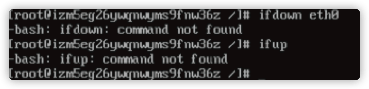

通过 `ifconfig` 配置 IP 信息

```shell
ifconfig <网卡>	<IP>	netmask <掩码>
```


然后添加路由

```shell
route add -net 0.0.0.0/0	gw	<公网网关>
```


如果是经典网络需要配置上内外网卡 ip 和路由，路由命令

```shell
route add -net 10.0.0.0/8 gw	<内网网关>
route add -net 100.64.0.0/10 gw	<内网网关>
```


网络通了后运行命令

```shell
yum -y install initscripts
```


安装上 ifup ifdown 相关的包


## 3.2 网络不通？ strace 二度出手

**问题现象**

> **主机网络不通，路由不正确，0.0.0.0 指向了 eth0。**


**问题分析**

尝试重启 network 服务，发现不行。

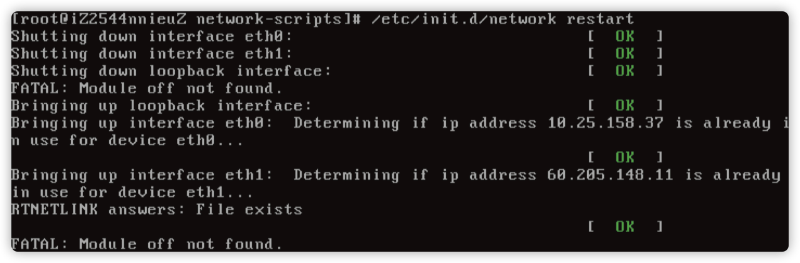


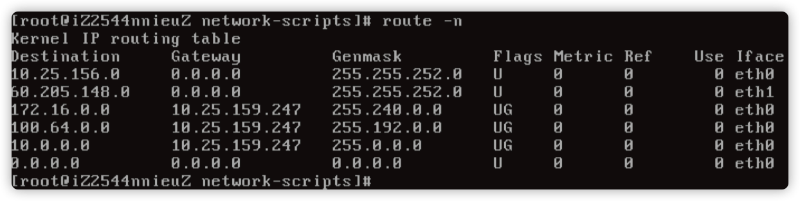


尝试停止网络服务，然后通过 `ifup eth1` 发现路由是正常的。

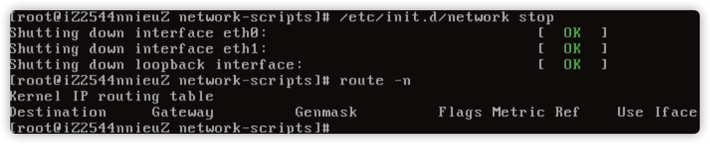


然后 `ifup eth0` 发现路由就异常了，基本定位在启动 eth0 网卡的时候出现了异常。


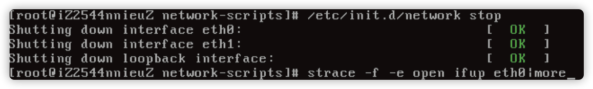


用 `strace -f -e open ifup eth0|more` 追踪一下。

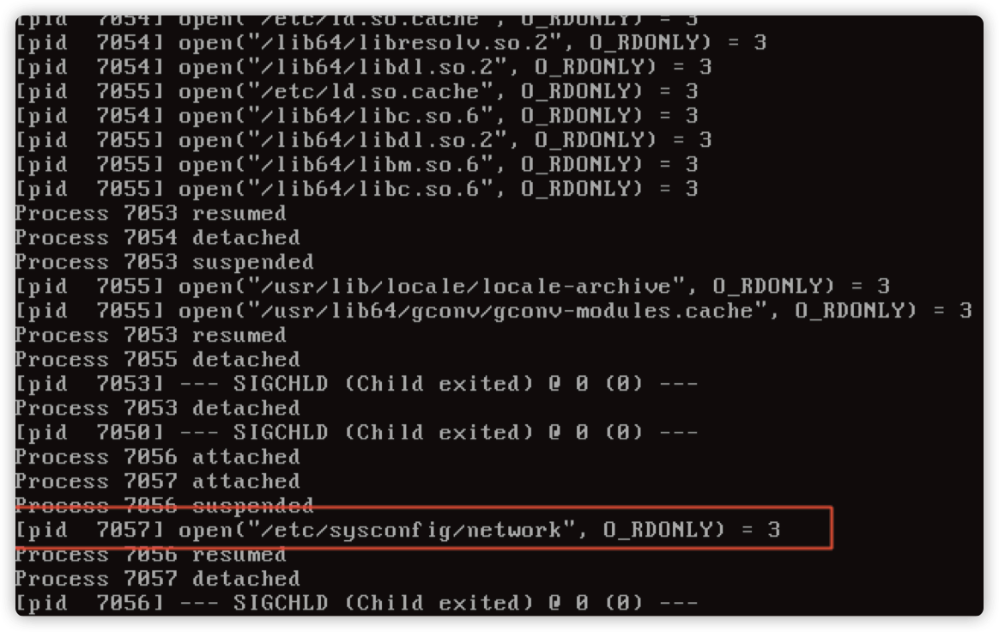

运气加眼神比较好，发现调用了 `/etc/sysconfig/network` 文件。

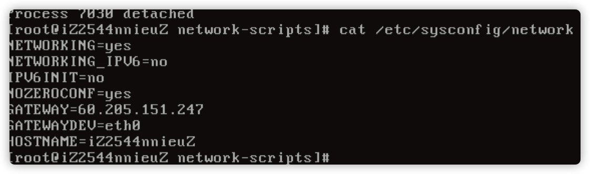

打开 `/etc/sysconfig/network` 文件，发现多了一行 `GATEWAYDEV=eth0`。


**解决方案**

注释 `/etc/sysconfig/network` 文件的 `GATEWAYDEV=eth0`，重启网络服务。


## 3.3 TIME_WAIT & CLOSE_WAIT 的讨论总结 

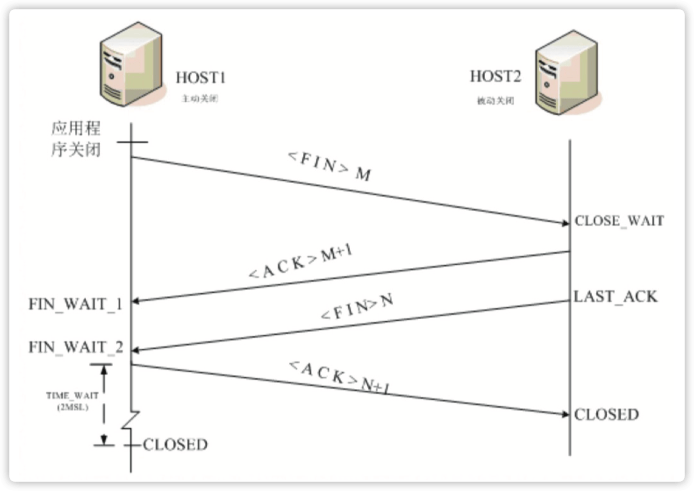

TIME_WAIT 是 TCP 连接关闭过程中的一个状态，具体是这么形成的：

1. 主动关闭端 A：发 FIN，进入 FIN-WAIT-1 状态，并等待 ......

2. 被动关闭端 P：收到 FIN 后必须立即发 ACK，进入 CLOSE_WAIT 状态，并等 待 ......

3. 主动关闭端 A：收到 ACK 后进入 FIN-WAIT-2 状态，并等待 ......

4. 被动关闭端 P：发 FIN，进入 LAST_ACK 状态，并等待 ......

5. 主动关闭端 A：收到 FIN 后必须立即发 ACK， 进入 TIME_WAIT 状态， 等待 2MSL 后结束 Socket。

6. 被动关闭端 P：收到 ACK 后结束 Socket。 58　　>　TIME_WAIT & CLOSE_WAIT 的讨论总结

因此，TIME_WAIT 状态是出现在主动发起连接关闭的一点， 和是谁发起的连接无关，可以是 client 端，也可以是 server 端。

而从 TIME_WAIT 状态到 CLOSED 状 态， 有一个超时设置， 这个超时设置是 2*MSL（RFC793 定义了 MSL 为 2 分钟，Linux 设置成了 30s）。

### 3.3.1 为什么需要 TIME_WAIT ？

主要有两个原因：

- 为了确保两端能完全关闭连接。
  - 假设 A 服务器是主动关闭连接方，B 服务器是被动方。 如果没有 TIME_WAIT 状态，A 服务器发出最后一个 ACK 就进入关闭状态， 如果这个 ACK 对端没有收到，对端就不能完成关闭。对端没有收到 ACK，会重发 FIN，此时连接关闭，这个 FIN 也得不到 ACK， 而有 TIME_WAIT， 则会重发这个 ACK， 确保对端能正常关闭连接。
- 为了确保后续的连接不会收到“脏数据”。
  - 刚才提到主动端进入 TIME_WAIT 后， 等待 2MSL 后 CLOSE， 这里的 MSL 是指（maximum segment lifetime， 我们内核一般是 30s，2MSL 就是1分钟）， 网络上数据包最大的生命周期。 这是为了使网络上由于重传出现的 old duplicate segment 都消失后，才能创建参数（四元组，源 IP/PORT，目标 IP/ PORT）相同的连接，如果等待时间不够长，又创建好了一样的连接，再收到 old duplicate segment，数据就错乱了。

### 3.3.2 TIME_WAIT 会导致什么问题

- 新建连接失败。

  - TIME_WAIT 到 CLOSED，需要 2MSL=60s 的时间。这个时间非常长。每个连接在业务结束之后，需要 60s 的时间才能完全释放。 如果业务上采用的是短连接的方式，会导致非常多的 TIME_WAIT 状态的连接，会占用一些资源，主要是本地端口资源。

  - 一台服务器的本地可用端口是有限的，也就几万个端口，由这个参数控制：

    `sysctl net.ipv4.ip_local_port_range`

    ```shell
    net.ipv4.ip_local_port_range = 32768 61000
    ```

  - 当服务器存在非常多的 TIME_WAIT 连接， 将本地端口都占用了， 就不能主动发起新的连接去连其他服务器了。

  - 这里需要注意，是主动发起连接，又是主动发起关闭的一方才会遇到这个问题。

  - 如果是 server 端主动关闭 client 端建立的连接产生了大量的 TIME_WAIT 连接，这是不会出现这个问题的。除非是其中涉及到的某个客户端的 TIME_WAIT 连接都有好几万个了。


- TIME_WAIT 条目超出限制。

  - 这个限制，是由一个内核参数控制的：

    sysctl net.ipv4.tcp_max_tw_buckets

    ```shell
    net.ipv4.tcp_max_tw_buckets = 5000
    ```

    

  - 超出了这个限制会报一条 INFO 级别的内核日志，然后继续关闭掉连接。并没有什么特别大的影响，只是增加了刚才提到的收到脏数据的风险而已。

  - 另外的风险就是，关闭掉 TIME_WAIT 连接后，刚刚发出的 ACK 如果对端没有收到， 重发 FIN 包出来时，不能正确回复 ACK，只是回复一个 RST 包， 导致对端程序报错，说 connection reset。

  - 因此 net.ipv4.tcp_max_tw_buckets 这个参数是建议不要改小的，改小会带来风险，没有什么收益，只是表面上通过 netstat 看到的 TIME_WAIT 少了些而已，有啥用呢？并且，建议是当遇到条目不够，增加这个值，仅仅是浪费一点点内存而已。


### 3.3.3 如何解决 time_wait?

1）最佳方案是应用改造长连接，但是一般不太适用。

2）修改系统回收参数。设置以下参数。

```shell
net.ipv4.tcp_timestamps = 1
net.ipv4.tcp_tw_recycle = 1
```

设置该参数会带来什么问题？

如果这两个参数同时开启， 会校验源 ip 过来的包携带的 timestamp 是否递增， 如果不是递增的话，则会导致三次握手建联不成功，具体表现为抓包的时候看到 syn 发出，server 端不响应 syn ack。

通俗一些来讲就是，一个局域网有多个客户端访问您，如果有客户端的时间比别的客户端时间慢，就会建联不成功。

治标不治本的方式：

放大端口范围。 sysctl net.ipv4.ip_local_port_range

```shell
net.ipv4.ip_local_port_range = 32768 61000
```

放大 time_wait 的 buckets 

sysctl net.ipv4.tcp_max_tw_buckets

```shell
net.ipv4.tcp_max_tw_buckets = 180000
```

关于 net.ipv4.tcp_max_tw_buckets 到底要不要放大，目前云上 ecs 多数是设置了 5000，在很多场景下可能是不够的。


简单来说 net.ipv4.tcp_max_tw_buckets 的作用是为了 "优雅" 的关闭连接。

1. 完整的关闭连接。

2. 避免有数据包重复。


### 3.3.4 如果 tw 满了会怎么样

TCP: time wait bucket table overflow。

**新内核**

- tw_bucket 满了的话， 会影响 established 状态的连接在 finack 的时候直接进入 closed 状态。

**老内核**

- tw_bucket 满了的话，会将 tw_bucket 里面的 time_wait 按照一定的规则（如 LRU），将一批 time_Wait 直接进入 closed 状态 ，然后 established 状态发送 finack 后进 入 time_wait。


### 3.3.5 tw 的开销是什么

- 特别少量的内存。

- 占用本地端口。


### 3.3.6 tw 放大的好与坏

1. 放大的话需要更多的内存开销，但是几乎可以忽略不计。

2. 占用更多的本地端口，需要适当的放大本地端口范围， 端口范围经过简单的测试，建议设置为 tw 的 1.5 倍。net.ipv4.ip_local_port_range

3. netstat 大量的扫描 socket 的时候（ss 不会扫描， 但是 ss 在 slab 内存特别高 的时候，也有可能会引起抖动），极端情况下可能会引起性能抖动。

4. tw 放大，local_port_range 放大，还可以配置复用以及快速回收等参数。

5. 使用快速回收可能会导致 snat 时间戳递增校验问题，不递增的话 syn 不响应。


特殊场景的时候（本机会发起大量短链接的时候）。

1. nginx 结合 php-fpm 需要本地起端口。

2. nginx 反代如（java，容器等）。

tcp_tw_reuse 参数需要结合 net.ipv4.tcp_timestamps = 1 一起来用。

即服务器即做客户端，也做 server 端的时候。

tcp_tw_reuse 参数用来设置是否可以在新的连接中重用 TIME_WAIT 状态的套接字。 注意， 重用的是 TIME_WAIT 套接字占用的端口号， 而不是 TIME_WAIT 套接字的内存等。这个参数对客户端有意义，在主动发起连接的时候会在调用的 inet_ hash_connect() 中会检查是否可以重用 TIME_WAIT 状态的套接字。如果你在服务器段设置这个参数的话，则没有什么作用，因为服务器端 ESTABLISHED 状态的套 接字和监听套接字的本地 IP、端口号是相同的，没有重用的概念。但并不是说服务器端就没有 TIME_WAIT 状态套接字。

因此该类场景最终建议是：

```shell
net.ipv4.tcp_tw_recycle = 0 关掉快速回收
net.ipv4.tcp_tw_reuse = 1	开启 tw 状态的端口复用（客户端角色）
net.ipv4.tcp_timestamps = 1 复用需要 timestamp 校验为 1
net.ipv4.tcp_max_tw_buckets = 30000 放大 bucket
net.ipv4.ip_local_port_range = 15000 65000 放大本地端口范围
```

内存开销测试。

```shell
# ss -s
Total: 15254 (kernel 15288)
TCP: 15169 (estab 5，closed 15158，orphaned 0，synrecv 0，timewait 3/0)，ports 0
Transport Total		IP		IPv6
*					15288		-			-
RAW				0				0			0
UDP				5				4			1
TCP				11			11		0
INET			16			15		1
FRAG			0				0			0
15000个socket消耗30多m内存
```

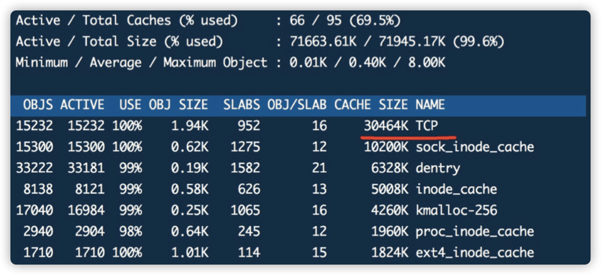


### 3.3.7 关于CLOSE_WAIT


如上所示，CLOSE_WAIT 的状态是 服务器端 / 客户端程序收到外部过来的 FIN 之 后，响应了 ACK 包，之后就进入了 CLOSE_WAIT 状态。 一般来说，如果一切正常，稍后服务器端 / 客户端程序需要发出 FIN 包，进而迁移到 LAST_ACK 状态，收到对端过来的 ACK 后，完成 TCP 连接关闭的整个过程。

**⚠️不管是服务器还是客户端， 只要是被动接收第一个 FIN 的那一方才会进入 CLOSE_WAIT 状态。**


## 3.4 一次网络抖动经典案例分析

**简介：**

> **本文记录的是一次多团队协作处理的抖动问题的过程，由于用户的执着，也得我们在这个案例分析得较为深入，希望对大家今后的此类案例的处理有所启发。**

**视频学习**

[性能抖动剖析(一)](https://yq.aliyun.com/live/1037)

[性能抖动剖析(二)](https://yq.aliyun.com/live/1038)

[性能抖动剖析(三)](https://yq.aliyun.com/live/1078?spm=a2c6h.12873639.0.0.4a7f428cMLnIqV)

网络抖动案例是一类处理难度较大的问题，原因主要是很多抖动发生的频率不高，且持续时间非常短极限情况可能仅有 100ms 以下，而很多用户的业务应用对实时性要求非常高，因此对此类在百毫秒的延迟也会非常敏感。本文记录的是一次多团队协作处理的抖动问题的过程，由于用户的执着，也使得我们在这个案例分析得较为深入，希望对大家今后的此类案例的处理有所启发。


**问题现象**

让我们先来看看问题现象吧，用户的应用日志记录了百毫秒甚至 1-2 秒级别的延迟， 而且发生较为频繁，由于业务的实时性要求较高，因此对业务的影响较大，当然其中也影响到了用户对迁云的信心。


**初步排查**

在用户通过应用层面的排查怀疑问题来源于虚拟网络环境的时候，我们需要做的第一 件事就是首先要将问题简单化。这一步是非常必要的，因为我们对用户的应用不可能有非常深入的了解，所以用户的应用日志具体含义和记录方式对我们来说更像黑盒。 我们所要做的是将问题现象转移到我们常见的系统组件上来，比如简单到 ping。所以我们第一件所做的事情就是编写脚本进行两台机器的内网互 ping，并将每次 ping 的延迟记录到文件。选择 ping 当然也是由于 ping 的间隔是可以设置到百毫秒的，比较容易说明问题。

在互 ping 的测试中我们确实发现有百毫秒以上的延迟，那么随后我们为了排除物理网络的影响，选择一台机器进行对网关的 ping 测试，同样发现了类似的延迟：


来看看上面的 ping 测试结果吧，初看也仅仅是一些百毫秒延迟的集中发生而已，但是仔细观察就会发现每次发生都有这样的情况，就是延迟在一组连续的 ping 上发生的，并且延迟是倒序排列的。那么这意味着什么呢？


**分析一**

通过以上的 ping 测试我们把问题简单化到了 ping 网关延迟上，但是上面如此规律的测试结果的具体含义是什么。首先他意味着并没有丢包发生，所以的 ICMP 请求都被系统发出并且收到回复，但是这样的倒序排列，更像是在问题时间段内所有的回复都没有被第一时间处理，而是突然在 800ms 之后系统处理了所有之前发生回复，因此才会产生这样的现象。那么我们此时可以有一个假设，在这 800ms 之前系统停止了对网络包的处理。那么什么样的情况会导致系统停止对网络包的处理呢？

答案是中断禁用，硬件中断是系统处理网络包的第一也是必须步骤，中断禁用会导致系统的软中断和中断都不能在 CPU 上发生，从而使得当前在 CPU 上运行的指令是无法被打断的，这经常被用于一些可能存在竞争风险的内核代码片段上，这些代码片段可能会因为被中断打断而导致数据不同步甚至损坏。

在当时我们内核团队甚至通过编写示例驱动，通过记录 timer 函数在一段时间内未能触发来验证了中断禁用的发生。那么庞大的内核代码中究竟是哪一部分的代码导致了这样的问题呢？


**分析二**

在这段分析过程中，我们做了大量实验，比如通过编写内核驱动来禁用中断，测试各类内核追踪方法是否能获得更进一步的信息，如禁用中断的堆栈，但是很可惜，目前尚无很好的方法在不影响业务的情况下较轻量级地获得禁用中断时的内核堆栈，原理也很简单，硬件中断本身优先级要高于一般进程和软中断，在其被禁用之后自然普通 软件层面的追踪方法也不起作用了。

然而问题就隐藏在一类系统的内存资源上，即系统的 slab 占用量相比正常系统要高出不少：

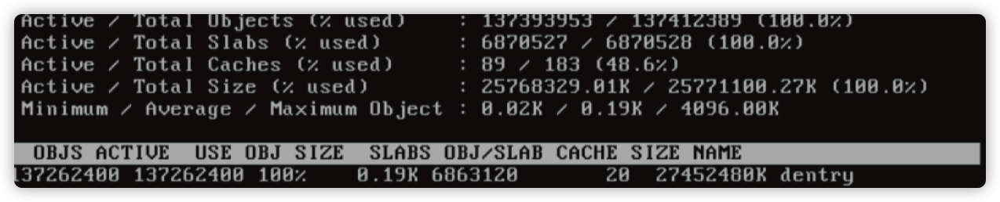

我们可以看到其中 dentry 在 slab 中的占用量达到了非常高的程度，dentry 是内存中表示目录和文件的对象，作为与 inode 的链接存在，在一般情况下如此高数字的 dentry 项可能代表这系统有大量被打开的文件。 然而此时我们首先需要解释大量的 dentry 项与禁用中断的关系，我们来看看 2.6 内核的这一段代码：

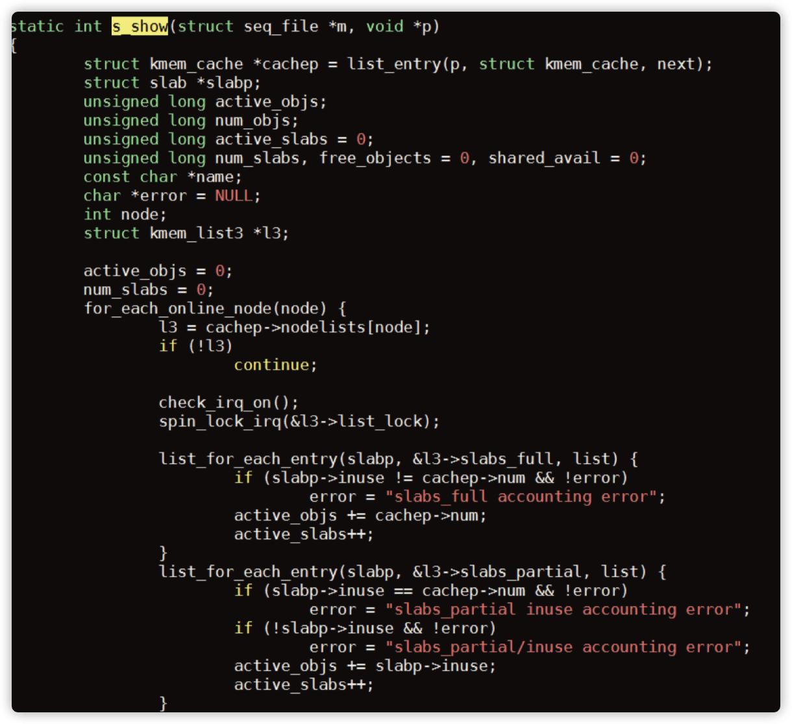

这是一段计算 slab 总量的代码，我们注意到它是以遍历链表的方式来统计 slab 总量的，而在进入链表之前调用了 `spin_lock_irq` 函数，我们来看看它的实现：

```c
static inline void __spin_lock_irq(spinlock_t *lock)
{
local_irq_disable();
```

于是我们可以确认在统计 slab 信息的时候，系统的行为是首先禁用中断，然后遍历链表统计 slab，最后再次启用中断。那么整个禁用中断的时间将取决于链表中对象的 个数，如果其对象数量惊人，很可能就会导致禁用中断时间过长。

验证问题也非常简单，我们可以主动运行 `cat /proc/slabinfo` 在获取 slab 信息，那么 以上函数也将会被调用，同时观察 ping 测试输出符合以上问题点的情况，即可以大致确认问题原因了。

此时我们已经有了可以暂时缓解问题的方法了，对 dentry 项是作为文件系统缓存的 一部分存在的，也就是真正的文件信息是存放于磁盘上的，dentry 只不过是在系统打开文件系统缓存在内存中的对象而已，即使缓存被清空，未来系统一样可以通过读取磁盘文件来重新生成 dentry 信息，因此我们可以通过类似 `echo 2 > /proc/sys/vm/ drop_caches && sync` 的方式来释放缓存，缓解问题。

但是其实事情远远没有就此结束，我们需要注意两个关键性的问题：

1. 是什么程序在反复地获取 slab 信息，产生类似 `cat /proc/slabinfo` 的效果。
2. 这么多 dentry 生成的原因是什么。

如果不知道这两点这个问题随时可能会复现。而周期性地 drop cache 并不是一个长久根治的方案。

看到这里，这个缓存问题的处理是不是在哪儿见过？对的，在系统性能分析那一章节我们也提到相似的问题，建议再往前回顾一下心中应该就差不多有答案了。


# 四、Linux 系统服务与参数问题

至此，我们分享了关于系统启动登录、性能、网络等三个方面遇到的一些经典和有趣案例，而这三个方面也基本涵盖了目前我们遇到的大部分的系统故障问题。此外，还有一类系统服务参数问题在我们处理的案例中也屡见不鲜。阿里云结合多年云上 ECS 运维经验和用户业务反馈，不断优化 ECS 系统镜像以最大化发挥用户业务效益，但很多时候由于业务增长缺少准确的预估，应用程序不合理设计等方面，需要调整系统默认的参数配置来适应和改善业务运行状态。下面我们分享几个案例来帮助大家更好的理解一些系统参数的实际参考和应用意义。


## 4.1 4 个 limits 生效的问题

### 4.1.1 第一个问题

> **limits.conf 的限制在 /proc/pid/limits 中未生效。**

```shell
# cat /proc/3606/limits
Limit					Soft Limit		Hard Limit		Units
Max processes 31202					31202					processes
Max open files	1024				4096					files
```


在 CentOS 7 & Ubuntu 系统中，使用 Systemd 替代了之前的 SysV。`/etc/security/ limits.conf` 文件的配置作用域缩小了。

`/etc/security/limits.conf` 的配置， 只适用于通过 PAM 认证登录用户的资源限制， 它对 systemd 的 service 的资源限制不生效。 因此登录用户的限制， 通过 `/etc/ security/limits.conf` 与 `/etc/security/limits.d` 下的文件设置即可。 对于 systemd service 的资源设置，则需修改全局配置， 全局配置文件放在 `/etc/systemd/system.conf` 和 `/etc/systemd/user.conf`，同时也会加载两个对应目录中的所有 .conf 文件 `/etc/systemd/system.conf.d/.conf` 和 `/etc/systemd/user.conf.d/.conf`。 system.conf 是系统实例使用的，user.conf 是用户实例使用的。

```shell
vim /etc/systemd/system.conf
DefaultLimitNOFILE=100000
DefaultLimitNPROC=65535
```

修改并重启即可。

```shell
# cat /proc/3613/limits
Limit					Soft Limit		Hard Limit		Units
Max processes 65535					65535					processes
Max open files	100000			100000				files
```


### 4.1.2 第二个问题

> **在服务里面设置 LimitNOFILE=infinity 为什么不是无穷大？** 
>
> **在服务里面设置 LimitNOFILE=infinity 后， 通过查看 pid 的 limit 发现 openfile 是 65536 ，而不是无穷大。**


查看服务配置

```shell
[root@iZwz98aynkjcxvtra0f375Z ~]# cat /etc/systemd/system/multi-user.target.wants/docker.service |grep -vi "^#"|grep -vi "^$"
[Unit]
Description=Docker Application Container Engine
Documentation=https://docs.docker.com
BindsTo=containerd.service
After=network-online.target firewalld.service containerd.service
Wants=network-online.target
Requires=docker.socket
[Service]
Type=notify
ExecStart=/usr/bin/dockerd -H fd://
ExecStartPost=/usr/sbin/iptables -P FORWARD ACCEPT
ExecReload=/bin/kill -s HUP $MAINPID
TimeoutSec=0
RestartSec=2
Restart=always
StartLimitBurst=3
StartLimitInterval=60s
LimitNOFILE=infinity
LimitNPROC=infinity
LimitCORE=infinity
TasksMax=infinity
Delegate=yes
KillMode=process
[Install]
WantedBy=multi-user.target
```


查看配置效果


这个是 systemd 的 bug，低于 240 的版本需要手动设置才可以生效。

LimitNOFILE=102400

[github上的说明](https://github.com/systemd/systemd/issues/6559)


### 4.1.3 第三个问题

> **为什么 openfile 不能设置为 unlimited。**

```shell
[root@iZwz98aynkjcxvtra0f375Z ~]# ulimit -n
65535

[root@iZwz98aynkjcxvtra0f375Z ~]# ulimit -n unlimited
-bash: ulimit: open files: cannot modify limit: Operation not permitted
```

原因是 **<span style=color:red>CentOS7里 openfile 不能大于 nr_open</span>**。

```shell
[root@iZwz98aynkjcxvtra0f375Z ~]# cat /proc/sys/fs/nr_open
1048576

[root@iZwz98aynkjcxvtra0f375Z ~]# ulimit -n 1048577
-bash: ulimit: open files: cannot modify limit: Operation not permitted

[root@iZwz98aynkjcxvtra0f375Z ~]# ulimit -n 1048576
[root@iZwz98aynkjcxvtra0f375Z ~]# ulimit -n
1048576
```


### 4.1.4 第四个问题

使用 supervisor 管理进程（测试环境 Ubuntu 16.04）启动进程后，maxfile 是1024。 

需要修改配置文件。

```shell
# cat /etc/supervisor/supervisord.conf
[supervisord]
logfile=/var/log/supervisor/supervisord.log ; (main log file;default $CWD/ supervisord.log)
pidfile=/var/run/supervisord.pid ; (supervisord pidfile;default supervisord.pid)
childlogdir=/var/log/supervisor		; ('AUTO' child log dir, default $TEMP)

下面这两行
minfds=655350		; min. avail startup file descriptors;default 1024
minprocs=65535	; min. avail process descriptors;default 200
```


[关于 file-max nr_open file_nr 的解释可参考此文章](https://www.kernel.org/doc/Documentation/sysctl/fs.txt)


参考外部文档

[cnblogs](https://www.cnblogs.com/zengkefu/p/5635153.html)

[csdn1](https://blog.csdn.net/google0802/article/details/52304776)

[360云](http://blog.cloud.360.cn/post/tuning-your-system-for-high-concurrency.html)

[csdn2](https://blog.csdn.net/qq_38165374/article/details/104881340)


## 4.2 六步排查 ss & netstat 统计结果不一样的原因

**ss 的结果，closed 状态的有 3w 多**

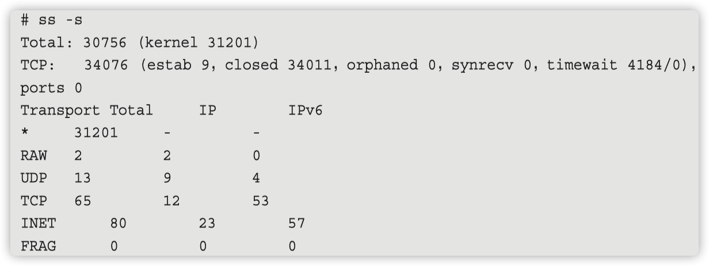

**netstat 统计只有一百来个连接**

```shell
# netstat -n | awk '/^tcp/ {++S[$NF]} END {for(a in S) print a，S[a]}'
ESTABLISHED 9
TIME_WAIT 79
```

**通过 strace 看看二者的统计方式得不同**

**<span style=color:red>ss 直接取自 /proc/net/sockstat。</span>**


**<span style=color:red>netstat 是读取的 /proc/pid/fd 下面关联 tcp 的 socket。</span>**

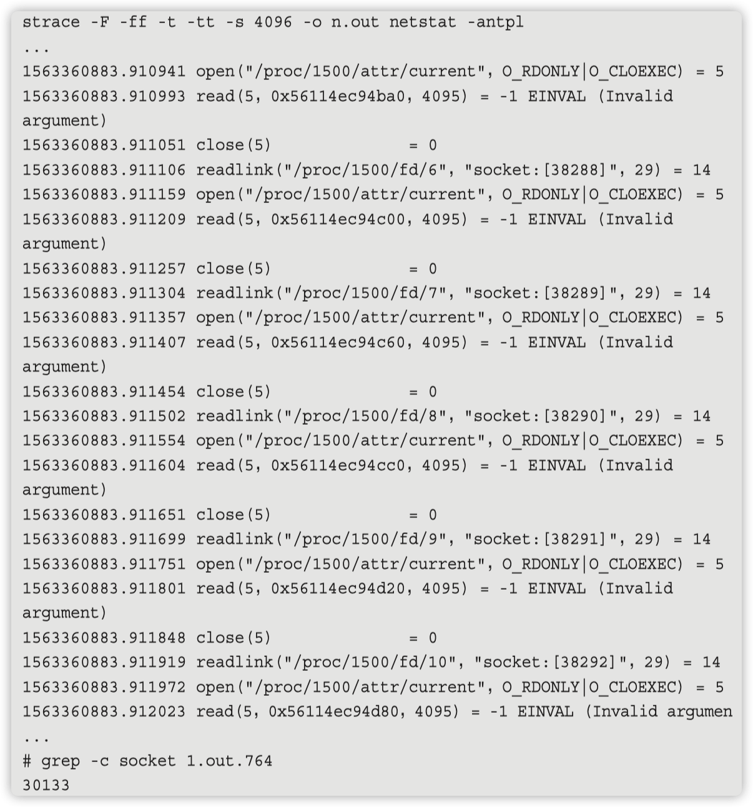

**netstat 也有扫到三万多个 socket， 为什么输出的时候没有展示呢？**

```shell
By default，netstat displays a list of open sockets. If you don’t specify any address families，then the active sockets of all configured address families will be printed.


默认情况下，netstat显示打开的套接字列表。如果不指定任何地址系列，则所有已配置地址系列的活动套接字将被打印
```


**找出来哪个 pid 的 socket 比较多， 对 /proc/pid/fd 目录做批量扫描**

```shell
for d in /proc/[0-9]*;do pid=$(basename $d);s=$(ls -l $d/fd | egrep -i socket | wc -l 2>/dev/null); [ -n "$s" ] && echo "$s $pid";done | sort -n | tail -20
```


**进入到 `/proc/7136/`(上述命令打印出的目录) 目录查看 cmdline 或者直接 ps -ef |grep pid 拿到进程，后面就需要客户自查了**


## 4.3 为什么明明内存很充足但是 java 程序仍申请不到内存 

**背景信息**

> **用户有一台 8G 内存的实例，剩余内存还很多（7G 左右），而 java 程序使用了 4G 内 存申请，直接抛出 OOM。**


**排查如下**


oom 的记录显示为申请 4g 内存失败。

4294967296 /1024 /1024 = 4096 M

1.第一反应是想起来之前的 `vm.min_free_kbytes & nr_hugepage` 导致的 free 大于 available 案例有关。

```shell
centos7 memavailable 小于 memfree
二者的统计方式不一样

MemFree: The sum of LowFree+HighFree

+MemAvailable: An estimate of how much memory is available for starting new
+		applications，without swapping. Calculated from MemFree,
+		SReclaimable，the size of the file LRU lists，and the low
+		watermarks in each zone.
+		The estimate takes into account that the system needs some
+		page cache to function well，and that not all reclaimable
+		slab will be reclaimable，due to items being in use. The
+		impact of those factors will vary from system to system.
https://git.kernel.org/pub/scm/linux/kernel/git/torvalds/linux.git/ commit/?id=34e431b0ae398fc54ea69ff85ec700722c9da773

memfree 统计的是所有内存的 free 内存，而 memavailable 统计的是可以拿来给程序用的内存，而客户设置了 vm.min_free_kbytes（2.5G），这个内存在 free 统计，但是不在 memavailable 统计

nr_hugepage 也会有这个问题
```


2.跟客户要 `free -m && sysctl -p && /proc/meminfo` 等信息分析问题。

HugePages_Total 为 0 说明没有设置 nr_hugepage。

MemAvailable: 7418172 kB 说明这么多内存可用。


```shell
# sysctl -p
net.ipv4.ip_forward = 0
net.ipv4.conf.default.accept_source_route = 0
kernel.sysrq = 1
kernel.core_uses_pid = 1
net.ipv4.tcp_syncookies = 1
kernel.msgmnb = 65536
kernel.msgmax = 65536
kernel.shmmax = 500000000
kernel.shmmni = 4096
kernel.shmall = 4000000000
kernel.sem = 250 512000 100 2048
net.ipv4.tcp_tw_recycle=1
net.ipv4.tcp_max_syn_backlog=4096
net.core.netdev_max_backlog=10000
vm.overcommit_memory=2
net.ipv4.conf.all.arp_filter = 1
net.ipv4.ip_local_port_range=1025 65535
kernel.msgmni = 2048
net.ipv6.conf.all.disable_ipv6=1
net.ipv4.tcp_max_tw_buckets = 5000
net.ipv4.tcp_max_syn_backlog = 8192
net.ipv4.tcp_keepalive_time = 600

#cat /proc/meminfo
MemTotal:		8009416 kB
MemFree:		7347684 kB
MemAvailable:		7418172 kB
Buffers:		18924 kB
Cached:		262836 kB
SwapCached:		0 kB
Active:		315188 kB
Inactive:		222364 kB
Active(anon):		256120 kB
Inactive(anon):		552 kB
Active(file):		59068 kB
Inactive(file):		221812 kB
Unevictable:		0 kB
Mlocked:		0 kB
SwapTotal:		0 kB
SwapFree:		0 kB
Dirty:		176 kB
Writeback:		0 kB
AnonPages:		255804 kB
Mapped:		85380 kB
Shmem:		880 kB
Slab:		40660 kB
SReclaimable:		22240 kB
SUnreclaim:		18420 kB
KernelStack:		4464 kB
PageTables:		6512 kB
NFS_Unstable:		0 kB		
Bounce:		0 kB
WritebackTmp:		0 kB
CommitLimit:		4004708 kB
Committed_AS:		2061568 kB
VmallocTotal:		34359738367 kB
VmallocUsed:		21452 kB
VmallocChunk:		34359707388 kB
HardwareCorrupted:		0 kB
AnonHugePages:		126976 kB
CmaTotal:		0 kB
CmaFree:		0 kB
HugePages_Total:		0
HugePages_Free:		0
HugePages_Rsvd:		0
HugePages_Surp:		0
Hugepagesize:		2048 kB
DirectMap4k:		114560 kB
DirectMap2M:		4079616 kB
DirectMap1G:		6291456 kB
```


3.实际上面的 meminfo 已经说明了问题，但是由于经验不足，一时没有看明白怎么回事，尝试自行测试。

使用 java 命令，去申请超出我的测试机物理内存尝试，拿到报错。

```shell
[root@test ~]# java -Xmx8192M -version
openjdk version "1.8.0_242"
OpenJDK Runtime Environment (build 1.8.0_242-b08)
OpenJDK 64-Bit Server VM (build 25.242-b08，mixed mode)
[root@test ~]# java -Xms8192M -version
OpenJDK 64-Bit Server VM warning: INFO: os::commit_ memory(0x00000005c0000000，5726797824，0) failed; error='Cannot allocate memory' (errno=12)
#
# There is insufficient memory for the Java Runtime Environment to continue.
# Native memory allocation (mmap) failed to map 5726797824 bytes for committing reserved memory.
# An error report file with more information is saved as:
# /root/hs_err_pid8769.log
[root@test ~]# java -Xms4096M -version
openjdk version "1.8.0_242"
OpenJDK Runtime Environment (build 1.8.0_242-b08)
OpenJDK 64-Bit Server VM (build 25.242-b08，mixed mode)
[root@test ~]# java -Xms5000M -version
OpenJDK 64-Bit Server VM warning: INFO: os::commit_ memory(0x0000000687800000，3495428096，0) failed; error='Cannot allocate memory' (errno=12)
......
--------------- S Y S T E M
---------------
OS:CentOS Linux release 7.4.1708 (Core)
uname:Linux 3.10.0-693.2.2.el7.x86_64 #1 SMP Tue Sep 12 22:26:13 UTC 2017 x86_64
libc:glibc 2.17 NPTL 2.17
rlimit: STACK 8192k，CORE 0k，NPROC 15088，NOFILE 65535，AS infinity
load average:0.05 0.05 0.05
/proc/meminfo:
MemTotal:		3881692 kB
MemFree:		2567724 kB
MemAvailable:		2968640 kB
Buffers:		69016 kB
Cached:		536116 kB
SwapCached:		0 kB
Active:		355280 kB
Inactive:		326020 kB
Active(anon):		87864 kB
Inactive(anon):		13296 kB
Active(file):		267416 kB
Inactive(file):		312724 kB
Unevictable:		0 kB
Mlocked:		0 kB
SwapTotal:		0 kB
SwapFree:		0 kB
Dirty:		72 kB
Writeback:		0 kB
AnonPages:		72200 kB
Mapped:		31232 kB
Shmem:		24996 kB
Slab:		63032 kB
SReclaimable:		51080 kB
SUnreclaim:		11952 kB
KernelStack:		1664 kB
PageTables:		4044 kB
NFS_Unstable:		0 kB
Bounce:		0 kB
WritebackTmp:		0 kB
CommitLimit:		1678700 kB
Committed_AS:		2282236 kB
VmallocTotal:		34359738367 kB
VmallocUsed:		14280 kB
VmallocChunk:		34359715580 kB
HardwareCorrupted:		0 kB
AnonHugePages:		30720 kB
HugePages_Total:		256
HugePages_Free:		256
HugePages_Rsvd:		0
HugePages_Surp:		0
Hugepagesize:		2048 kB
DirectMap4k:		57216 kB
DirectMap2M:		3088384 kB
DirectMap1G:		3145728 kB
container (cgroup) information:
container_type: cgroupv1
cpu_cpuset_cpus: 0-1
cpu_memory_nodes: 0
active_processor_count: 2
cpu_quota: -1
cpu_period: 100000
cpu_shares: -1
memory_limit_in_bytes: -1
memory_and_swap_limit_in_bytes: -1
memory_soft_limit_in_bytes: -1
memory_usage_in_bytes: 697741312
memory_max_usage_in_bytes: 0
CPU:total 2 (initial active 2) (1 cores per cpu，2 threads per core) family 6 model 79 stepping 1，cmov，cx8，fxsr，mmx，sse，sse2，sse3，ssse3，sse4.1， sse4.2，popcnt，avx，avx2
，aes，clmul，erms，rtm，3dnowpref，lzcnt，ht，tsc，bmi1，bmi2，adx
/proc/cpuinfo:
processor		: 0
vendor_id		: GenuineIntel
cpu family		: 6
model		: 79
model name		: Intel(R) Xeon(R) CPU E5-2682 v4 @ 2.50GHz
stepping		: 1
microcode		: 0x1
cpu MHz		: 2500.036
cache size		: 40960 KB
physical id : 0
siblings		: 2
core id		: 0
cpu cores		: 1
apicid		: 0
initial apicid		: 0
fpu		: yes
fpu_exception		: yes
cpuid level : 13
wp		: yes
flags : fpu vme de pse tsc msr pae mce cx8 apic sep mtrr pge mca cmov pat pse36 clflush mmx fxsr sse sse2 ss ht syscall nx pdpe1gb rdtscp lm constant_tsc rep_good nopl
eagerfpu pni pclmulqdq ssse3 fma cx16 pcid sse4_1 sse4_2 x2apic movbe popcnt tsc_deadline_timer aes xsave avx f16c rdrand hypervisor lahf_lm abm 3dnowprefetch fsgsbase tsc_adjust
bmi1 hle avx2 smep bmi2 erms invpcid rtm rdseed adx smap xsaveopt
bogomips		: 5000.07
clflush size		: 64
cache_alignment : 64
address sizes		: 46 bits physical，48 bits virtual
power management:
processor		: 1
vendor_id		: GenuineIntel
cpu family		: 6
model		: 79
model name		: Intel(R) Xeon(R) CPU E5-2682 v4 @ 2.50GHz
stepping		: 1
microcode		: 0x1
cpu MHz		: 2500.036
cache size		: 40960 KB
physical id : 0
siblings		: 2
core id		: 0
cpu cores		: 1
apicid		: 1
initial apicid		: 1
fpu		: yes
fpu_exception		: yes
cpuid level : 13
wp		: yes
flags		: fpu vme de pse tsc msr pae mce cx8 apic sep mtrr pge mca cmov
pat pse36 clflush mmx fxsr sse sse2 ss ht syscall nx pdpe1gb rdtscp lm constant_tsc rep_good nopl
eagerfpu pni pclmulqdq ssse3 fma cx16 pcid sse4_1 sse4_2 x2apic movbe popcnt tsc_deadline_timer aes xsave avx f16c rdrand hypervisor lahf_lm abm 3dnowprefetch fsgsbase tsc_adjust
bmi1 hle avx2 smep bmi2 erms invpcid rtm rdseed adx smap xsaveopt
bogomips		: 5000.07
clflush size		: 64
cache_alignment : 64
address sizes		: 46 bits physical，48 bits virtual
power management:
Memory: 4k page，physical 3881692k(2567600k free), swap 0k(0k free)
vm_info: OpenJDK 64-Bit Server VM (25.242-b08) for linux-amd64 JRE (1.8.0_242-b08)，built on Jan 28 2020 14:28:22 by "mockbuild" with gcc 4.8.5 20150623 (Red Hat 4.8.5-39)
time: Thu Feb 20 15:13:30 2020
timezone: CST
elapsed time: 0 seconds (0d 0h 0m 0s)
```


4.java 测试证明正常申请内存不会有问题，超额的内存才会 oom，那么为什么超额呢，视线回归到 sysctl -p 有所发现。


5.两相对照，说明客户设置的 vm.overcommit_memory 在生效， 建议改回 0 再试试。

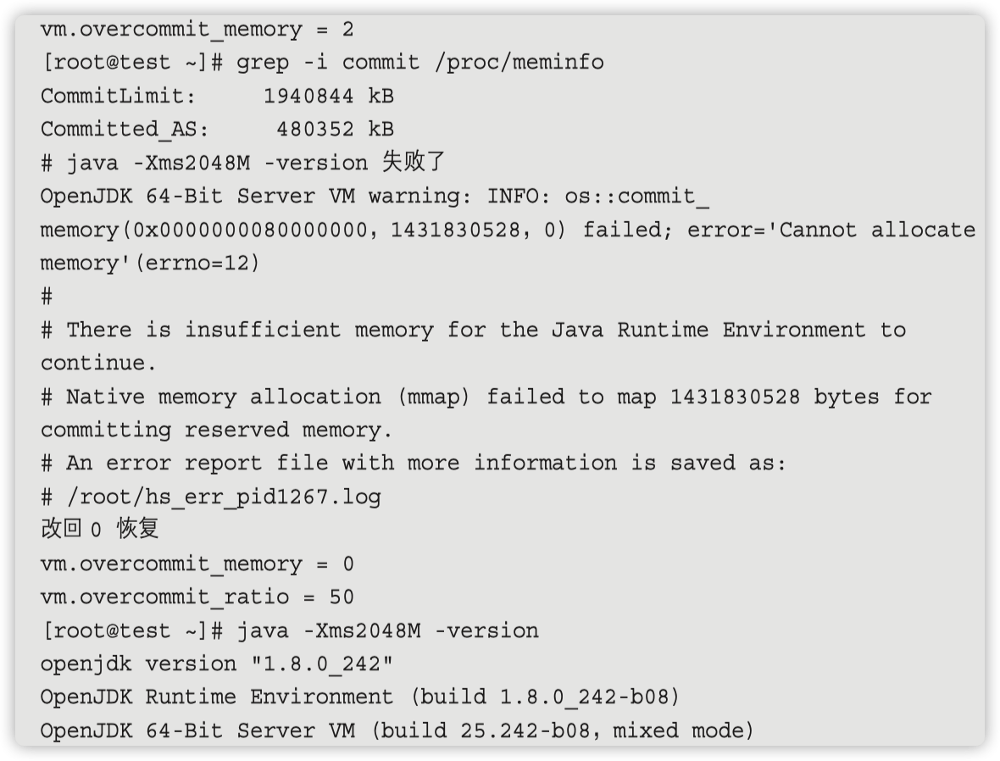


## 4.4 请不要忽略 min_free_kbytes 的设置

**问题背景**

> **服务器内主要运行程序：Jadeos。** 

**问题描述**

> **LINUX tmpfs 空间使用未达到 100%，内存也未占满。 执行任何命令提示 bash: fork: Cannot allocate memory 过几秒时间系统会自动重启。 但在客户本地环境是没有这种情况的，即使 tmpfs 使用达到 100% 系统未提示 Cannot allocate memory。**

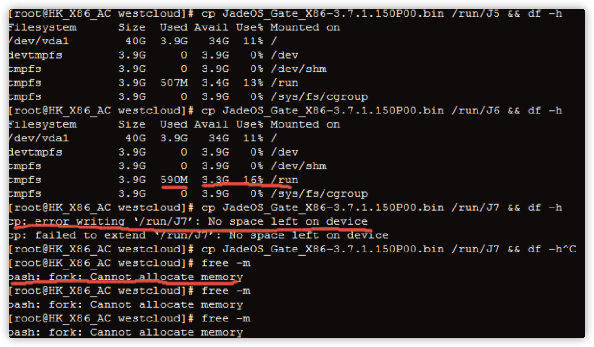


**处理过程**

1.首先判断客户是否内存不足导致，每次执行测试操作后，free 结果显示可用内存是有的。

2.当进程 Process 比较多， 导致无法分配 pid， 也会提示 Cannot allocate memory，执行命令 pstree -a | wc -l 统计下进程数，排除进程数过多导致的内存无法分配。


3.登录主机内部查看客户客户内部设置 min_free_kbytes 值为 1G。

即强制 Linux 系统最低保留多少空闲内存（Kbytes），如果系统可用内存低于该值，默认会启用 oom killer 或者强制重启。 

当耗尽内存直至系统最低保存内存时会有两种现象， 根据内核参数 `vm.panic_ on_oom` 设置值的不同而有不同的行为。 

`vm.panic_on_oom=0` 系统会提示 oom ，并启动 oom-killer 杀掉占用最高内存的进程。 `vm.panic_on_oom =1`. 系统关闭 oom, 不会启动 oom-killer，而是会自动重启。

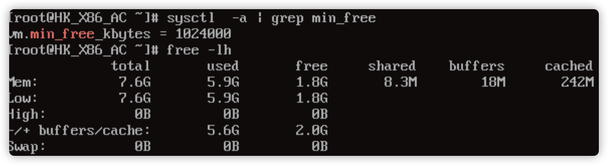


**解决方案**

- 建议客户降低 `min_free_kbytes` 值。 
- 更改减小 `min_free_kbytes` 后，再执行更多次的拷贝，最后一次 free 可用内存显示解决到设置值是，才提示内存不足。 这个是符合 linux 系统对内存管理的预期的。


# 五、最后的彩蛋

## 某地区口罩项目架构演进及优化经验

**简介**

> **疫情初期某地政府决定发放一批免费口罩面向该市市民，该市市民均可免费预约领取，预约时间为早上 9点 -12点，因此该场景为限时抢购类型场景， 会面临非常大的定时超大流量超大并发问题，在该项目的落地过程中，涉及的架构演变，做了一些记录和思考。**


**原始架构图示 & 分析（2月2号晚上 22 点左右的原始架构）。**

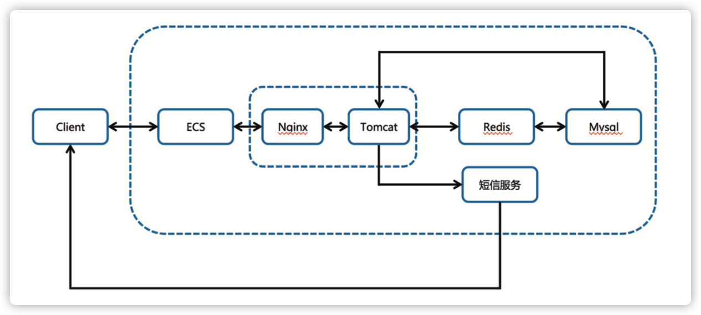

- 客户端走 https 协议直接访问 ecs。

- ECS 上使用 nginx 自建 https 监听。-
- Nginx 反代 tomcat，Nginx 处理静态文件，tomcat 处理动态请求。

- 程序先去 redis 查缓存， 如未命中则去数据库查询数据， 同时 redis 与 mysql 之间的数据同步靠程序控制。 
  - 优点：易管理，易部署。 
  - 缺点：性能差，无扩展性，存在单点风险。 事实证明：该应用一经上线立刻被打挂了（未知原因预约页面泄露，导致还未到预约时间即被打挂）。

**我方介入后的二代架构（24点左右找的我们，早上9点要开服，时间太紧，任务太重， 程序不能动的情况下，几十万的并发架构如何做？ 2月3号早上9点左右的架构，4号也恢复了这个架构）。**

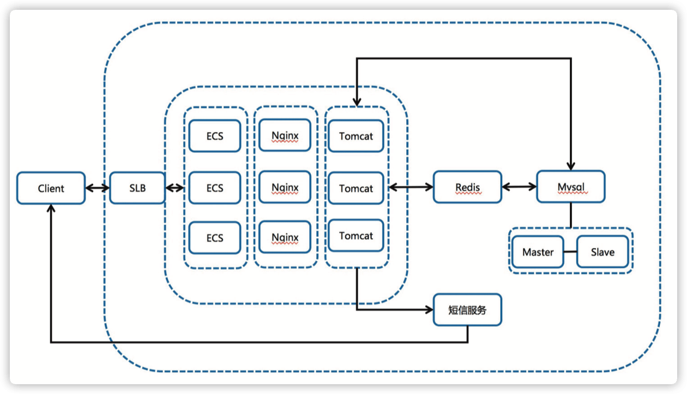


- 接入 slb，通过镜像横向扩展负载能力。

- 接入读写分离数据库架构， 通过阿里云数据库自动进行读写分离， 自动同步数据。

- 调整 nginx 协议。

- 同架构备集群启用（域名解析做了两个 A 记录）。

- 分析访问日志发现失败原因在获取短信 & 登陆初始化 cookie 的点上。 
  - 优点：增加了高可用性，扩展了负载能力。 
  - 缺点：对流量预估不足， 静态页面也在 ECS 上， 因此 SLB 的出带宽一度达到最大值 5.xG，并发高达 22w+，用户一度打不开页面，同时由于新网的限制客户无法自助添加解析， 当晚联系不到新网客服导致 CDN 方案搁浅。


**知耻而后勇的第三代架构（2月4号 & 2月5号的架构，5号应用）。**

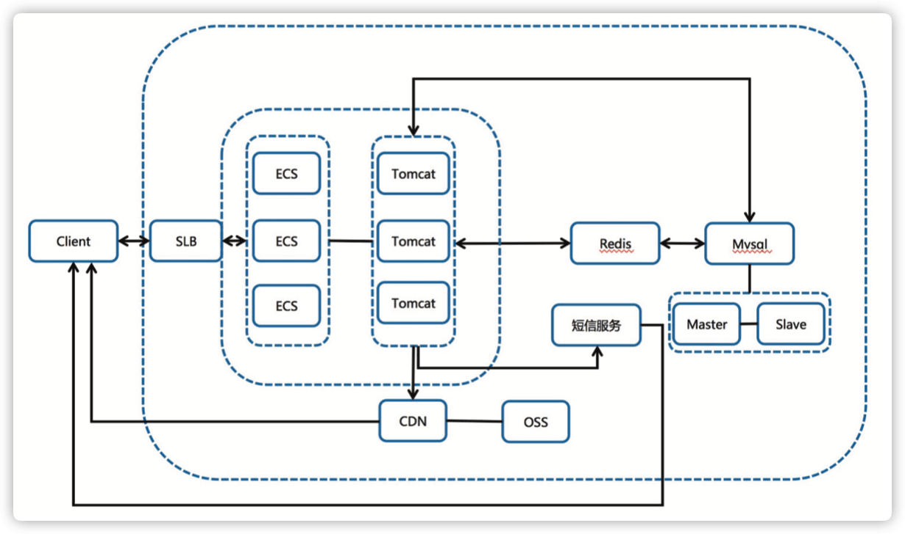

- 接入 CDN 分流超大带宽。

- 取消 nginx 的代理。

- 做了新程序无法准时上线的灾备切换方案（没想到还真用到了）。

- 使用虚拟服务器组做新老程序的切换，但是缺点是一个七层监听的 slb 后端只能挂 200 个机器，再多 slb 也扛不住了，导致老程序刚承接的时候再度挂掉。

- 5号使用这个架构上线，7分钟库存售罄，且体验极度流程，丝般顺滑，健康同学开发的新程序真是太爽的。 
  - 优点：CDN 负担静态资源的流量降低了 SLB 的出带宽，压测的效果也非常理想。 
  - 缺点：需要多一个独立的域名在页面里面，涉及跨域，4号临开服之际测试发现入库 & 预约短信乱码返回，紧急切换回了老程序，即二代架构。


**理想架构**

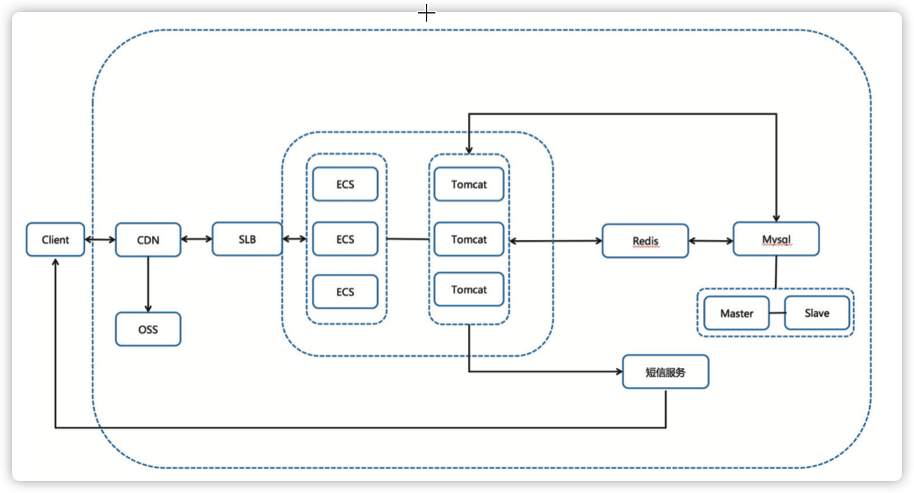

- 主域名接入 CDN，

- CDN 通过设置回源 http、https 协议去访问 SLB 的不同监听实现新老程序之间的切换，具体实现为回源协议对应。不同监听，监听对应不同的程序。 
  - 优点：静态加速降低 SLB 带宽，动态回源，无跨域问题 ，切换方便。
  - 缺点：仍需手工设置，镜像部署 ecs 不方便，如果时间充足，可以直接上容器的架构该有多美好呢，一个 scale 可以扩出来几十上百的 pod，也可以做节点自动扩容。


**总结**

总结：时间紧任务重，遇到了 N 多的坑，想起来一个补一个 ~

1. vcpu 购买额度。

2. slb 后端挂载额度。

3. 客户余额不足欠费停机。

4. 新网解析需要联系客服添加。

5. 第一次考虑 CDN 架构的时候未考虑跨域问题。

6. 新程序开发期间未连接主库测试，导致上线失败（主库乱码）。

7. 第一次（3 号）被打挂的时候只关注了 slb 的流量，未详细分析失败最多的环节。

8. 上线前压测缺失，纯靠人工测试功能。

9. 压测靠人手一台 jmeter（4号晚上到5号早上引入了PTS进行压测）。

10. 突然想起来客户原始的程序是放在 windows 上的，导致性能出现了大大的折扣。


最后的成果统计（采样分析，实际数据比这个还大）：


最后上线的三代架构，为了保险起见上了 150 台机器，但是根据活动期间的观察，以及对压测结果的评估，上50台机器应该就可以抗住了，从持续5小时一直崩溃被终端用户骂街，到7分钟库存售罄的领导赞赏，虽然经历了3个通宵的戮战，依然可以隐隐约约感觉到身心都得到了升华 ~


**优化参数笔记**

**1.参数优化**

```shell
net.ipv4.tcp_max_tw_buckets = 5000 --> 50000
net.ipv4.tcp_max_syn_backlog = 1024 --> 4096
net.core.somaxconn = 128 --> 4096
net.ipv4.tcp_tw_reuse = 1
net.ipv4.tcp_timestamps = 1(5 和 6 同时开启可能会导致nat上网环境建联概率失败 )
net.ipv4.tcp_tw_recycle = 1


/etc/security/limits.conf
* soft nofile 65535
* hard nofile 65535


nginx 参数优化
worker_connections	1024-->10240;
worker_processes	1-->16;（根据实际情况设置，可以设置成 auto）
worker_rlimit_nofile 1024-->102400;	
listen 80 backlog 511-->65533；
部分场景也可以考虑 nginx 开启长连接来优化短链接带来的开销
```


**2.架构优化**

```shell
扩容SLB后端ECS数量，ecs配置统一
nginx反代后端upstream无效端口去除
云助手批量处理服务，参数优化，添加实例标识
云监控大盘监控，ECS slb dcdn redis
调整SLB为7层监听模式，前7后4关闭会话保持导致登录状态失效，
```


**3.程序优化**

```shell
添加 gc log，捕捉 gc 分析问题，设置进程内存
/usr/bin/java -server -Xmx8g -verbose:gc -XX:+PrintGCDetails -Xloggc:/var/ log/9052.gc.log -Dserver.port=9052 -jar /home/app/we.*****.com/serverboot0.0.1-SNAPSHOT.jar

优化短信发送逻辑，登陆先查询 redis 免登 session，无免登 session 再允许发送短信验证码（降短信的量，优化登陆体验）

jedis 连接池优化
maxTotal 8-->20
acceptcount 优化（对标 somaxconn）

bug：
springboot1.5 带的 jedis2.9.1 的 redis 连接泄漏的问题，导致 tomcat 800 进程用满后都无 限等待 redis 连接
后来进一步调研发现这个问题在 2.10.2 已经修复，而且 2.10.2 向后兼容 2.9.1
```


**4.数据库优化**

```shell
redis 公网地址变更为内网地址
redis session 超时设置缩短，用于释放 redis 连接
server.servlet.session.timeout=300s
spring.session.timeout=300s

慢 SQL 优化（RDS 的 CloudDBA 非常好用哟）
添加只读实例，自动读写分离
优化 backlog
添加读写分离实例数量
```

