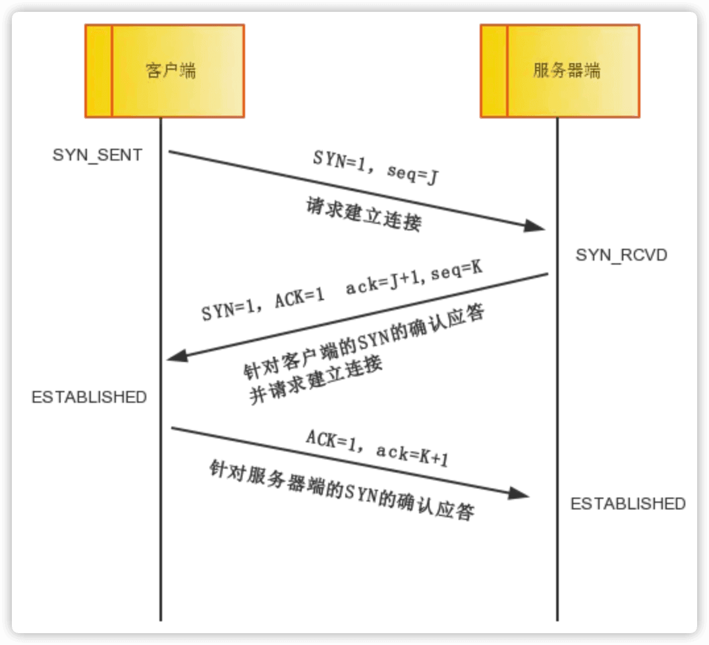
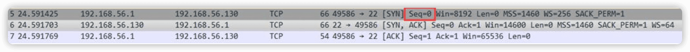
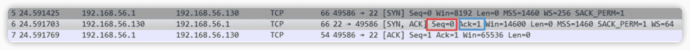
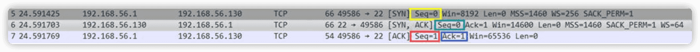
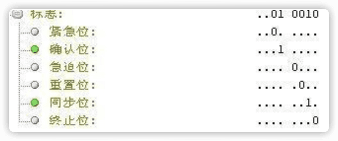
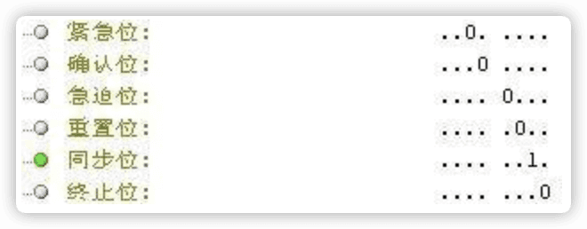
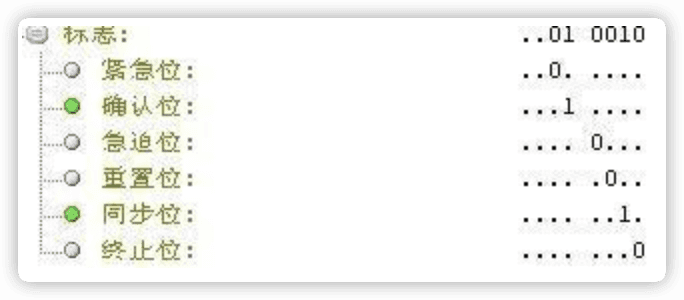
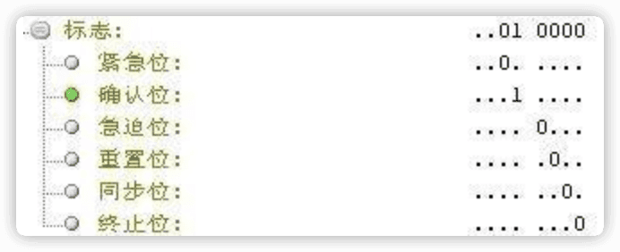

# TCP三次握手和四次挥手

## 三次握手（重点）

- TCP 提供面向有连接的通信传输。面向有连接是指在数据通信开始之前先做好两端之间的准备工作。
- 所谓三次握手是指建立一个 TCP 连接时需要客户端和服务器端总共发送三个包以确认连接的建立。在socket编程中，这一过程由客户端执行connect来触发。

下面来看看三次握手的流程图：

- **第一次握手：客户端将标志位SYN置为1，随机产生一个值seq=J，并将该数据包发送给服务器端，客户端进入SYN_SENT状态，等待服务器端确认。**

- **第二次握手：服务器端收到数据包后由标志位SYN=1知道客户端请求建立连接，服务器端将标志位SYN和ACK都置为1，ack=J+1，随机产生一个值seq=K，并将该数据包发送给客户端以确认连接请求，服务器端进入SYN_RCVD状态。**

- **第三次握手：客户端收到确认后，检查ack是否为J+1，ACK是否为1，如果正确则将标志位ACK置为1，ack=K+1，并将该数据包发送给服务器端，服务器端检查ack是否为K+1，ACK是否为1，如果正确则连接建立成功，客户端和服务器端进入ESTABLISHED状态，完成三次握手，随后客户端与服务器端之间可以开始传输数据了。**

**这里小写的ack为确认编号(上一次对方主机传输过来的seq+1)，大写的ACK是确认值，确认值为1表示确认连接**

## 四次挥手（重点）

- 四次挥手即终止TCP连接，就是指断开一个TCP连接时，需要客户端和服务端总共发送4个包以确认连接的断开。在socket编程中，这一过程由客户端或服务端任一方执行close来触发。
- 由于TCP连接是全双工的，因此，每个方向都必须要单独进行关闭，这一原则是当一方完成数据发送任务后，发送一个FIN来终止这一方向的连接，收到一个FIN只是意味着这一方向上没有数据流动了，即不会再收到数据了，但是在这个TCP连接上仍然能够发送数据，直到这一方向也发送了FIN。首先进行关闭的一方将执行主动关闭，而另一方则执行被动关闭。

下面来看看四次挥手的流程图：

- 中断连接端可以是客户端，也可以是服务器端。
- **第一次挥手：客户端发送一个FIN=M，用来关闭客户端到服务器端的数据传送，客户端进入FIN_WAIT_1状态。意思是说"我客户端没有数据要发给你了"，但是如果你服务器端还有数据没有发送完成，则不必急着关闭连接，可以继续发送数据。**
- **第二次挥手：服务器端收到FIN后，先发送ack=M+1，告诉客户端，你的请求我收到了，但是我还没准备好，请继续你等我的消息。这个时候客户端就进入FIN_WAIT_2 状态，继续等待服务器端的FIN报文。**
- **第三次挥手：当服务器端确定数据已发送完成，则向客户端发送FIN=N报文，告诉客户端，好了，我这边数据发完了，准备好关闭连接了。服务器端进入LAST_ACK状态。**
- **第四次挥手：客户端收到FIN=N报文后，就知道可以关闭连接了，但是他还是不相信网络，怕服务器端不知道要关闭，所以发送ack=N+1后进入TIME_WAIT状态，如果Server端没有收到ACK则可以重传。服务器端收到ACK后，就知道可以断开连接了。客户端等待了2MSL后依然没有收到回复，则证明服务器端已正常关闭，那好，我客户端也可以关闭连接了。最终完成了四次握手。**

**上面是一方主动关闭，另一方被动关闭的情况，实际中还会出现同时发起主动关闭的情况，**
具体流程如下图：

## 关于TCP协议中三次握手中的大写ACK和小写ack number的区别

在三次握手发送的数据包中有两个ACK值（Acknowledgement），人们习惯一个大写，一个小写来加以区分。**大小写只是为了便于区分**

- 一个是确认值(Acknowledgement)，为1便是确认连接。
- 另一个是确认编号(Acknowledgement Number)，即接收到的上一次远端主机传来的seq然后+1，再发送给远端主机。提示远端主机已经成功接收上一次所有数据。

**三次握手的数据包**

**第一次握手**

红框内为第一次握手时IP为192.168.56.1的请求端（请求连接端）发送的seq，值为0（实际中此值不一定为0）

**第二次握手**

红框内为第二次握手时IP为192.168.56.130的服务端（被请求连接端）发送的seq，因为是服务端发给请求端的一个新的seq，所以值为0（实际中此值不一定为0）

蓝框内为Ack（Acknowledgement Number确认编号）即我理解的小写的ack，值为第一次握手时请求端发送来的seq+1即0+1=1

**第三次握手**

红框内为第三次握手时IP为192.168.56.1的请求端（请求连接端）发送的seq，因为第一次握手时它发送给服务端的seq为0（黄框内），在上次的基础上+1，值就是1。
蓝框内的Ack（Acknowledgement Number确认编号）还是我理解的小写的ack，值为第二次握手时请求端发来的seq+1，即绿框中的seq+1，值为0+1=1

那么问题来了，那个起确认连接作用的确认值即我理解的那个大写的ACK在哪呢？

在这里，展开看一下：

---

对照网上找到的关于第二次握手的标志位的一张图可以看出：
确认位即ACK，为1即为确认进行连接
同步位即SYN，从第一次握手时，此位就为1

下面是网上找到的三次握手的标志图，供参考：

**第一次握手的标志位**
我们可以看到标志位里面只有个同步位，也就是在做请求(SYN)

**第二次握手的标志位**
我们可以看到标志位里面有个确认位和同步位，也就是在做应答(SYN + ACK)

**第三次握手的标志位**
我们可以看到标志位里面只有个确认位，也就是再做再次确认(ACK)

