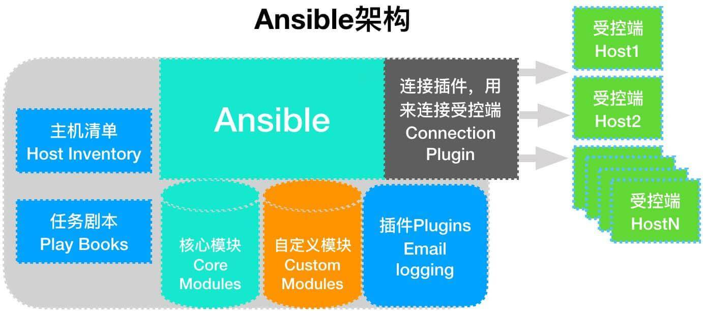
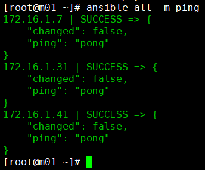
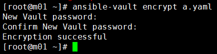
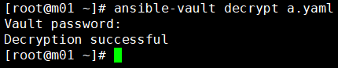
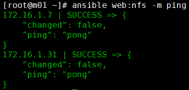
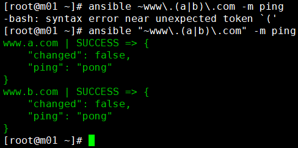
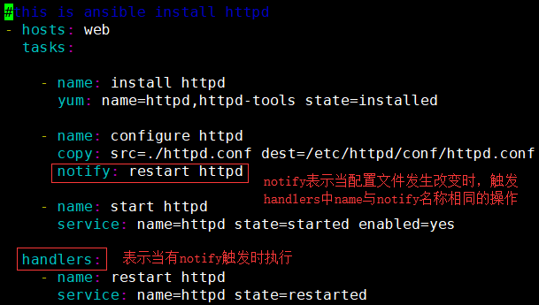

# Ansible基础知识

# 1.Ansible基本概述

**Ansible是一个配置管理系统configuration management system你只需要可以使用ssh访问你的服务器或设备就行**


## 1.1Ansible能做什么

**ansible可以帮助我们完成一些批量任务，或者完成一些需要经常重复的工作。**

**比如：同时在100台服务器上安装nginx服务，并在安装后启动服务。**

**比如：将某个文件一次性拷贝到100台服务器上。**

**比如：每当有新服务器加入工作环境时，你都要为新服务器部署某个服务，也就是说你需要经常重复的完成相同的工作。**

**这些场景中我们都可以使用到ansible。**


## 1.2Ansible软件特点

**1.ansible不需要单独安装客户端，SSH相当于ansible客户端。**

**2.ansible不需要启动任何服务，仅需安装对应工具即可。**

**3.ansible依赖大量的python模块来实现批量管理。**

**4.ansible配置文件/etc/ansible/ansible.cfg**


## 1.3Ansible基础架构

**1.连接插件(connectior plugins) 用于连接主机 用来连接被管理端**

**2.核心模块(core modules) 连接主机实现操作， 它依赖于具体的模块来做具体的事情**

**3.自定义模块(custom modules) 根据自己的需求编写具体的模块**

**4.插件(plugins) 完成模块功能的补充**

**5.剧本(playbooks)ansible的配置文件,将多个任务定义在剧本中，由ansible自动执行**

**6.主机清单(host inventory)定义ansible需要操作主机的范围**

**最重要的一点是 ansible是模块化的 它所有的操作都依赖于模块**




# 2.Ansible安装配置

**所有的受控主机必须与ansible服务端做ssh免密登陆**

## 2.1.安装ansible(需要配置epel源)

```python
[root@m01 ~]# yum install ansible -y

//检查ansible版本
[root@m01 ~]# ansible --version
ansible 2.6.1
```


## 2.2配置ansible

```python
[root@m01 ~]# cat >> /etc/ansible/hosts<EOF
[host]
172.16.1.10
172.16.1.20
EOF

###############################
/etc/absible/hosts	ansible主机清单配置文件
[host]			  主机清单名
172.16.1.10		主机IP地址1
172.16.1.20		主机IP地址2
```


## 2.3验证ansible与受控机是否通信

```python
//ansible是通过ssh端口探测通信
[root@m01 ~]# ansible hehe -m ping
10.0.0.30 | SUCCESS => {
    "changed": false,
    "ping": "pong"
}
10.0.0.40 | SUCCESS => {
    "changed": false,
    "ping": "pong"
}
```


## 2.4ansible语法格式

> **命令  主机模块名  指定模块参数  模块名称  指定利用模块执行的动作选项  批量执行操作动作**

```python
[root@m01 ~]# ansible all -m command -a "hostname"
10.0.0.31 | SUCCESS | rc=0 >>
backup

10.0.0.41 | SUCCESS | rc=0 >>
nfs01

all	         模块名
-m	         指定模块
command	     command模块，完成基础命令
-a	         指定执行动作
"hostname"	 执行hostname命令
```


# 3.Ansible系列命令

## 3.1ansiblie系列命令1：ansible

**使用场景：**

- **非固化需求** 

- **临时一次性操作**

- **二次开发接口调用**

**使用示例**

- **//检查服务器存活状态**
  - **ansible all -m ping** 




## 3.2ansiblie系列命令2：ansible-galaxy

**命令作用：**

- **根据下载量和关注量等信息，查找和安装优秀的roles**

**命令格式：**

- **ansible-galaxy [init|info|install|list|remove] [ --help] [options] ...**

**命令分为3部分**

**(1)	[init|info|install|list|remove]**

**init		初始化本地的roles配置，以备上传roles至galaxy**

**info		列表指定role的详细信息**

**install	下载并安装galaxy指定的roles到本地**

**list		列出本地已经下载的roles**

**remove	删除本地已经下载的roles**


**(2)	help用法显示[--help]**

**ansible-galaxy init --help**


**(3)	参数项**

**ansible-galaxy init [options] role_name**


## 3.3ansiblie系列命令3：ansible-doc

**命令作用：**

- **模块文档说明**

**命令格式：**

- **ansible-doc [options] [module]**

**示例：**

- **//列出ansible支持的 模块**
  - **ansible-doc -l**

- **//模块功能说明**
  - **ansible-doc ping**


## 3.4ansiblie系列命令4：ansible-playbook

**命令作用：**

- **读取预先编写好的playbook文件实现批量管理**

**命令格式：**

- **ansible-playbook xxx.yaml**

**示例：**

- **//执行http_install这个playbook种定义的所有任务集**
  - **ansible-playbook http_install.yaml**


## 3.5ansiblie系列命令5：ansible-vault

**命令作用：**

- **用于配置文件加密**

**命令格式：**

- **ansible-vault [encrypt|decrypt|create|edit|rekey|view] [--help] [options] file**

**示例：**

- **//加密a.yaml文件**

  - **ansible-vault encrypt a.yaml		encrypt 加密**

  

  - **//加密后查看a.yaml文件就会显示乱码**

​               


- **//解密a.yaml文件**

  - **ansible-vault decrypt a.yaml		decrypt 解密**

    


# 4.Ansible正则

## 4.1ALL全量匹配	all或*

**匹配所有主机，all与*号功能相同**

**//all和*号功能相同，但是\*号需要用""引起来**

**ansible all -m ping**


**ansible "*" -m ping** 


## 4.2逻辑或匹配	：

**同时对多台主机或多个组同时执行，相互之间用":"分割**

**web1:web2**


**//检测web组和nfs组中所有主机的存活**

**ansible "web:nfs" -m ping**




## 4.3逻辑非匹配	！

**逻辑非用!表示，主要针对多重条件的匹配规则**

**//所有在a组但不在b组的主机**

**a:!b**


## 4.4逻辑与匹配	&

**逻辑与用&表示**

**//a组和b组中同时存在的主机**

**a:&b**


## 4.5模糊匹配	*

***通配符在ansible中表示0个或多个任意字符**

**//所有以www开头.com结尾的主机**


## 4.6正则匹配	~

**~在ansible中表示正则匹配**

**//匹配www.a.com和www.b.com**


**⚠️注意**

**~要在最前边，一定要加双引号**




# 5.Ansible清单管理

**inventory文件通常用于定义要管理主机的认证信息， 例如ssh登录用户名、密码以及key相关信息。如何配置Inventory文件**


**主机**

- **1.支持主机名通配以及正则表达式，例如web[1:3].abc.com**

- **2.支持基于非标准的ssh端口，例如web1.abc.com:6666**

- **3.支持指定变量，可对个别主机的特殊配置，如登陆用户，密码等**


**主机组**

- **1.支持嵌套组，例如[game:children],那么在game模块下面的组都会被game所包含**

- **2.支持指定变量，例如[game:vars]在下面指定变量**

```python
[root@m01 ~]# cat /etc/ansible/hosts
[webservers]
10.0.0.8
10.0.0.31
10.0.0.41
10.0.0.61

//添加三台主机至webserver[low版]
[webservers]
web1.abc.com
web2.abc.com
web3.abc.com

//添加三台主机至webserver[low改良版]
[webservers]
web[1:3].abc.com


//添加三台主机至webserver[密码版]
[webservers]
web1.abc.com ansible_ssh_pass='123456'
web2.abc.com ansible_ssh_pass='123456'
web3.abc.com ansible_ssh_pass='123456'

//添加三台主机至webserver[密码改良版]
[webservers]
web[1:3].abc.com ansible_ssh_pass='123456'

//添加三台主机至webserver[密码拆分版]
[webservers]
web1.abc.com
web2.abc.com
web3.abc.com
[webservers:vars]
ansible_ssh_pass='123456'


//定义多组，多组汇总整合
[apache]
web1.abc.com
web2.abc.com
web3.abc.com
[apache:vars]
ansible_ssh_pass='123456'

[nginx]
10.0.0.7
10.0.0.31
10.0.0.41
10.0.0.61
[nginx:vars]
ansible_ssh_pass='123456'

//webservers组包括两个子组[apapche,nginx]
[webservers:children]
apache
nginx

ansible nginx --list-hosts
ansible apache --list-hosts
ansible websers --list-hosts
```


## Ansible内置变量

| **参数**                     | **用途**                     | 示例                                          |
| ---------------------------- | ---------------------------- | --------------------------------------------- |
| ansible_ssh_host             | 定义hosts ssh地址            | ansible_ssh_host=192.168.1.10                 |
| ansible_ssh_port             | 定义hosts ssh端口            | ansible_ssh_port=2222                         |
| ansible_ssh_user             | 定义hosts ssh认证用户        | ansible_ssh_user=user                         |
| ansible_ssh_pass             | 定义hosts ssh认证密码        | ansible_ssh_pass=pass                         |
| ansible_sudo                 | 定义hosts sudo用户           | ansible_sudo=www                              |
| ansible_sudo_pass            | 定义hosts sudo密码           | ansible_sudo_pass=pass                        |
| ansible_sudo_exe             | 定义hosts sudo路径           | ansible_sudo_exe=/usr/bin/sudo                |
| ansible_connection           | 定义hosts 连接方式           | ansible_connection=local                      |
| ansible_ssh_private_key_file | 定义hosts 私钥               | ansible_ssh_private_key_file=/root/key        |
| ansible_ssh_shell_type       | 定义hosts shell类型          | ansible_ssh_shell_type=bash                   |
| ansible_python_interpreter   | 定义hosts 任务执行python路径 | ansible_python_interpreter=/usr/bin/python2.7 |
| ansible_*_interpreter        | 定义hosts 其他语言解析路径   | ansible_* _interpreter=/usr/bin/ruby          |


# 6.Ansible Playbook

**playbook是由一个或多个模块组成的，使用多个不同的模块，完成一件事情**

**playbook通过yaml语法识别描述的状态文件。扩展名是yaml或yml**

## 6.1YAML三板斧

- **缩进**

- - **YAML使用一个固定的缩进风格表示层级结构,每个缩进由两个空格组成, 不能使用tabs**

- **冒号**

- - **以冒号结尾的除外，其他所有冒号后面所有必须有空格**

- **短横线**

- - **表示列表项，使用一个短横杠加一个空格**
  - **多个项使用同样的缩进级别作为同一列表**

## 6.2ansible playbook安装Apache示例

