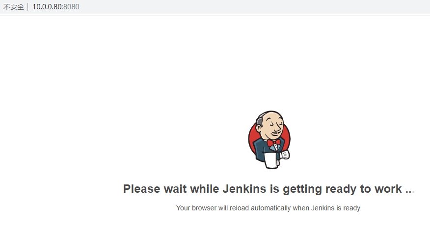
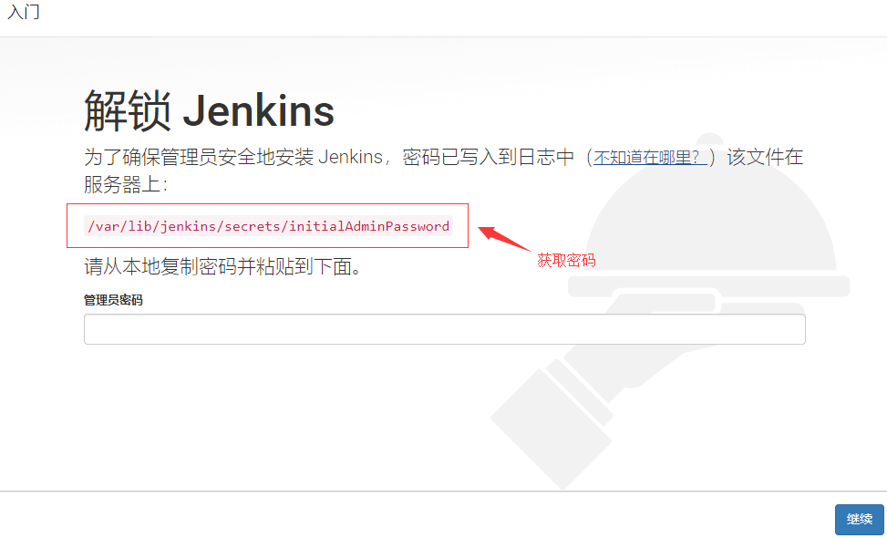
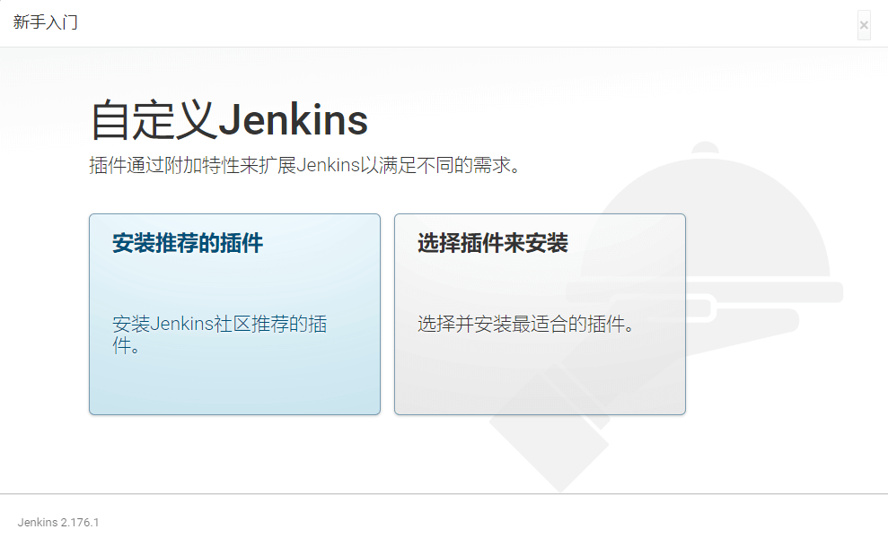

# CentOS7.5安装jenkins-2.176

[jenkins中文官网](https://jenkins.io/zh/)

[jenkins官网](https://jenkins.io)


# 1.安装jdk8,jenkins运行依赖jdk

**自行到oracle官网下载jdk**

[oracle官网](https://www.oracle.com/technetwork/java/javase/downloads/index.html)

```python
1.解压缩包
[root@jenkins ~]# tar xf jdk-8u211-linux-x64.tar.gz -C /usr/local

2.导出环境变量
[root@jenkins ~]# cat >/etc/profile.d/jdk8.sh<<'EOF'
export JAVA_HOME=/usr/local/jdk1.8.0_211
export PATH=$JAVA_HOME/bin:$JAVA_HOME/jre:$JAVA_HOME/lib:$PATH
export CLASSPATH=.:$JAVA_HOME/lib/dt.jar:$JAVA_HOME/lib/tools.jar
export JAVA_HOME PATH CLASSPATH
EOF

3.使配置生效
[root@jenkins ~]# source /etc/profile

4.链接java命令，否则后续启动jenkins会报错
[root@jenkins ~]# ln -s /usr/local/jdk1.8.0_211/bin/java /usr/bin/java

5.查看java版本
[root@jenkins ~]# java -version
java version "1.8.0_211"
Java(TM) SE Runtime Environment (build 1.8.0_211-b12)
Java HotSpot(TM) 64-Bit Server VM (build 25.211-b12, mixed mode)
```


# 2.安装jenkins，这里安装长期支持版

```python
#安装LTS(长期支持版)
LTS (长期支持) 版本每12周从常规版本流中选择，作为该时间段的稳定版本。
[root@jenkins ~]# curl -o /etc/yum.repos.d/jenkins.repo https://pkg.jenkins.io/redhat-stable/jenkins.repo

[root@jenkins ~]# rpm --import https://pkg.jenkins.io/redhat-stable/jenkins.io.key

[root@jenkins ~]# yum -y install jenkins


#安装每周更新版
每周都会发布一个新版本，为用户和插件开发人员提供错误修复和功能。
[root@jenkins ~]# curl -o /etc/yum.repos.d/jenkins.repo https://pkg.jenkins.io/redhat/jenkins.repo

[root@jenkins ~]# rpm --import https://pkg.jenkins.io/redhat/jenkins.io.key

[root@jenkins ~]# yum -y install jenkins


#安装指定版本
https://pkg.jenkins.io/redhat-stable/
```


# 3.修改jenkins配置文件，让jenkins以root用户运行

```python
[root@jenkins ~]# sed -i.bak '29cJENKINS_USER="root"' /etc/sysconfig/jenkins
```


# 4.启动jenkins

```python
#启动jenins并加入开机自启
[root@jenkins ~]# systemctl enable jenkins && systemctl start jenkins
```


# **5.浏览器访问jenkins**

**jenkins刚启动比较慢，等待启动完成**




**从/var/lib/jenkins/secrets/initialAdminPassword文件按中获取密码**



**是否安装插件，自行选择**




**选择插件进行安装，必须选择Locale插件，修改jenkins语言**


**等待安装完成**


**插件安装完成后创建管理员用户，输入密码、用户全名、邮件地址**


**jenkins URL默认为主机IP地址加8080端口**


**jenkins首界面**


# 6.设置jenkins默认语言为中文

**选择jenkins管理**


**配置系统**


**默认语言填写zh_CN**

