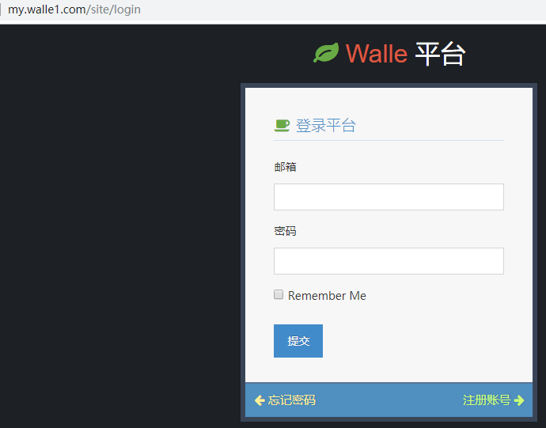
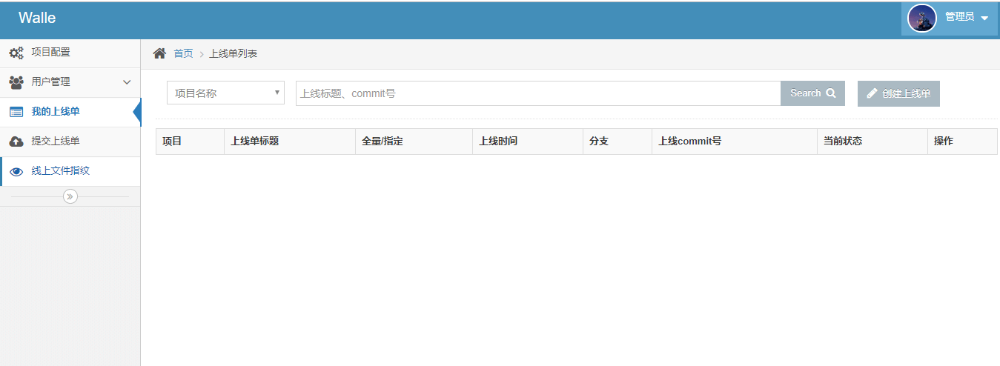

# CentOS7.5安装walle1.2

**walle1.0是基于php开发的，需要php5.4以上版本**

[瓦力官方文档](http://www.walle-web.io/docs/1/installation.html)


**瓦力上线流程**


# 一、依赖

- **Bash(git、ssh)**
- **意味着不支持win、mac的zsh**
- **LNMP/LAMP(php5.4+)**
- **php需要开启pdo_mysql，exec函数执行**
- **Composer**
- **如果国内环境安装极慢，可以直接下载[vendor](http://pan.baidu.com/s/1c0wiuyc)解压到项目根目录**
- **ansible**


# 二、系统环境

## 2.1系统版本

```python
[root@walle ~]# cat /etc/redhat-release 
CentOS Linux release 7.5.1804 (Core) 
```


## 2.2php版本

```python
[root@walle ~]# php -v
PHP 7.2.16 (cli) (built: Mar 10 2019 21:22:49) ( NTS )
Copyright (c) 1997-2018 The PHP Group
Zend Engine v3.2.0, Copyright (c) 1998-2018 Zend Technologies
    with Zend OPcache v7.2.16, Copyright (c) 1999-2018, by Zend Technologies
```


# 三、安装步骤

## 3.1更换系统yum源为阿里云yum源及添加epel源

```python
//备份原有base源
[root@walle ~]# mv /etc/yum.repos.d/CentOS-Base.repo /etc/yum.repos.d/CentOS-Base.repo.backup

//下载阿里云yum源
[root@walle ~]# wget -O /etc/yum.repos.d/CentOS-Base.repo http://mirrors.aliyun.com/repo/Centos-7.repo

//下载epel源
[root@walle ~]# wget -O /etc/yum.repos.d/epel.repo http://mirrors.aliyun.com/repo/epel-7.repo

//清空缓存、生成yum缓存
[root@walle ~]# yum clean all
[root@walle ~]# yum makecache
```


## 3.2安装php-7.2

```python
//1.下载php7.2yum源
需要先安装epel-release
[root@walle ~]# yum -y install https://mirror.webtatic.com/yum/el7/webtatic-release.rpm

//2.安装php7.2
[root@walle ~]# yum -y install php72w php72w-cli php72w-common php72w-curl php72w-gd \
php72w-mbstring php72w-mysqlnd php72w-process php72w-xml php72w-zip \
php72w-opcache php72w-pecl-apcu php72w-intl php72w-pecl-redis php72w-fpm 

//3.启动php-fpm并设置为开机自启
[root@walle ~]# systemctl start php-fpm && systemctl enable php-fpm
```


## 3.3安装mysql-5.7.22

[gitbook链接-安装msql-5.7.22](https://gitbook.pptfz.top/db/mysql/mysql%E5%9F%BA%E7%A1%80/4.CentOS7.5%E4%BA%8C%E8%BF%9B%E5%88%B6%E5%AE%89%E8%A3%85MySQL-5.7.22.html)

[有道云链接-安装mysql-5.7.22](http://note.youdao.com/noteshare?id=797a38d0cd414fbd93dc6f4ab6f74ce3&sub=A4D89AF1BA6142F6B4A10620F4BB788D)


## 3.4安装nginx-1.14并编辑配置文件

```python
//添加nginx官方yum源
[root@walle ~]# cat >/etc/yum.repos.d/nginx.repo <<'EOF'
[nginx]
name=nginx repo
baseurl=http://nginx.org/packages/centos/7/$basearch/
gpgcheck=0
enabled=1
EOF

//安装nginx1.14
[root@walle ~]# yum -y install nginx

//编辑配置文件
[root@walle ~]# cd /etc/nginx/conf.d/
[root@walle conf.d]# mv default.conf default.conf.bak
[root@walle conf.d]# cat >/etc/nginx/conf.d/my.walle1.com.conf <<'EOF'
server {
    listen       80;
    server_name  my.walle1.com; # 改你的host
    root /data/www/walle-web/web; # 根目录为web
    index index.php;

    # 建议放内网
    # allow 192.168.0.0/24;
    # deny all;

    location / {
        try_files $uri $uri/ /index.php$is_args$args;
    }

    location ~ \.php$ {
        try_files $uri = 404;
        fastcgi_pass   127.0.0.1:9000;
        fastcgi_param  SCRIPT_FILENAME  $document_root$fastcgi_script_name;
        include        fastcgi_params;
    }
}
EOF

//检测nginx配置文件语法
[root@walle conf.d]# nginx -t
nginx: the configuration file /etc/nginx/nginx.conf syntax is ok
nginx: configuration file /etc/nginx/nginx.conf test is successful

//启动nginx并设置开机自启
[root@walle conf.d]# systemctl start nginx && systemctl enable nginx
```


## 3.5安装ansible

```python
[root@walle ~]# yum -y install ansible
```


## 3.6代码检出

```python
//创建目录
[root@walle ~]# mkdir -p /data/www && cd /data/www

//克隆代码
[root@walle ~]# git clone https://github.com/meolu/walle-web-v1.x.git .
```


## 3.7设置mysql

```python
[root@walle walle-web]# pwd
/data/www/walle-web
[root@walle walle-web]# vim config/local.php
修改24行，25行，写入mysql用户名和密码
'username'  => isset($_ENV['WALLE_DB_USER']) ? $_ENV['WALLE_DB_USER'] : 'root',
'password'  => isset($_ENV['WALLE_DB_PASS']) ? $_ENV['WALLE_DB_PASS'] : '123456',

//创建数据库walle
[root@walle walle-web]# mysql -uroot -p -e "create database walle"
```


## 3.8安装composer，Composer 是 PHP5.3以上 的一个依赖管理工具

```python
//下载安装脚本composer-setup.php到当前目录
[root@walle walle-web]# php -r "copy('https://install.phpcomposer.com/installer', 'composer-setup.php');"

//执行安装过程
[root@walle walle-web]# php composer-setup.php

//删除安装脚本
[root@walle walle-web]# php -r "unlink('composer-setup.php');"

//将composer.phar移动至/usr/local/bin,以便能直接执行composer命令
[root@walle walle-web]# mv composer.phar /usr/local/bin/composer
```


## 3.9安装vendor

```python
[root@walle walle-web]# pwd
/data/www/walle-web
[root@walle walle-web]# composer install --prefer-dist --no-dev --optimize-autoloader -vvvv
```


## 3.10初始化项目

```python
[root@walle walle-web]# pwd
/data/www/walle-web
[root@walle walle-web]# ./yii walle/setup
```


## 3.11绑定hosts文件

```python
//windows
C:\Windows\System32\drivers\etc
10.0.0.51  my.walle1.com

//mac
/etc/hosts
```


## 3.12浏览器访问my.walle1.com

**初始化管理员账号密码为：admin/admin**

**初始化开发者账号密码为：demo/demo**





**登陆后首界面**




**<span style=color:red>到此，瓦力1.2安装完成！！！</span>**