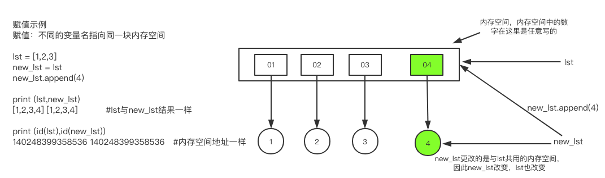
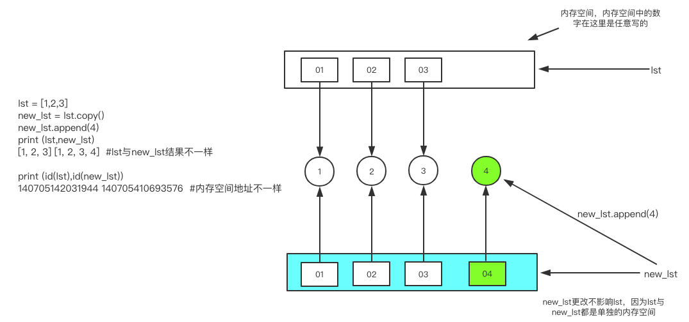
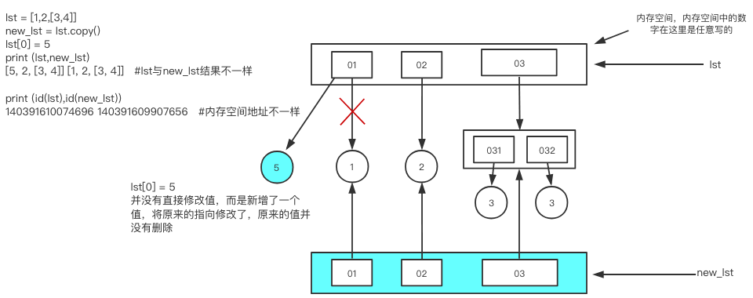
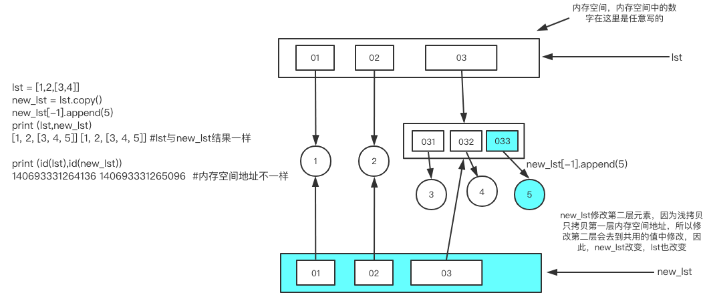
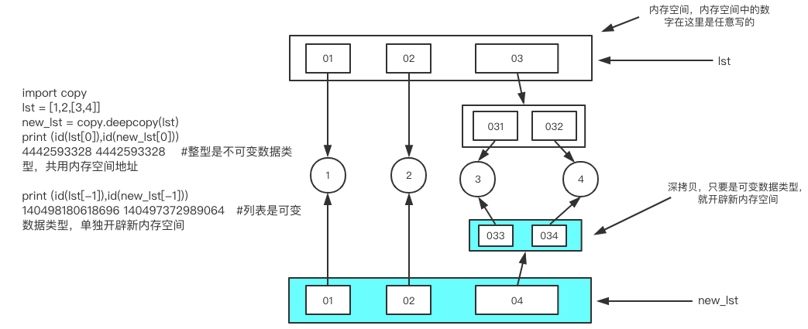

# python基础九	深浅拷贝

## 1.深浅拷贝（⚠️重要）

### 1.1 浅拷贝

#### 1.1.1 定义

``只拷贝第一层的内存地址``


#### 1.1.2 浅拷贝示例

**赋值					示意浅拷贝前先说明赋值**

```python
1.赋值共用同一块内存空间，一个变量的值改变，另一个赋值的变量同时也改变
2.多个变量名指向同一块内存空间

//列表示例
lst = [1,1,3]
lst1 = lst
lst1.append(4)					//正常思维理解应该是lst1更改后，lst不会改变，但是赋值是多个变量名指向同一个内存    													空间，因此只要一个变量改变，另一个变量也改变	
print (lst,lst1)
[1, 1, 3, 4] [1, 1, 3, 4]


//字典示例
dic = {'k1':1,'k1':1}
dic1 = dic
dic1.update({'k1':111})
print (dic,dic1)
{'k1': 1, 'k1': 111} {'k1': 1, 'k1': 111}
```

**赋值示意图**



**浅拷贝**		**只拷贝第一层的内存地址**

```python
列表中浅拷贝有两种方式
1. lst = [1,1,3]
   new_lst = lst.copy()
  
1. lst = [1,1,3]
   new_lst = lst[:]
  

浅拷贝只拷贝第一层的内存空间地址,浅拷贝的两个变量是单独的内存空间，不再是共用同一个内存空间地址
//列表示例1	列表中未嵌套第二层元素
lst = [1,1,3]
new_lst = lst.copy()
new_lst.append(4)
print (lst,new_lst)
[1, 1, 3] [1, 1, 3, 4]			//浅拷贝中lst和new_lst结果不同

print (id(lst),id(new_lst))
140584614767176 140584614774344		//浅拷贝中lst和new_lst内存空间地址不同

//列表示例1	列表中嵌套了第二层元素
lst = [1,1,[3,4,5]]
new_lst = lst.copy()
new_lst.append(6)
print (lst,new_lst)
[1, 1, [3, 4, 5]] [1, 1, [3, 4, 5], 6]

print (id(lst),id(new_lst))
140431875130951 140431874963911

print (id(lst[1]),id(new_lst[1]))		//浅拷贝只拷贝第一层内存空间，因此两个列表的第二个嵌套的元素的值内存空间相同
140633470413384 140633470413384


```


**浅拷贝单层元素示意图（增加元素）**



**浅拷贝多层元素示意图（修改元素）**




**浅拷贝多层元素示意图（第二层增加元素）**




#### 1.1.3 浅拷贝总结

``1.浅拷贝只复制第一层内存空间地址``

``1.浅拷贝，修改第一层元素或者追加元素，都是将旧指向改变为新指向，两个变量互不影响``

``3.浅拷贝修改第二层及以下元素或者追加元素，修改的是两个变量共用的值，此时修改会影响两个变量``


#### 1.1.4 浅拷贝坑

```python
lst = [1,3,[4,5],6]
lst1 = lst
lst1 = lst[:]
lst1[-1] = [8,9]
lst1[-1].append([0])			#数字无法进行追加操作
print (lst,lst1,lst1)
AttributeError: 'int' object has no attribute 'append'
```


### 1.2深拷贝

#### 1.2.1 定义

``不可变数据类型共用内存空间，可变数据类型开辟新的内存空间，不管嵌套多少层都是这样的原理``


#### 1.2.2 深拷贝语法

> Import copy
>
> copy.deepcopy()

#### 1.2.3 深拷贝示例 

```python
import copy
lst = [1,1,[3,4]]
new_lst = copy.deepcopy(lst)
print (id(lst[0]),id(new_lst[0]))			#lst[0]为1，1是整型，是不可变数据类型 --> 共用内存空间地址
4464777164 4464777164

print (id(lst[-1]),id(new_lst[-1]))
140663166316984 140663166494088				#lst[-1]为[3,4]，[3,4]是列表，是可变数据类型	--> 新开辟内存空间地址
```

#### 1.2.4 深拷贝原理图



#### 1.2.5 深拷贝总结

``深拷贝中，不可变数据类型共用内存空间地址，可变数据类型开辟新的内存空间，不管嵌套多少层都是这样``

